> 代码开源在[GitHub](https://github.com/Vincent-ice/myCPU)上，写的很菜，有很多不对的地方（比如分支预测单开一流水级），仅供参考

## 设计概述

采用哈佛架构，为顺序单发射静态六级流水，核心部分可实现最高100M的运行频率，实现了 46 条指令、分支预测、中断例外、TLB、控制状态寄存器（CSR），采用 AXI 接口与外界交互。本核使用booth2位乘的两周期乘法器，基2的srt除法器，并尝试性采用了除法历史查找表以应对可能的连续取商和取余的指令。

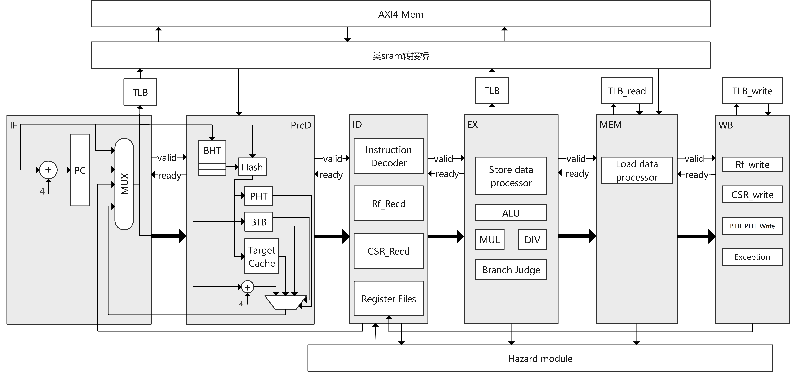

## 模块设计

### booth2乘法器

使用booth2位乘+六层华莱士树实现两周期的乘法计算，采用34位有符号乘法的方式将有/无符号乘法统一计算。

经过时序平衡，且在第二周期有较短延时。

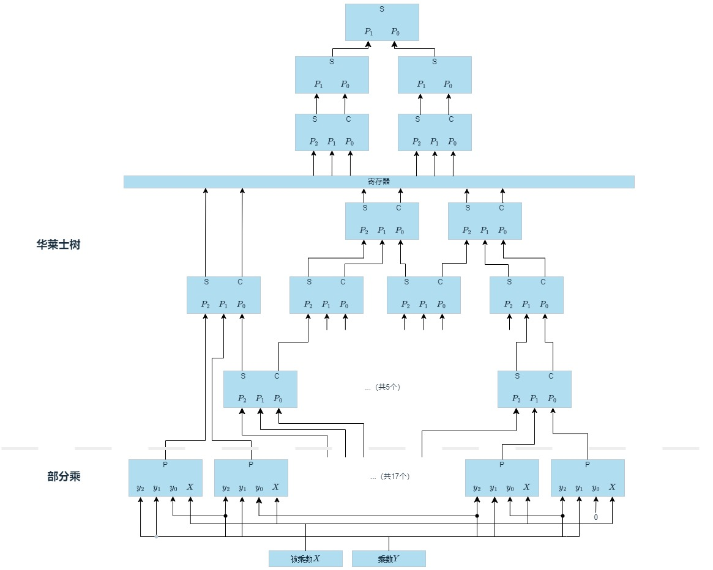

### srt2除法器

> 参考https://www.cnblogs.com/devindd/articles/17633558.html

使用基2的srt除法实现1~16周期的除法运算，同样采用34位有符号除法的方式将有/无符号除法统一计算。

~~商和余数的最后处理写的很烂，纯粹是一个个试出来的~~

#### 除法查找表

注意到LoongArch32R架构下如果同时需要商和余数时需要连续两条指令，此时同一组被除数和除数将会启动两次除法器，而除法器一次可将商数和余数同时计算出。于是添加了一个除法的查找表，其每项由被除数、除数、有/无符号、商、余数组成，每次除法运算前将会在查找表中查询是否已经计算过，如果有则会直接输出结果，没有时才会启动除法器进行计算。

由于查找发生在ALU发送使能信号给除法器的那一拍，且查找表只有两项，所以不会引入额外延迟。

### 分支预测

> 预测的写的不大对，我的是取到指令之后再进行目标值的预测，但是应该是没取回指令就根据PC值进行预测。
>
> 参考：https://www.cnblogs.com/lyc-seu/p/16995926.html（《超标量处理器设计》）

分支预测根据直接跳转指令和间接跳转指令使用不同的预测方法

#### 直接跳转指令--BTB（Branch Target Buffer）预测

BTB采用直接映射，一共有16项，每项保存Tag、有效性、转移地址。

Tag使用PC[13:2]作为比对内容，一致且该项有效则取出该项的转移地址作为下一条指令的取值PC。

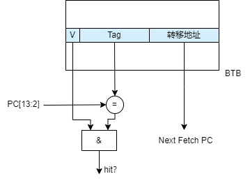

如果发生BTB缺失，则默认分支不发生，使用顺序的PC（即PC+4）作为下一条指令的取值PC，之后复用分支预测错误的处理方式。

#### 间接跳转指令--两级自适应预测器（Adaptive Two-level Predictror）

预测流程如下：

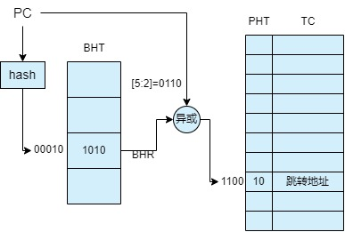

- 使用hash算法将32位PC映射到5位的BHT（Branch History Register Table）索引上，减小重名可能

使用的hash算法如下：

```verilog
module hash_function(    
    input [31:0] x,
    output [4:0] y
);

wire [31:0] xR16 = x >> 16;
wire [31:0] xR8 = x >> 8;

assign y = (x[4:0] ^ xR16[4:0]) + (x[4:0] ^ xR8[4:0]);

endmodule
```


- BHT由32个BHR（Branch History Register）项组成。BHR是4位移位寄存器，其保存了前4次该PC值下的跳转情况，可完美预测跳转周期在4次以内的跳转。
- 采用`PC[5:2]^BHR`得到PHT（Pattern History Table）表的索引，再次减小重名可能

- PHT是一个存储了16项两位饱和计数器的列表，两位饱和计数器其有4个状态如下：

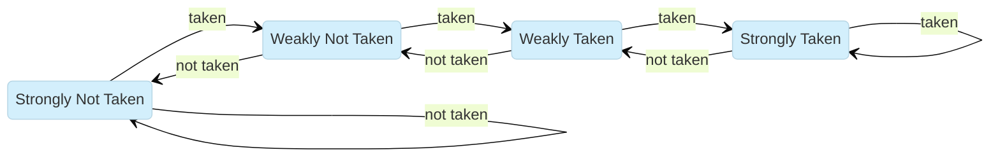

其相当于一个去抖电路，在饱和时需要连续两次预测失败才会改变预测结果。

- TC（Target Cache）是存储了跳转目标PC的缓存区，其与PHT共用索引。

### TLB（Translation Lookaside Buffer）

TLB采用8项全相连映射，支持4KB和4MB两种页大小，其每项构成如下：

| E      | VPPN       | PS       | ASID   | G      |
| ------ | ---------- | -------- | ------ | ------ |
| 存在位 | 虚拟双页号 | 页表大小 | 进程号 | 全局域 |
| 1bit   | 19bit      | 1bit     | 10bit  | 1bit   |

| PPN0/1   | PLV0/1   | MAT0/1       | D0/1 | V0/1   |
| -------- | -------- | ------------ | ---- | ------ |
| 物理页号 | 权限等级 | 存储访问类型 | 脏位 | 有效位 |
| 20bit    | 2bit     | 2bit         | 1bit | 1bit   |

- 页表大小位以1表示4MB，0表示4KB

## 流水线设计

### 流水级设计

#### Fetch 取指级

取指级包括了npc的仲裁、TLB页表项查询、inst_ram读取请求发送。

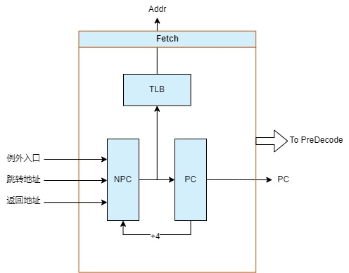

#### PreDecode预译码级

预译码级主要功能为分支预测和指令的部分译码。

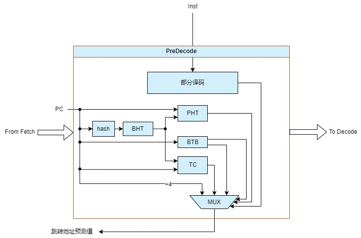

#### Decode译码级

译码级将指令完全译码，根据指令信息读取通用寄存器或者CSR寄存器的内容，处理数据前推的仲裁，处理提供给执行级的数据。

TLB重填和ertn例外返回的处理在此级处理并发送给Fetch取指级进行地址跳转。

中断信息将会被标记在此级的指令上。

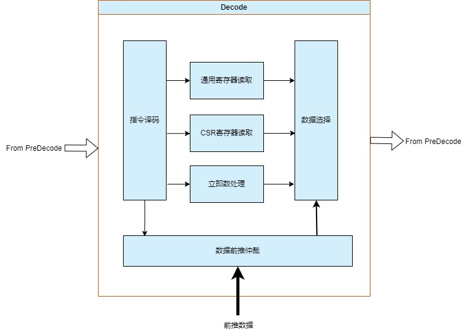

#### Execute执行级

执行级负责数据的运算、访存信息发送、分支预测判错。

预测错误带来的开销为5周期（假设inst_ram可立即发送数据）。

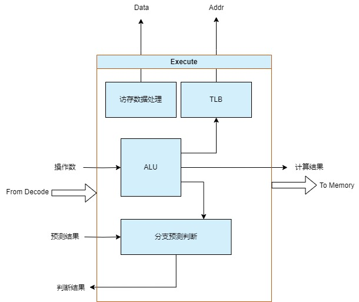

#### Memory访存级

访存级对访存返回的数据进行处理，并仲裁最终写入寄存器的数据和地址。此外还负责TLB读取指令的执行。

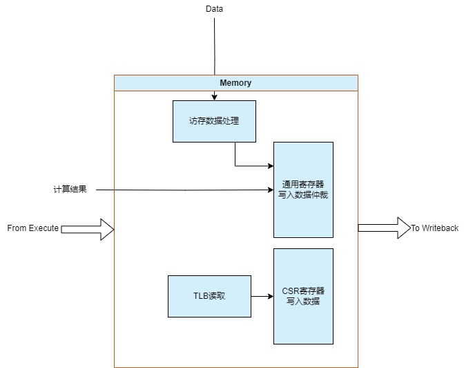

#### Write back写回级

写回级将通用寄存器、CSR寄存器的数据写入，将分支预测的记录更新，TLB写入指令的指令，以及中断例外的触发。

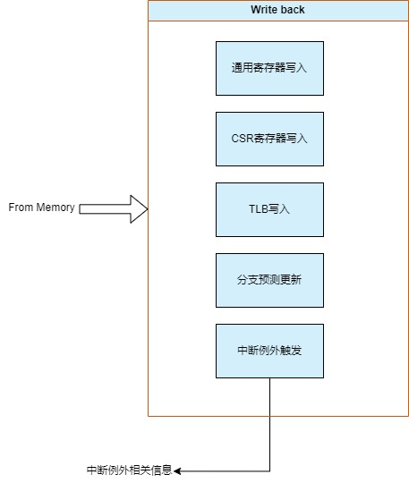

### 级间设计

流水级之间采用握手方式，仅当前级有效信号和后级允许进入信号均为高电平时视为握手成功，级间寄存器数据被更新，其简单代码如下：

```verilog
always @(posedge clk) begin
    if (for_valid && next_allowin) begin
        buffer <= for_input;
    end
end
```

- `for_valid`为前级有效信号
- `next_allowin`为后级允许进入信号
- `buffer`为级间寄存器
- `for_input`为前级输入数据

每级的输出有效信号生成由本级有效性、本级任务完成情况生成；

每级的允许输入信号由本级有效性、本级任务完成情况和下级允许输入情况生成。

基于此级间互锁的握手信号，流水级可支持任意级阻塞时自动阻塞其前所有级的运行，但其后的级不受影响继续运行。