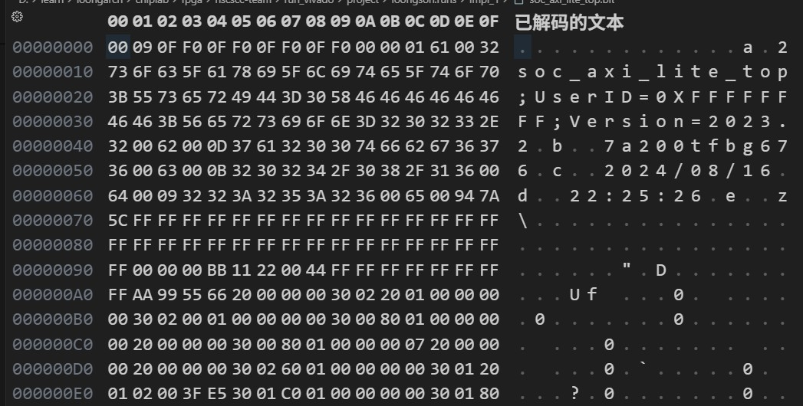

> 目前在FPGA领域打工了，借由多镜像启动的学习继续捡起来这个图书馆的维护工作吧。

> 以官方手册为准[7 Series FPGAs Configuration User Guide (UG470)](https://docs.amd.com/v/u/en-US/ug470_7Series_Config)

## `.bit`和`.bin`的区别

### `.bit`

`.bit` 文件通常包含：

1. Vivado 文件元数据头
2. 填充和总线宽度检测数据
3. 原始 FPGA 配置包

`.bit` 文件头中的设计名、器件名、日期和时间主要用于工具识别。FPGA 配置逻辑不会把这些元数据当成配置指令。

### `.bin`

`.bin` 是面向配置接口的原始二进制流，通常用于烧写 SPI Flash 或由配置控制器读取。



> 如上图`.bit`文件二进制解码所示，`.bit`文件的前面部分是Vivado工具生成的元数据和填充数据，后面才是实际的配置包。而`.bin`文件则是直接从配置部分开始，前面全部用`FF`填充。


## 整体结构

假设 BIN 的有效配置流从偏移 `0x130` 开始：

```text
偏移 0x00000000
┌────────────────────────────────────┐
│ 前置填充数据                         │
│ 0x00000000 ~ 0x0000012F             │
├────────────────────────────────────┤
│ Sync Word                           │
│ 0xAA995566                          │
├────────────────────────────────────┤
│ 配置寄存器初始化                     │
│ TIMER / WBSTAR / COR0 / IDCODE      │
├────────────────────────────────────┤
│ FAR、WCFG                            │
├────────────────────────────────────┤
│ FDRI / Type-2 配置帧数据             │
│ CLB、IO、BRAM、互连等配置内容         │
├────────────────────────────────────┤
│ CRC 与启动配置                       │
├────────────────────────────────────┤
│ STARTUP、DESYNC                     │
├────────────────────────────────────┤
│ NOP 填充                             │
└────────────────────────────────────┘
```

## 总线宽度识别

在同步字之前，会有一段`00 00 00 BB 11 22 00 44`的填充数据。在刚上电时，配置逻辑并不知道使用8位、16位还是32位总线宽度，于是在读出`BB`后进入总线宽度识别阶段，根据下一次读出的低位数值[7:0]来判断总线宽度。总线宽度识别阶段的读出值如下：

```text
11 -> 8位总线宽度
22 -> 16位总线宽度
44 -> 32位总线宽度
```

如果不是这几个值则会等待下一次`BB`的读出。

## 同步字和字节序

FPGA 配置状态机在找到同步字(`0xAA995566`)以前不会按正常配置包解释数据。同步字以后，数据按照 32 位大端序配置包解析。

## 配置包格式

### Type-1 包

Type-1 包头为一个 32 位 word：

```text
31       29 28 27 26             13 12 11 10          0
+----------+-----+-----------------+-----+-------------+
| 001      | OP  | Register Addr   | RSV | Word Count  |
+----------+-----+-----------------+-----+-------------+
```

字段含义：

| 字段 | 位 | 说明 |
|---|---:|---|
| Type | `[31:29]` | `001` 表示 Type-1 |
| Opcode | `[28:27]` | `00`=NOP，`01`=READ，`10`=WRITE |
| Register Address | `[26:13]` | 配置寄存器地址 |
| Word Count | `[10:0]` | 后续数据 word 数量 |

例如：

```text
30008001 00000007
```

解析为：

```text
Type-1 WRITE
Register = 0x04
Count    = 1
Data     = 0x00000007
```

也就是向 CMD 寄存器写入 `RCRC` 命令。

### Type-2 包

Type-2 包用于一次传输大量数据。它不重复携带寄存器地址，而是复用前一个 Type-1 包指定的地址。

```text
31       29 28 27 26                              0
+----------+-----+----------------------------------+
| 010      | OP  | Word Count                       |
+----------+-----+----------------------------------+
```

Type-2 常用于把大量配置帧数据写入 FDRI。

例如以下 FDRI 数据包：

```text
0x200: 30004000
0x204: 50000E99
```

其中：

```text
30004000  -> Type-1 WRITE，目标寄存器 FDRI，长度为 0
50000E99  -> Type-2 WRITE，继续写入 FDRI
0xE99     -> 3737 个 32-bit word
```

因此第一段 FDRI 数据从 `0x208` 开始，到 `0x3C67` 结束。

### NOP

```text
0x20000000
```

NOP 不改变配置寄存器状态，常用于：

- 插入配置时序延迟
- 等待配置逻辑完成内部动作
- 对齐配置包
- 启动序列后的填充

## 7系列常用配置寄存器

| 地址 | 名称 | 作用 |
|---:|---|---|
| `0x00` | CRC | CRC 校验相关寄存器 |
| `0x01` | FAR | Frame Address Register，配置帧地址 |
| `0x02` | FDRI | Frame Data Input，配置帧数据入口 |
| `0x03` | FDRO | Frame Data Output，配置帧数据出口 |
| `0x04` | CMD | 配置命令寄存器 |
| `0x05` | CTL0 | 配置控制寄存器 |
| `0x06` | MASK | CTL0 写掩码 |
| `0x07` | STAT | 配置状态寄存器 |
| `0x08` | LOUT | 配置输出/回读辅助寄存器 |
| `0x09` | COR0 | 配置选项寄存器 |
| `0x0A` | MFWR | Multi-Frame Write 相关寄存器 |
| `0x0B` | CBC | 加密配置 CBC 相关寄存器 |
| `0x0C` | IDCODE | 器件 ID 校验寄存器 |
| `0x0D` | AXSS | 配置访问/扩展状态寄存器 |
| `0x0E` | COR1 | 配置选项寄存器 1 |
| `0x10` | WBSTAR | Warm Boot Start Address |
| `0x11` | TIMER | 配置看门狗定时器 |
| `0x16` | BOOTSTS | 启动状态寄存器 |
| `0x18` | CTL1 | 第二个配置控制寄存器 |
| `0x1F` | BSPI | BPI/SPI 配置接口相关寄存器 |

### CRC `0x00`

CRC 是配置数据完整性校验相关寄存器。配置逻辑会根据配置包和帧数据维护内部 CRC 状态，并在配置流程中比较期望结果。

BIN 中常见的写法是：

```text
30000001 <crc_value>
```

其中 `30000001` 表示向寄存器 `0x00` 写入一个 word。

### FAR `0x01`

FAR（Frame Address Register）指定后续配置帧写入 FPGA 配置存储器的位置。7 系列 FAR 的主要字段如下：

<table>
<tbody>
<tr>
<td style="width:9.375%;text-align:left;">31</td>
<td style="width:9.375%;text-align:right;">26</td>
<td style="width:4.6875%;text-align:left;">25</td>
<td style="width:4.6875%;text-align:right;">23</td>
<td style="width:3.125%;text-align:center;">22</td>
<td style="width:7.8125%;text-align:left;">21</td>
<td style="width:7.8125%;text-align:right;">17</td>
<td style="width:15.625%;text-align:left;">16</td>
<td style="width:15.625%;text-align:right;">7</td>
<td style="width:10.9375%;text-align:left;">6</td>
<td style="width:10.9375%;text-align:right;">0</td>
</tr>
<tr>
<td style="text-align:center;" colspan="2">Reserved</td>
<td style="text-align:center;" colspan="2">Block Type</td>
<td style="text-align:center;">Top/<br>Bottom</td>
<td style="text-align:center;" colspan="2">Row</td>
<td style="text-align:center;" colspan="2">Column</td>
<td style="text-align:center;" colspan="2">Minor</td>
</tr>
</tbody>
</table>

| 字段         |         位 | 说明                                                                            |
| ---------- | --------: | ----------------------------------------------------------------------------- |
| Reserved   | `[31:26]` | 保留                                                                            |
| Block Type | `[25:23]` | `000`=CLB/IO/CLK；`001`=Block RAM content；`010`=CFG_CLB；正常 bitstream 不使用 `011` |
| Top/Bottom |    `[22]` | `0`=器件上半区；`1`=器件下半区                                                           |
| Row        | `[21:17]` | 当前配置 Row。地址由器件中心向上递增，随后从中心向下递增                                                |
| Column     |  `[16:7]` | Major Column 地址，从左向右由 0 递增                                                    |
| Minor      |   `[6:0]` | Major Column 内的 Frame 地址                                                      |


### FDRI `0x02`

FDRI（Frame Data Input）是配置帧数据入口。配置状态机在收到 `WCFG` 后，后续写入 FDRI 的数据会被写入配置存储器。

典型序列为：

```text
30008001 00000001    ; CMD = WCFG
30004000             ; Type-1，选择 FDRI，长度字段为 0
50000E99             ; Type-2，继续写入 0xE99 个 word
```

FDRI 通常使用 Type-2 包传输大量数据。Type-2 不重复携带寄存器地址，而是沿用前一个 Type-1 包的目标地址。

### FDRO `0x03`

FDRO（Frame Data Output）是配置帧读出路径，主要用于配置存储器回读、验证和调试。普通 SPI 启动 BIN 通常以写 FDRI 为主，不会像 JTAG/SelectMAP 回读操作那样频繁使用 FDRO。

### CMD `0x04`

CMD 是配置命令寄存器。写 CMD 的 Type-1 包形式为：

```text
30008001 <command>
```

CMD 寄存器的常用命令如下：

| CMD 值 | 名称 | 作用 |
|---:|---|---|
| `0x00000000` | NULL | 无操作 |
| `0x00000001` | WCFG | 准备接收配置帧数据 |
| `0x00000002` | MFW | Multi-Frame Write 相关操作 |
| `0x00000003` | LFRM | 载入帧相关操作 |
| `0x00000004` | RCFG | 准备通过 FDRO 读取配置数据 |
| `0x00000005` | START | 启动配置完成后的启动序列 |
| `0x00000006` | RCAP | Single-shot Readback 后复位 CAPTURE |
| `0x00000007` | RCRC | 清零并重新开始 CRC 计算 |
| `0x00000008` | AGHIGH | 置位 GHIGH_B |
| `0x00000009` | SWITCH | 切换配置相关状态 |
| `0x0000000A` | GRESTORE | 恢复全局状态 |
| `0x0000000B` | SHUTDOWN | 进入关机配置状态 |
| `0x0000000C` | GCAPTURE | 捕获全局状态 |
| `0x0000000D` | DESYNC | 解除配置接口同步 |
| `0x0000000F` | IPROG | 内部重配置，从 WBSTAR 地址重新启动 |
| `0x00000010` | CRCC | 重配置后重新计算第一个回读CRC值 |
| `0x00000011` | LTIMER | 装载配置定时器 |
| `0x00000012` | BSPI_READ | 重新启动 BPI/SPI bitstream 读取 |
| `0x00000013` | FALL_EDGE | 切换为下降沿采样配置数据 |

### CTL0 `0x05`

CTL0 是配置控制寄存器，控制配置期间的全局状态、配置接口行为、安全/CRC 相关选项以及部分配置状态控制。CTL0 的具体位必须结合 MASK 使用，因为配置文件经常采用“先写 MASK，再写 CTL0”的方式只修改选定位。

<table>
<tbody>
<tr>
<td>31</td>
<td>30</td>
<td>29</td>
<td>13</td>
<td>12</td>
<td>11</td>
<td>10</td>
<td>9</td>
<td>8</td>
<td>7</td>
<td>6</td>
<td>5</td>
<td>4</td>
<td>3</td>
<td>2</td>
<td>1</td>
<td>0</td>
</tr>
<tr>
<td style="text-align:center;">EFUSE_KEY</td>
<td style="text-align:center;">ICAP_SELECT</td>
<td style="text-align:center;"
colspan="2">Reserved</td>
<td style="text-align:center;">OverTemp<br>PowerDown</td>
<td style="text-align:center;">Reserved</td>
<td style="text-align:center;">Config<br>Fallback</td>
<td style="text-align:center;">Reserved</td>
<td style="text-align:center;">GLUTMASK_B</td>
<td style="text-align:center;">FARSRC</td>
<td style="text-align:center;">DEC</td>
<td style="text-align:center;"
colspan="2">SBITS</td>
<td style="text-align:center;">PERSIST</td>
<td style="text-align:center;"
colspan="2">Reserved</td>
<td style="text-align:center;">GTS_USR_B</td>
</tr>
</tbody>
</table>

| 字段                |         位 | 说明                                     |
| ----------------- | --------: | -------------------------------------- |
| EFUSE_KEY         |    `[31]` | AES Key 来源：`0`=BBRAM；`1`=eFUSE         |
| ICAP_SELECT       |    `[30]` | ICAPE2 端口选择：`0`=Top；`1`=Bottom         |
| Reserved          | `[29:13]` | 保留                                     |
| OverTempPowerDown |    `[12]` | `1`=XADC 检测到过温时允许 Power Down           |
| Reserved          |    `[11]` | 保留                                     |
| ConfigFallback    |    `[10]` | `0`=允许配置失败后 Fallback；`1`=禁止 Fallback   |
| Reserved          |     `[9]` | 保留                                     |
| GLUTMASK_B        |     `[8]` | 控制可变存储单元，如 LUT RAM/SRL 的 Readback Mask |
| FARSRC            |     `[7]` | FAR 输出源选择：ECC Error FAR 或正常 FAR        |
| DEC               |     `[6]` | AES 解密器使能                              |
| SBITS             |   `[5:4]` | 安全级别：`00`=读写允许；`01`=禁止回读；`1x`=禁止读写     |
| PERSIST           |     `[3]` | 配置完成后是否保留 M[2:0] 指定的配置接口               |
| Reserved          |   `[2:1]` | 保留                                     |
| GTS_USR_B         |     `[0]` | `0`=用户 I/O 三态；`1`=用户 I/O 工作            |


### MASK `0x06`

MASK 为 CTL0/CTL1 等控制寄存器提供写掩码。一般操作模式是：

```text
写 MASK，选择允许修改的位
写 CTL0 或 CTL1，提供目标值
```

如果某一位在 MASK 中为 0，对应 CTL 写入位通常不会改变。

### STAT `0x07`

STAT 是配置状态寄存器，主要用于通过 JTAG 或其它配置访问路径读取当前配置状态。

<table>
<tbody>
<tr>
<td>31</td>
<td>27</td>
<td>26</td>
<td>25</td>
<td>24</td>
<td>21</td>
<td>20</td>
<td>18</td>
<td>17</td>
<td>16</td>
<td>15</td>
<td>14</td>
<td>13</td>
<td>12</td>
<td>11</td>
<td>10</td>
<td>8</td>
<td>7</td>
<td>6</td>
<td>5</td>
<td>4</td>
<td>3</td>
<td>2</td>
<td>1</td>
<td>0</td>
</tr>
<tr>
<td colspan="2" style="text-align:center;">Reserved</td>
<td colspan="2" style="text-align:center;">BUS_WIDTH</td>
<td colspan="2" style="text-align:center;">Reserved</td>
<td colspan="2" style="text-align:center;">STARTUP_STATE</td>
<td>XADC_<br>OVER_TEMP</td>
<td>DEC_<br>ERROR</td>
<td>ID_<br>ERROR</td>
<td>DONE</td>
<td>RELEASE_<br>DONE</td>
<td>INIT_B</td>
<td>INIT_<br>COMPLETE</td>
<td colspan="2" style="text-align:center;">MODE</td>
<td>GHIGH_B</td>
<td>GWE</td>
<td>GTS_<br>CFG_B</td>
<td>EOS</td>
<td>DCI_<br>MATCH</td>
<td>MMCM_<br>LOCK</td>
<td>PART_<br>SECURED</td>
<td>CRC_<br>ERROR</td>
</tr>
</tbody>
</table>

| 字段             |         位 | 说明                                       |
| -------------- | --------: | ---------------------------------------- |
| Reserved       | `[31:27]` | 保留                                       |
| BUS_WIDTH      | `[26:25]` | 配置总线宽度：`00`=x1，`01`=x8，`10`=x16，`11`=x32 |
| Reserved       | `[24:21]` | 保留                                       |
| STARTUP_STATE  | `[20:18]` | Startup 状态机当前 Phase                      |
| XADC_OVER_TEMP |    `[17]` | XADC 过温告警                                |
| DEC_ERROR      |    `[16]` | AES 解密相关错误                               |
| ID_ERROR       |    `[15]` | DEVICE_ID 检查失败                           |
| DONE           |    `[14]` | DONE 引脚当前值                               |
| RELEASE_DONE   |    `[13]` | 内部 DONE 是否已释放                            |
| INIT_B         |    `[12]` | INIT_B 引脚当前值                             |
| INIT_COMPLETE  |    `[11]` | 初始化是否完成                                  |
| MODE           |  `[10:8]` | M[2:0] 模式引脚状态                            |
| GHIGH_B        |     `[7]` | GHIGH_B 状态                               |
| GWE            |     `[6]` | Global Write Enable 状态                   |
| GTS_CFG_B      |     `[5]` | 配置全局三态状态                                 |
| EOS            |     `[4]` | End Of Startup                           |
| DCI_MATCH      |     `[3]` | 所有相关 DCI 是否匹配                            |
| MMCM_LOCK      |     `[2]` | 所有相关 MMCM 是否锁定                           |
| PART_SECURED   |     `[1]` | AES 解密安全状态                               |
| CRC_ERROR      |     `[0]` | `1`=检测到 CRC Error                        |


### LOUT `0x08`

LOUT 用于配置逻辑的回读/输出路径，属于配置接口辅助寄存器。正常 bitstream 中通常不会把它当作用户逻辑寄存器使用。

### COR0 `0x09`

COR0（Configuration Options Register 0）保存一组配置选项，包括配置启动时序、启动时钟、DONE/GWE/GTS 相关周期以及其它配置行为。

这个值通常由 Vivado 根据 Bitstream Settings、配置模式和工程选项生成，无需修改。

### MFWR `0x0A`

MFWR（Multi-Frame Write）用于多帧写入相关流程。样本中该寄存器被大量访问，这是因为配置帧写入会按 FAR 地址递增并配合 MFWR/帧写入命令完成连续配置。

### CBC `0x0B`

CBC 与加密配置的 CBC 状态/初始值相关。对于未加密的样本，不能仅凭出现 CBC 寄存器地址就断定 bitstream 已加密；应结合安全配置状态和 bitstream 的加密选项判断。

### IDCODE `0x0C`

IDCODE 用于核对配置 bitstream 的目标器件。

例如：

```text
30018001 0364C093
```

`0364C093` 对应 `7k160tffg676` 型号，说明该文件面向 XC7K160T。

如果 IDCODE 与实际 FPGA 不匹配，配置逻辑可能产生 IDCODE 错误并停止配置；在 MultiBoot 场景中，这类错误还可能触发 Fallback。

> IDCODE可以在ug470中找到，或者去[此网站](https://bsdl.info/index.htm)搜索

### AXSS `0x0D`

AXSS 是配置访问/扩展状态相关寄存器，主要服务于配置逻辑内部访问和配置接口操作。

### COR1 `0x0E`

COR1（Configuration Options Register 1）保存另一组配置选项，例如配置接口持久化、配置错误处理、CRC/安全相关选项以及部分启动行为。

### WBSTAR `0x10`

WBSTAR（Warm Boot Start Address Register）保存 IPROG 或相关重配置流程使用的下一次启动地址。在 7 系列 Master SPI MultiBoot 中，WBSTAR 的地址字段不是简单地按完整 32 位 Flash 字节地址解释。对于该配置方式，WBSTAR 中的有效地址字段对应 Flash 地址的高位，低 8 位相当于地址对齐部分。

例如 Golden 配置：

```text
WBSTAR = 0x00010000
```

对应：

```text
SPI Flash address = 0x00010000 << 8
                  = 0x01000000
```

### TIMER `0x11`

TIMER 是配置看门狗定时器寄存器。它用于限制配置过程的最长等待时间，主要用于检测 Update Image 损坏、同步字缺失或配置过程卡死等情况。

具体超时换算应按 UG470 对 TIMER 字段和配置时钟的定义进行，不能直接把寄存器原值当作微秒数。

### BOOTSTS `0x16`

BOOTSTS 是启动状态寄存器，用于记录与启动来源、内部重配置和 Fallback 相关的状态。它是调试 MultiBoot 的关键寄存器。

<table>
<tbody>
<tr>
<td>31</td><td>16</td>
<td>15</td><td>14</td><td>13</td><td>12</td><td>11</td><td>10</td><td>9</td><td>8</td>
<td>7</td><td>6</td><td>5</td><td>4</td><td>3</td><td>2</td><td>1</td><td>0</td>
</tr>
<tr>
<td colspan="2" style="text-align:center;">Reserved</td>
<td>HMAC_<br>ERROR_1</td>
<td>WRAP_<br>ERROR_1</td>
<td>CRC_<br>ERROR_1</td>
<td>ID_<br>ERROR_1</td>
<td>WTO_<br>ERROR_1</td>
<td>IPROG_1</td>
<td>FALLBACK_1</td>
<td>VALID_1</td>
<td>HMAC_<br>ERROR_0</td>
<td>WRAP_<br>ERROR_0</td>
<td>CRC_<br>ERROR_0</td>
<td>ID_<br>ERROR_0</td>
<td>WTO_<br>ERROR_0</td>
<td>IPROG_0</td>
<td>FALLBACK_0</td>
<td>VALID_0</td>
</tr>
</tbody>
</table>

| 字段           |         位 | 说明                         |
| ------------ | --------: | -------------------------- |
| Reserved     | `[31:16]` | 保留                         |
| HMAC_ERROR_1 |    `[15]` | 上一组状态的 HMAC Error          |
| WRAP_ERROR_1 |    `[14]` | 上一组 BPI Address Wrap Error |
| CRC_ERROR_1  |    `[13]` | 上一组 CRC Error              |
| ID_ERROR_1   |    `[12]` | 上一组 IDCODE Error           |
| WTO_ERROR_1  |    `[11]` | 上一组 Watchdog Timeout       |
| IPROG_1      |    `[10]` | 上一组配置由 IPROG 触发            |
| FALLBACK_1   |     `[9]` | 上一组发生 Fallback             |
| VALID_1      |     `[8]` | Status 1 有效                |
| HMAC_ERROR_0 |     `[7]` | 当前组 HMAC Error             |
| WRAP_ERROR_0 |     `[6]` | 当前组 BPI Address Wrap Error |
| CRC_ERROR_0  |     `[5]` | 当前组 CRC Error              |
| ID_ERROR_0   |     `[4]` | 当前组 IDCODE Error           |
| WTO_ERROR_0  |     `[3]` | 当前组 Watchdog Timeout       |
| IPROG_0      |     `[2]` | 当前配置由 IPROG 触发             |
| FALLBACK_0   |     `[1]` | 当前配置发生 Fallback            |
| VALID_0      |     `[0]` | Status 0 有效                |


### CTL1 `0x18`

CTL1 是第二个配置控制寄存器，与 CTL0 类似，也应配合 MASK 使用。

### BSPI `0x1F`

BSPI 是 BPI/SPI 配置接口相关寄存器。

## 样本文件开头指令逐条解析

### 原始 word 序列

```text
0x00000130: AA995566
0x00000134: 20000000
0x00000138: 3003E001
0x0000013C: 0000026C
0x00000140: 30008001
0x00000144: 00000012
0x00000148: 20000000
0x0000014C: 30022001
0x00000150: 40010000
0x00000154: 30020001
0x00000158: 00000000
0x0000015C: 30008001
0x00000160: 00000000
0x00000164: 20000000
0x00000168: 30008001
0x0000016C: 00000007
0x00000170: 20000000
0x00000174: 20000000
0x00000178: 30026001
0x0000017C: 00000000
0x00000180: 30012001
0x00000184: 022A35E5
0x00000188: 3001C001
0x0000018C: 00000000
0x00000190: 30018001
0x00000194: 0364C093
0x00000198: 30008001
0x0000019C: 00000013
0x000001A0: 30008001
0x000001A4: 00000009
0x000001A8: 20000000
0x000001AC: 3000C001
0x000001B0: 00000001
0x000001B4: 3000A001
0x000001B8: 00000001
0x000001BC: 3000C001
0x000001C0: 00001000
0x000001C4: 30030001
0x000001C8: 00001000
0x000001CC: 20000000
0x000001D0: 20000000
0x000001D4: 20000000
0x000001D8: 20000000
0x000001DC: 20000000
0x000001E0: 20000000
0x000001E4: 20000000
0x000001E8: 20000000
0x000001EC: 30002001
0x000001F0: 00000000
0x000001F4: 30008001
0x000001F8: 00000001
0x000001FC: 20000000
0x00000200: 30004000
0x00000204: 50000E99
```

### 逐条解释

| 偏移 | 原始数据 | 解析 |
|---:|---:|---|
| `0x130` | `AA995566` | 同步字 |
| `0x134` | `20000000` | NOP |
| `0x138` | `3003E001` + `0000026C` | 向寄存器 `0x1F` 写入 `0x26C` |
| `0x140` | `30008001` + `00000012` | CMD=`0x12`，UG470 中属于保留/未使用命令值 |
| `0x14C` | `30022001` + `40010000` | 向 TIMER/相关定时器寄存器写入配置值 |
| `0x154` | `30020001` + `00000000` | WBSTAR=`0x00000000` |
| `0x15C` | `30008001` + `00000000` | CMD=`NULL` |
| `0x168` | `30008001` + `00000007` | CMD=`RCRC`，重新开始 CRC |
| `0x178` | `30026001` + `00000000` | 向保留地址 `0x13` 写入 0 |
| `0x180` | `30012001` + `022A35E5` | COR0=`0x022A35E5` |
| `0x188` | `3001C001` + `00000000` | COR1=`0x00000000` |
| `0x190` | `30018001` + `0364C093` | 写入目标器件 IDCODE |
| `0x198` | `30008001` + `00000013` | 执行器件相关配置命令 |
| `0x1A0` | `30008001` + `00000009` | CMD=`SWITCH` |
| `0x1AC` | `3000C001` + `00000001` | MASK=`0x1` |
| `0x1B4` | `3000A001` + `00000001` | CTL0=`0x1` |
| `0x1BC` | `3000C001` + `00001000` | MASK=`0x1000` |
| `0x1C4` | `30030001` + `00001000` | CTL1=`0x00001000` |
| `0x1EC` | `30002001` + `00000000` | FAR=`0`，从第一个配置帧开始 |
| `0x1F4` | `30008001` + `00000001` | CMD=`WCFG`，准备写配置帧 |
| `0x200` | `30004000` | 指定 FDRI，后接 Type-2 数据包 |
| `0x204` | `50000E99` | Type-2 WRITE，写入 3737 个 word |

## FDRI 配置帧区

FDRI 是 FPGA 配置数据的主要入口。写入 FDRI 的数据最终加载到 FPGA 的配置存储器中，用于配置：

- CLB
- LUT
- 触发器
- 可编程互连
- I/O 资源
- Block RAM
- 时钟资源
- 配置逻辑相关资源

样本文件中共有 123 个 FDRI 写入包，总计：

```text
1,228,968 个 32-bit word
```

因为启用了压缩：

```text
COMPRESS=TRUE
```

所以不能简单地把 FDRI 区域按普通指令逐个解释。FDRI 数据中的数值主要是压缩后的配置帧内容，而不是 CMD、FAR 等配置控制指令。

解析 FDRI 区域时必须遵循以下原则：

1. 先解析 FDRI 包头，获取数据长度
2. 跳过对应数量的 32 位 payload
3. 在 payload 内不能再次搜索配置包，否则会把随机帧数据误判成命令
4. 处理下一个 Type-1 或 Type-2 包

XC7K160T 的 7 系列配置帧通常以 101 个 32 位 word 为一个 frame。FAR 控制帧地址递增，配置状态机会根据 FAR 把数据写入不同的配置列、配置行和 minor frame。

## 文件末尾启动指令

该文件最后一段有效控制序列位于约 `0x4ED5D4` 到 `0x4ED7D0`。末尾可观察到：

```text
0x4ED5D4: 30000001
0x4ED5D8: A7703B21
0x4ED5DC: 20000000
0x4ED5E0: 20000000
0x4ED5E4: 30008001
0x4ED5E8: 0000000A
0x4ED5EC: 20000000
0x4ED5F0: 30008001
0x4ED5F4: 00000003
0x4ED5F8: 3000C001
0x4ED5FC: 00001000
0x4ED600: 30030001
0x4ED604: 00000000
...
0x4ED798: 30008001
0x4ED79C: 00000005
...
0x4ED7CC: 30008001
0x4ED7D0: 0000000D
```

其中：

```text
CMD = 0x00000005
```

表示启动配置完成后的 STARTUP 流程，使配置数据作用于用户逻辑。

最后：

```text
CMD = 0x0000000D
```

表示 DESYNC，配置逻辑解除与配置接口的同步。
