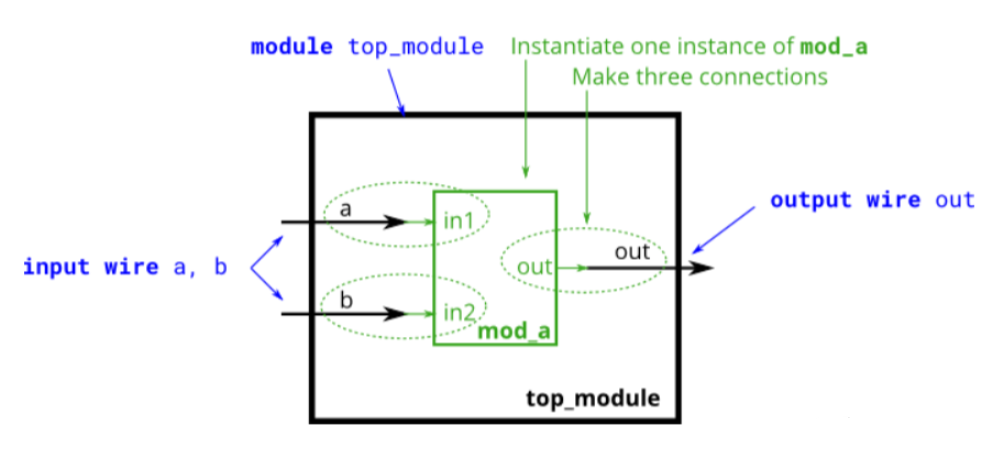
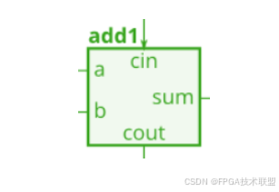
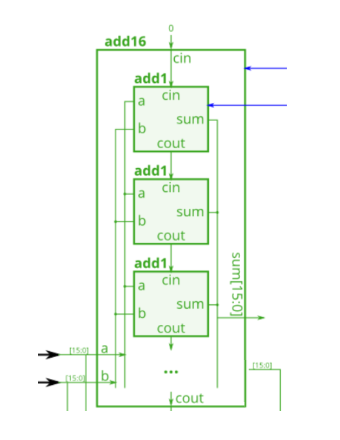

## 基础知识

### 模块(Module)

​Verilog中的module可以看成一个具有输入输出端口的黑盒子，该黑盒子有输入和输出接口(信号)，通过把输入在盒子中执行某些操作来实现某项功能。(类似于C语言中的函数)




#### 模块描述

顶层模块(top\_module)结构用Verilog语言可描述为：

```verilog
module top_module(
	input a,
	input b,
	output out
);
    
    ......
    
endmodule
```

- 模块以module 开始，endmodule结束
- top\_module 为模块名
- input : 为输入端口
- output:  为输出端口
- **所有代码必须处于module模块中！**

同理，次级模块(mod\_a)结构用Verilog语言可描述为：

```verilog
module mod_a(
	input in1,
	input in2,
	output out
);

	......
	
endmodule
```

**注意事项：每个模应单独块处于一个.v文件中，模块名即为文件名(规范代码！)**

#### 模块输入输出信号

- 输出：output
- 输入：input

模块的输入输出端口都可看出模块的信号，若不写信号类型则默认为wire类型信号！

```verilog
// 以下两个语句本质是一致的
input a;

input wire a;
```

除了wire型信号，还有reg型信号，具体详见1.4节！

#### 模块实例化

如图1所示，top\_module的两个输入端口连接到次级模块(mod\_a)的输入端口，那如何在top\_module模块模块中使用mod\_a模块的功能呢？这就需要通过模块实例化，可以把top\_module看成C语言中的主函数，次级模块mod\_a看成普通函数，这样就可以在主函数中调用其他函数来完成相应的功能！

在top\_module中实例化mod\_a的方式为：

**模块实例化语法：模块名 实例名(定义连接port的信号);**

```verilog
module top_module(
    input a,
    input b,
    output out
);

    mod_a instance1 (a, b, out); // 按mod_a定义的端口顺序实例化
    mod_a instance2 (.in1(a), .in2(b), .out(out)); // 按mod_a端口名实例化(推荐此种写法)
```

### 逻辑块(always、generate)

#### always逻辑块

always块可构建 *组合逻辑块* 和 *时序逻辑块*，复杂的逻辑操作都需要处于该逻辑块中，如if、case、for等

##### 组合逻辑块

```verilog
module top_module();

    always @(*) begin
        ......
    end

endmodule
```

- always逻辑块中任意信号变化时立即触发，执行begin - end之间的语句
- begin - end用于将多条语句组成一个代码块，只有一条语句时可省略

##### 时序逻辑电路

```verilog
module top_module();

    always @(posedge clk) begin
        ......
    end

endmodule
```

- clk 信号的上升沿触发
- posedge: 上升沿
- negedge: 下降沿

#### generate逻辑块

generate主要结合for循环使用，主要用途有：

- 对向量中的多个位进行重复操作
- 对同一个模块进行多次重复实例化(主要用途)

##### 操作向量

```verilog
module top_module(input [7:0] in, output [7:0] out);
    genvar i;   // genvar i;也可以定义在generate内部
    generate
        for(i = 0; i < 8; i = i + 1) begin  // verilog中for循环不支持i++
            assign out[i] = ^in[7:i];       // ^:异或运算符
        end
    endgenerate
endmodule
```

##### 模块重复多次实例化

```verilog
module top_module(
    input a,
    input b,
    output out
);
    genvar i;
    generate
        for(i = 0; i < 8; i = i + 1) begin : gen_mod_a  // gen_mod_a为每个begin_end结构的名称
            mod_a instance2 (.in1(a), .in2(b), .out(out));
        end
    endgenerate
endmodule
```

- 注意：模块多次实例化时必须写每个begin\_end结构的名称(gen\_mod\_a)
- 仿真器会通过gen\_mod\_a来标识生成结构: gen\_mod\_a[0],gen\_mod\_a[1]....

#### initial块

initial块可以理解为一个初始化块，在initial的起始位置的语句在0时刻即开始执行，之后如果遇到延时，则延时之后执行接下来的语句。

初始块是**不可综合**的，因此不能将其转化为带有数字元素的硬件原理图。因此初始块除了在仿真中使用外，并没有太大的作用。

如:在仿真文件中初始化各种参数：

```verilog
initial
begin
    sys_clk     = 1'b1;
    sys_rst_n   = 1'b0;
    #50                 // #n 代表延时n个时间单位
    sys_rst_n   = 1'b1;
end
```

注意：

- initial 块在电路中不可综合，故一般不出现在RTL代码中
- initial 一般只在仿真文件中使用

若需要在RTL代码中初始化参数，需要用always块，用initial块会导致错误！

如下所示，在RTL代码中初始化存储器的方式为：

```verilog
reg [255:0] char_data[4:0];

always @ (posedge clk)
    begin
        char_data[0] <= 256'h0000000000000000000000000000000000000000000000000000000000000000;
        char_data[1] <= 256'h0000000000000000000000000000000000000000000000000000000000000000;
        char_data[2] <= 256'h0000000000000000000000000000000000000000000000000000000000000000;
        char_data[3] <= 256'h0000000000000000000000000000000000000000000000000000000000000000;
        char_data[4] <= 256'h0000000000000000000000000000000000000000000000000000000000000000;
    end
```

### 赋值方式

Verilog 中赋值方式有三种：连续赋值、阻塞赋值、非阻塞赋值

#### 连续赋值(assign)

```verilog
assign x = y;
```

- 该语句表示把x和y两个信号进行连接，真实的物理连接！
- **不能在always块中使用**

#### 阻塞赋值(=)

```verilog
// 组合块
always @(*) begin
    out1 = a;
    a = b;
    out2 = a;
end
```

- **组合always块中用阻塞式赋值**
- 执行顺序：按照begin\_end语句块中的**顺序依次执行**，上述输出结果为：out1 = a ，out2 = b

#### 非阻塞赋值(<=)

```verilog
// 时序块
always @(posedge clk) begin
    out1 <= a;
    a <= b;
    out2 <= a;
end
```

- **时序always块中用非阻塞赋值**
- 执行顺序：begin\_end中所有语句**并行执行**，上述输出结果为：out1 = a ，out2 = a

## 基础语法

### 标识符

- 用途：标识符用于定义常数、变量、信号、端口、参数名、模块名等。
- 组成：字母、数字、$、下划线任意组合而成
- 注意事项：
    - 区分大小写(Verilog 和 verilog是不同的)
    - 第一个字符只能是字母或下划线(123demo 是非法标识符)

### 逻辑值与逻辑运算      

#### 逻辑值

Verilog中有4中逻辑值：0、1、x、z
- 0: 低电平
- 1: 高电平
- x: 表示状态未知
- z: 表示高阻状态

注意：这里的z、x是不区分大小写的(X、Z也可)

#### 逻辑运算

##### 逻辑运算符：&&(与)、==（相等）、||（或）、!=（不等）

- 如 m&&n  : 判断m和n是否全为真(非0即为真)，真则输出1'b1，否则输出1'b0 (4’b1010&4’b0101 = 1’b1)
- 最后输出结果只有1bit

##### 按位运算符：&、|、~、^、~&、~^、~| 

- 如 m&n  : 是把m的每一位与n的每一位按位做与运算 (4’b1010&4’b0101 = 4’b0000)
- 输出结果与m/n的bit数相同

##### 归约运算符：  &、|、~、^、&、~^、~| 

- 只有一个参量参与运算时( &为一元运算符),表示规约与，即向量内部进行与运算

```verilog
&a [3:0] // 表示a[3]&a[2]&a[1]&a[0] 相当于(a[3:0]==4'b1111)
|b [3:0] // 表示b[3]|b[2]|b[1]|b[0] 相当于(b[3:0]!=4'b0000)
^c [3:0] // 表示c[3]^c[2]^c[1]^c[0]
```

- 即(&4’b0101 = 0&1&0&1 = 1'b0 )
- 最后输出结果只有1bit

### 常量的表示方法

与C语言类似，常量主要有：整数型、实数型和字符串型三种

#### 用十进制整数表示整型常量

(1) 正数：直接写 10 表示位宽为32bit的十进制整数(系统默认)
(2) 负数：-10需要用二进制补码表示，多了一位符号位(1 1010)
(3) 用科学计数法表示：12.345e3   表示 12345

#### 用基数法表示整数型常量

[换算成二进制数后的位宽]'*[数制符号][与数制对应的值]*

- 二进制(b):     8'b1000\_1100      
- 十六进制(h):   8'h8c
- 八进制(o):     8'o214
- 十进制(d):     8'd140

注意事项：
- 当表示二进制时，最好每4位写一个下划线以增强可读性：如8'b1000\_1100   与8'b10001100 是一样的
- 基数表示法中遇到x时：十六进制表示4个x，八进制中表示3个x  
- **当位宽大于二进制位数时左边自动补0，小于二进制数时2从左边截断！**

#### 字符串(用双引号)

- 每个字符由1个8位的ASCII码值表示，即需要1byte存储空间
- 如：“Hello world”字符串由11个ASCII符号构成，需要11byte存储空间

### 注释方式

Verilog中注释主要有行注释(//)和块注释(/\*  ....     \*/)两种，表示方法与C语言一致！

```verilog
// 行注释

/* 
    块注释

 */
```


### 变量(wire、reg)

Verilog中的变量主要有两种：wire和reg

#### wire

(1) 线网型(wire): 表示电路间的物理连接，wire定义的变量也可看成信号端口
(2) 当两个wire信号被连续赋值时，在逻辑块中会被映射成真实的物理连线，此时这两个信号端口的变化是同步的！

#### reg

(1) 寄存器型(reg): 表示一个抽象的数据存储单元
(2) reg 具有对某一时间点状态进行保持的功能

#### 用法与注意事项

(1) 在always、initial语句中被赋值的变量(赋值号左边的变量)都是reg型变量
(2) 在assign语句中被赋值的变量，为wire型变量

### 向量(vector)与 参数(常量)

#### parameter 参数(常量)

(1) 参数是一种常量，通常出现在module内部，常被用于定义状态、数据位宽等

```verilog
parameter STATE = 1'b0;
```

(2) **只作用于声明的那个文件**，且可以被灵活改变！
(3) 局部参数localparam，只在本模块中使用

```verilog
localparam WIDTH = 8;
```

(4) 参数的名称一般为大写，以区分其他变量 

#### 向量(vector)

vector(向量)，是一组信号的集合,可视为位宽超过1bit 的 wire 信号。

(1) 定义方式：

```verilog
// 输入输出型
input [7:0] a,b,
output reg [7:0] out

// 模块中间向量
wire [7:0] c,d;
reg [7:0] d;
```

(2) 向量的位宽定义：

- [upper:lower] 定义位宽，如 [7:0] 表示位宽为8 bit ，即upper=7，lower=0
- vector\_name可以一次写多个向量

#### 向量片选

- a[3:0]    取向量a的0~4位数据
- b[n]      取向量b的第n位数据
- c[-1:-2]  取向量c的最低2位数据
- c[0:3]    取向量c的最高4位数据

多路选择器应用：实现一个 256 选 1 选择器，sel 信号作为选择信号，当 sel = 0 时选择 in[3:0]，sel = 1 时选择 in[7:4],以此类推。

```verilog
module top_module (
    input [255:0] in,
    input [7:0] sel,
    output [3:0] out
);

    assign out = {in[sel*4+3], in[sel*4+2], in[sel*4+1], in[sel*4+0]};

    // assign out = {in[sel*4 +: 4]};
    // assign out = {in[sel*4+3 -: 4]};
endmodule
```

- 片选信号sel输入为n位二进制数，当参与运算、充当索引时会自动转换成十进制数
- 该题所选取的信号片段为: in[sel\*4+3: sel\*4] ,但这不符合Verilog的片选语法规则故应写成：

in[sel\*4 +: 4]   表示索引从sel\*4开始的高4bit信号

in[sel\*4+3 -: 4] 表示索引从sel\*4+3开始的低4bit信号

- 或是直接选出需要的每一位，再用{ }拼接成新向量：

{in[sel\*4+3], in[sel\*4+2], in[sel\*4+1], in[sel\*4+0]}

### 三元表达式

(1) 与C语言相同，Verilog也有三元表达式：

```verilog
condition ? if_true : if_false
```

当条件为真，表达式值为if\_true ，否则表达式值为if\_false。

(2) 应用

```verilog
(sel ? b : a)   // 一个二选一MUX，通过sel的值选择a或b

always @(posedge clk)       // 一个T触发器
    q <= toggle ? ~q : q;

assign out = ena ? q : 1'bz;    // 三态缓冲器
```

### 分支语句(if-else、case)

#### if-else语句

(1) 最常用的形式：(优势：**输出的所有可能都写到，不存在未知电平输出！**)

```verilog
if (condition1) begin
    ......
end
else if (condition2) begin
    ......
end
else begin
    ......
end
```

(2) 不建议使用if-else嵌套，会存在优先级问题，导致逻辑混乱，
(3) 所有if-else语句都应写成(1)的形式！
(4) 根据条件表达式依次比较，**存在优先级！* *

#### case 语句

(1) 书写形式：

```verilog
case (<控制表达式>)
    <分支语句1>: begin
        ......
    end
    <分支语句2>: begin
        ......
    end
    ......
    default: begin
        ......
    end
endcase
```

比较<控制表达式>与<分支语句n>的取值相等则执行对应语句，否则执行default后语句！

(2) *执行完某一分支语句后立即跳出case语句结构，终止case语句执行。*
(3) **<分支语句n>的取值必须互不相同！**
(4) 以encase结束case语句块
(5) 各分支语句间**不存在优先级！**
(6) 具体应用: 用case语句搭建多路选择器，（以9选1多路选择器为例）

```verilog
module top_module (
    input [15:0] a,b,c,d,e,f,g,h,i,
    input [3:0] sel,
    output [15:0] out
);

    always @(*) begin
        case(sel)
            4'b0000: out = a;
            4'b0001: out = b;
            4'b0010: out = c;
            4'b0011: out = d;
            4'b0100: out = e;
            4'b0101: out = f;
            4'b0110: out = g;
            4'b0111: out = h;
            default: out = 16'hffff;
        endcase
    end
endmodule
```

## for循环语句

(1) 书写形式：

```verilog
integer i;
always @(*) begin
    for(i = 0; i < 8; i = i + 1) begin : for_name
        ......
    end
end
```

- 执行<循环语句>n次
- for\_name为每一次循环的名称

### 关系运算符(>、<、>=、<=)

- 运算结果为真返回 1
- 运算结果为假返回 0
- 若某个操作数值不定(x)，则返回值为 x

### 拼接运算符({ , })

#### 拼接

用一对花括号加逗号组成“{ , }”拼接运算符，逗号隔开的数据**按顺序拼接成新数据！**

#### 通过拼接实现移位

在左边拼接实现右移，右边拼接实现左移！

```verilog
{a[3:0], 4'b0000} // a[3:0]左移4位
{4'b0000, a[3:0]} // a[3:0]右移4位
```

#### 连接符中重复多次的操作

语法： {重复次数{vector}}

```verilog
{4{a[3:0]}} // 重复4次a[3:0]
{3'd5, 4{a[3:0]}} // 3'd5与a[3:0]重复4次拼接
```

### 移位运算符

移位运算符用于将左边操作数左移或右移指定的位数！移位后空闲位用0填充。

- 左移运算符：<<
如：4‘b1101 << 3 结果为：4‘b1000

- 右移算法符: >>
如：4‘b1101 >> 3 结果为：4‘b0001

- 移位运算符其他用途：左移一位可以看成是乘以 2，右移一位可以看成是除以 2。
- 移位运算符代替乘除法可以节省资源！

## 完整模块示例

### 二进制全加器



- a、b为输入 1bit 数据
- cin为上一个加法器进位输入
- cout为本加法器的进位输出
- sum = a+b

$$
\begin{array}{c}
sum=a \wedge b \wedge cin  \\
cout=(a \& b) | (a \& cin) | (b \& cin)
\end{array}
$$

代码实现：

```verilog
module full_adder(
    input a,
    input b,
    input cin,
    output sum,
    output cout
);

    assign sum = a ^ b ^ cin;
    assign cout = (a & b) | (a & cin) | (b & cin);
endmodule
```

### 16进制全加器



16进制全加器如上图所示，它可由上节中16个二进制全加器组合而成。

用Verilog实现16进制全加器代码为：

```verilog
module adder16(
    input [15:0] a,
    input [15:0] b,
    input cin,
    output [15:0] sum,
    output cout
);

    wire [16:0] c;

    assign c[0] = cin;

    genvar i;
    generate
        for(i = 0; i < 16; i = i + 1) begin : gen_full_adder
            full_adder instance1 (.a(a[i]), .b(b[i]), .cin(c[i]), .sum(sum[i]), .cout(c[i+1]));
        end

    assign cout = c[16];

endmodule
```

## 模块中的参数传递

### 定义可传递参数的模块

```verilog
module counter
// 参数
#(
    parameter COUNT_MAX = 25'd24_999_999,
    parameter STATE     = 1'b0
)
(
    input wire sys_clk,
    output reg led_out
);

......

endmodule
```

### 带参数模块的实例化

```verilog
counter #(
    .COUNT_MAX(25'd24_999_999), // 参数赋值
    .STATE(1'b0)
) counter_instance (
    .sys_clk(sys_clk),
    .led_out(led_out)
);
```

