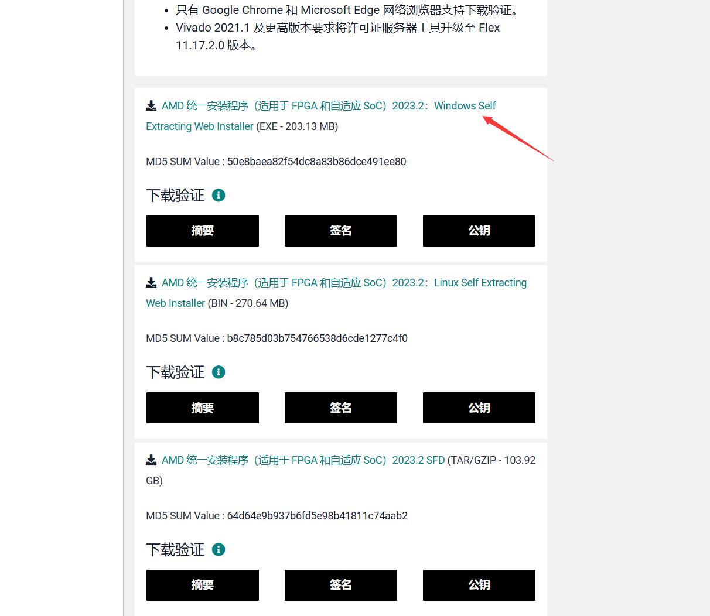
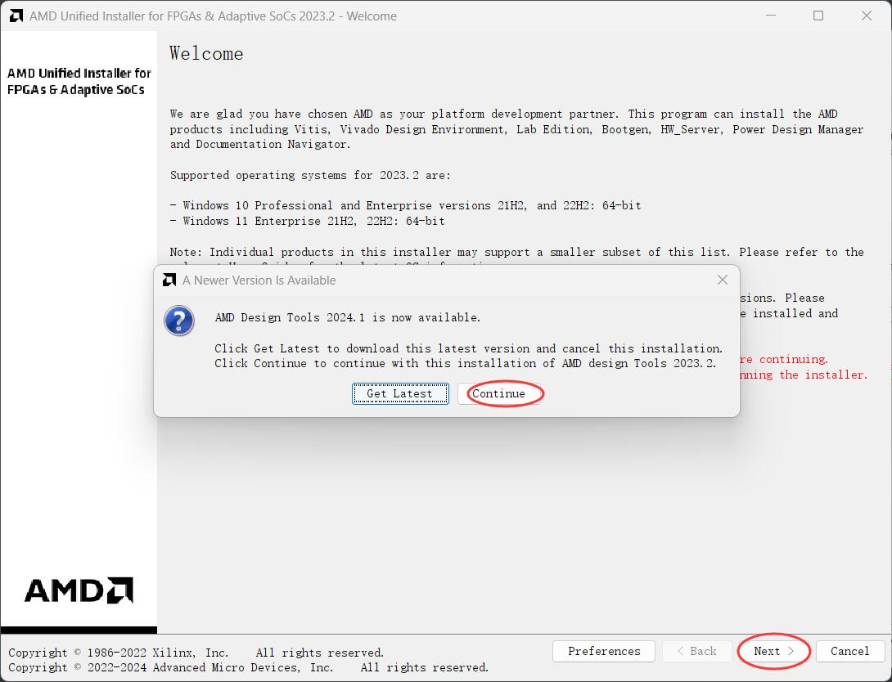
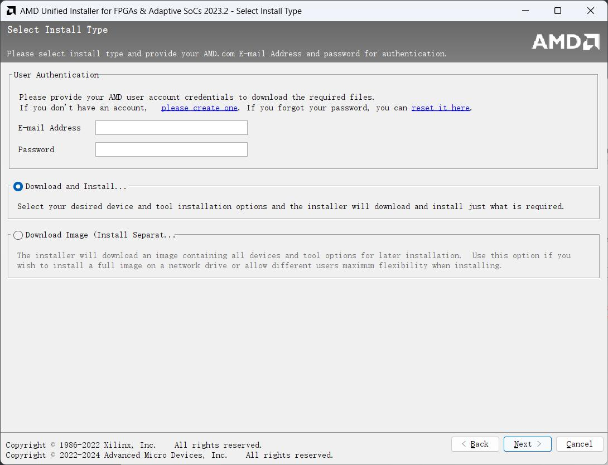
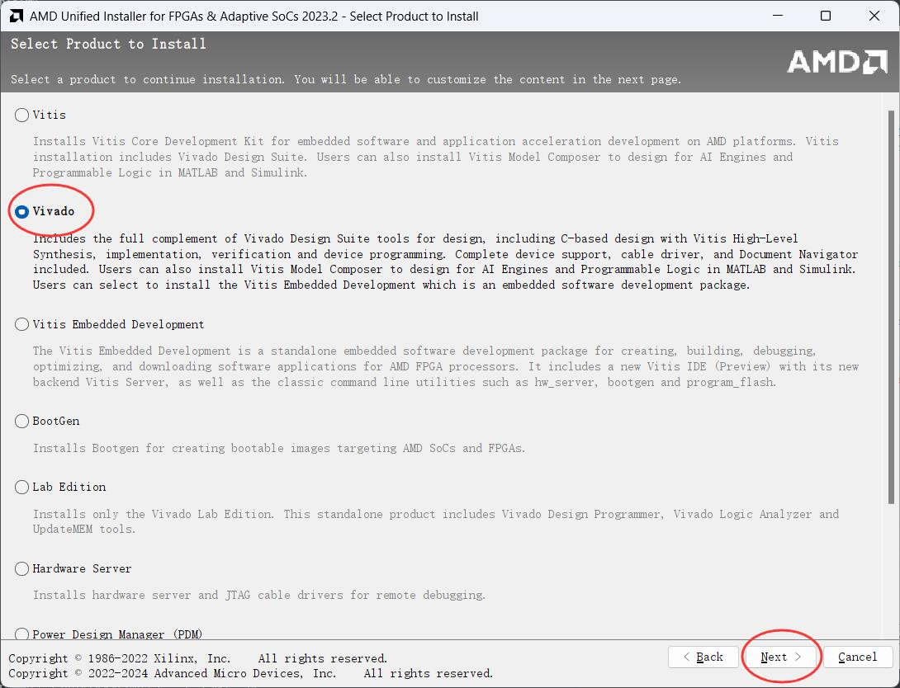
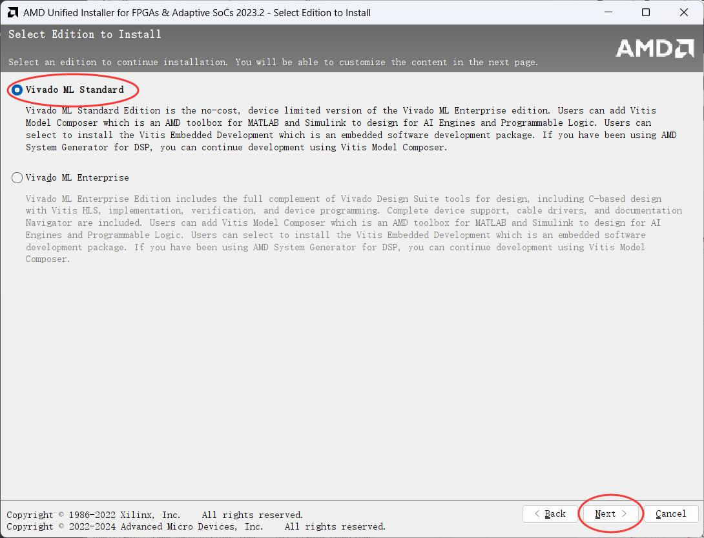
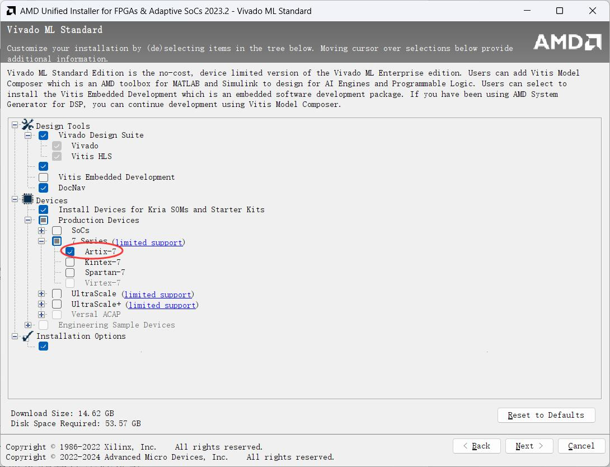
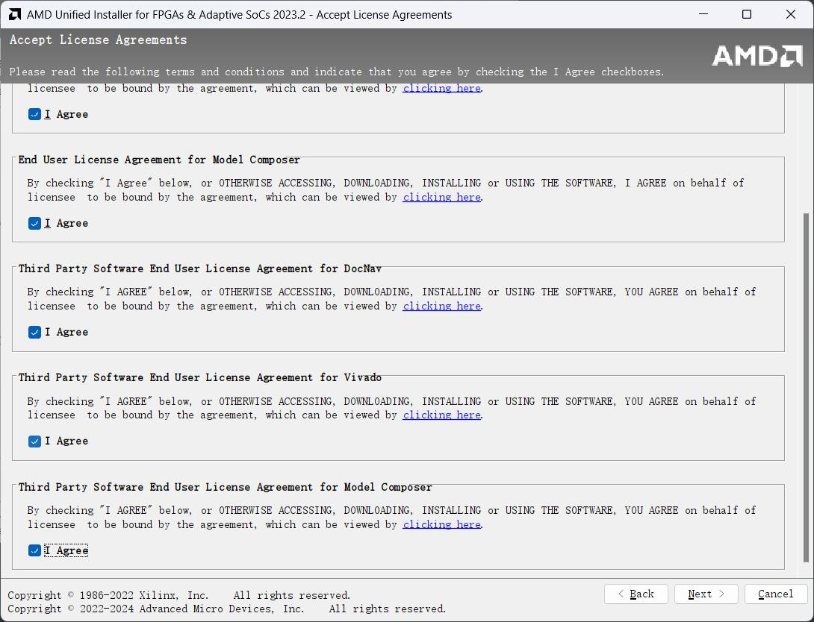
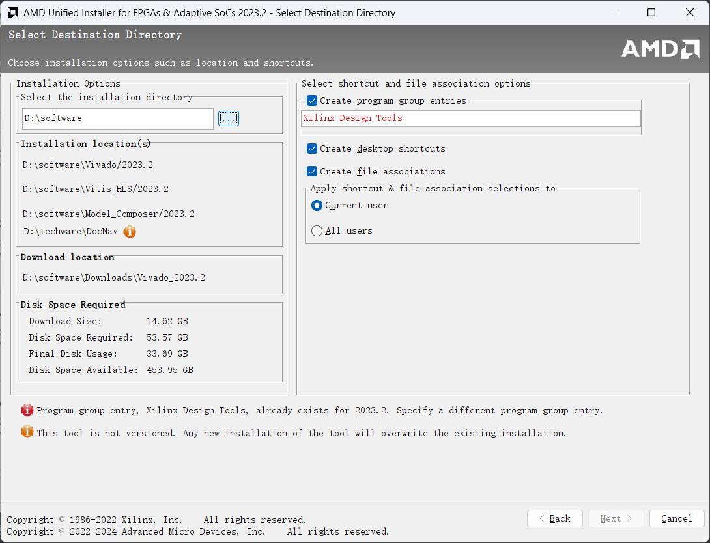

# 下载安装包

1. 百度搜索vivado，找到"下载 - Xilinx"，进入vivado下载页面

2. 选择2023.2版本，[下载链接](https://china.xilinx.com/support/download/index.html/content/xilinx/zh/downloadNav/vivado-design-tools/2023-2.html)

3. 下载Windows环境下的在线安装器（Windows Self Extracting Web Installer）

   

   - 下载需要登陆AMD。如果已有AMD账户直接填写用户名和密码登陆，如果没有账户则点“Create account”免费创建一个新账户。
   - 点击链接后会要求输入个人信息，随便填即可。
   - [*如果在线安装器下载不下来*](https://pan.baidu.com/s/1xt8L6RWmHROTX-C5JzIj3A?pwd=3a6p) 

# 在线安装

1. 双击运行已下载的可执行文件FPGAs_AdaptiveSoCs_Unified_2023.2_1013_2256_Win64.exe。（使用管理员权限，允许网络访问）

2. 如果弹出更新窗口，点击“continue”。

3. 点击“Next”。

   

4. 登录下载时注册的AMD账号，点击“Next”。

   
5. 选择“vivado”，点击“Next”。

   

6. 选择免费的标准版，点击“Next”。

   

7. 在“Device”中必勾选“Artix-7”，因为开发板搭载的FPGA是Artix-7，其他器件可以根据需要进行选择，“Design Tools”和“Installation Options”按照默认即可。

   

8. 全部“I agree”，点击“Next”。

   

9. 选择Vivado安装目录，默认安装在“C:\Xilinx”下，可以点击浏览或者直接更改路径，注意**安装路径中不能出现中文和空格**。点击“Next”。

   

   *我由于安装过了，显示和大家不一样。*

10. 查看summary，点击“install”。

11. 等待安装完成。

# 问题

- 不同版本间的编译逻辑可能有所不同，可能会导致不可预知的差异，我们建议使用比赛指定的23.2版本
- 注意安装路径**不要有中文和空格**！包括后续项目文件路径中都**不能出现中文和空格！！！**
- *如果你的用户名不幸的有中文的话，STFW改成英文的吧，不然会有更多奇奇怪怪的bug*
- 如果在线安装器有网络问题的话，尝试关闭魔法多试几次，实在不行使用完整的安装包选择本地安装（官网103GB的版本）。

# 与代码编辑器的联动

- [VIVADO使用vscode实现实时纠错与自动补全等功能_vivado代码自动对齐_fujiayu1997zz的博客-CSDN博客](https://blog.csdn.net/weixin_44425619/article/details/115479272)
- [Sublime与Verilog【一】：从安装到使用，提高FPGA开发效率！ - 知乎 (zhihu.com)](https://zhuanlan.zhihu.com/p/341728027)

