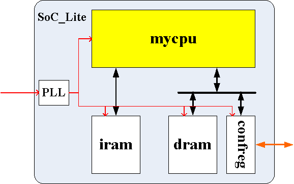
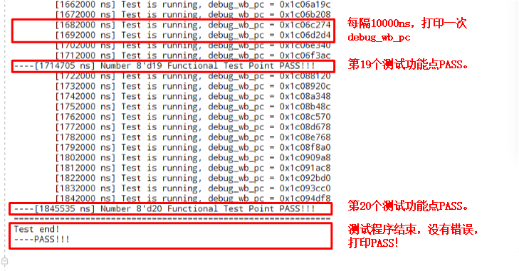
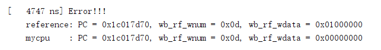
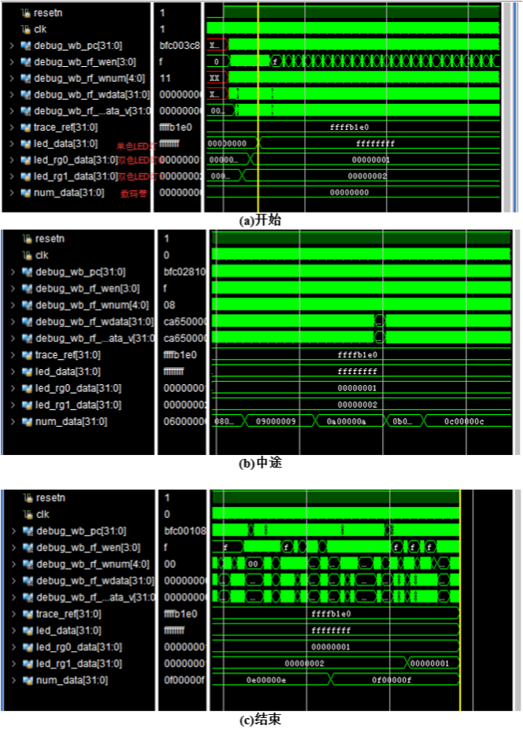
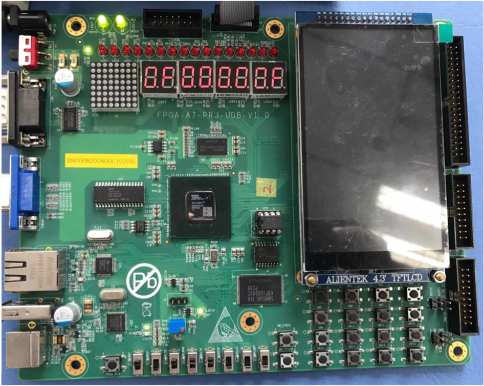

## 基于trace比对的调试框架
在调试C程序的时候应该都使用过单步调试这种调试手段。在“慢动作”运行程序的每一行代码的情况下，能够及时看到每一行代码的运行行为是否符合预期，从而能够及时定位到出错点。在实验开发环境中提供的这套基于trace比对的调试辅助手段，借鉴的就是这种“单步调试”的策略。

其具体实现方式是：我们先用一个已知的功能上是正确的CPU运行一遍测试指令序列，将每条指令的PC和写寄存器的信息记录下，记为golden_trace；然后在验证myCPU的时候运行相同的指令序列，在myCPU每条指令写寄存器的时候，将myCPU中的PC和写寄存器的信息同之前的golden_trace进行比对，如果不一样，那么立刻报错并停止仿真。

简单的来说, golden_trace就是参考答案, 通过比对myCPU的运行结果和golden_trace的运行结果, 来判断myCPU功能的正确性。

## 功能测试环境使用方法
> [基于NSCSCC2024 团体赛功能测试](https://gitee.com/loongson-edu/cdp_ede_local/tree/ee7dd7e5f1d12a9f94788a279f096b25407d9d0b)
> 它是[CPU设计实战--Loongarch版](https://gitee.com/loongson-edu/cdp_ede_local)的实验环境的exp16

### 开发环境组织结构介绍

整个实验开发环境的基本目录结构及各部分功能简介如下所示：

``` python
|--func/                     功能验证测试程序
|  |--obj/                   编译生成的二进制测试程序
|    |--inst_ram.coe         测试程序对应上板用的二进制纯数据文件
|    |--inst_ram.mif         测试程序对应功能仿真用的二进制纯数据文件
|    |--inst_ram.txt         测试程序汇编代码说明
|
|--gettrace/                 trace文件生成工程
|  |--gettrace.xpr           生成golden_trace的Vivado工程文件
|  |--golden_trace.txt       生成的golden_trace文件
|
|--myCPU/                    待验证的CPU设计代码目录
|
|--soc_verify/soc_axi        所现的CPU的SoC验证环境
   |--rtl/                   验证用SoC设计代码目录
   |  |--soc_lite_top.v      SoC的顶层文件
   |  |--CONFREG/            confreg模块，用于访问实验板上的LED灯、拨码开关等外设
   |  |--xilinx_ip/          定制的Xilinx IP，包含clk_pll、inst_ram
   |
   |--testbench/             功能仿真验证平台
   |  |--mycpu_tb.v          功能仿真顶层，该模块会抓取debug信息与golden_trace.txt进行比对
   |
   |--run_vivado/            Vivado工程的运行目录
      |--constraints/        Vivado工程设计的约束
      |--create_project.tcl  创建Vivado工程的tcl脚本
```

### SoC_Lite片上系统结构介绍


<center>用于验证myCPU的片上系统</center>

- PLL: 锁相环，用于产生时钟信号
- iram: 指令内存，用于存放测试程序
- dram: 数据内存，用于存放数据
- confreg: 外设控制器，用于控制LED灯、拨码开关等外设
- mycpu: 待验证的CPU设计

> 因为在LoongArch指令系统架构下，所有I/O设备的寄存器都是采用memory mapped方式访问的。我们这里实现的confreg也不例外。Memory mapped的访问方式意味I/O设备中的寄存器各自都有一个唯一内存编址，所以CPU可以通过load、store指令对其进行访问。

### 生成golden_trace

#### func功能测试程序

**以下涉及Linux编译的部分建议但不要求大家掌握, 包里已经提供了编译好的最终文件**

##### func测试程序说明

func程序分为func/start.S和func/inst/*.S，都是LoongArch32汇编程序:

1. func/start.S ：主函数，执行必要的启动初始化后调用func/inst/下的各汇编程序。
2. func/inst/*.S ：针对每条指令或功能点有一个汇编测试程序。
3. func/include/*.h ：测试程序的配置信息和宏定义。

主函数func/start.S中主体部分代码如下，分为三大部分，具体查看注释。

```
  ......
  #以下是设置程序开始的LED灯和数码管显示，单色LED全灭，双色LED灯一红一绿。
      LI (a0, LED_RG1_ADDR)
      LI (a1, LED_RG0_ADDR)
      LI (a2, LED_ADDR)
      LI (s1, NUM_ADDR)
  
      LI (t1, 0x0002)
      LI (t2, 0x0001)
      LI (t3, 0x0000ffff)
      lu12i.w s3, 0
      NOP4
  
      st.w t1, a0, 0
      st.w t2, a1, 0
      st.w t3, a2, 0
      st.w s3, s1, 0
  #以下是运行各功能点测试，每个测试完执行idle_1s等待一段时间，且数码管显示加1。
  inst_test:
      bl n1_lu12i_w_test    #lu12i.w
      bl idle_1s
      
      bl n2_add_w_test   #add.w
      bl idle_1s
  ......
  #以下是显示测试结果，PASS则双色LED灯亮两个绿色，单色LED不亮；
  #Fail则双色LED灯亮两个红色，单色LED灯全亮。
  test_end:
      LI  (s0, TEST_NUM)
      NOP4
      beq s0, s3, 1f
  
      LI (a0, LED_ADDR)
      LI (a1, LED_RG1_ADDR)
      LI (a2, LED_RG0_ADDR)
  
      LI (t1, 0x0002)
      NOP4
  
      st.w zero, a0, 0
      st.w t1, a1, 0
      st.w t1, a2, 0
  ......
```

inst/ 目录下每个功能点的测试代码程序名为n#_*_test.S，其中“#”为编号，如有15个功能点测试，则从n1编号到n15。每个功能点的测试，其测试代码大致如下。

```
  ......
  LEAF(n1_lu12i_w_test)
      addi.w   s0, s0 ,1         #加载功能点编号s0++
      addi.w   s2, zero, 0x0
      lu12i.w  t2, 0x1
      ###test inst
      addi.w   t1, zero, 0x0
      TEST_LU12I_W(0x00000, 0x00000)
      ......                     #测试程序，省略
      TEST_LU12I_W(0xff0af, 0xff0a0)
      ###detect exception
      bne      s2, zero, inst_error
      ###score ++                #s3存放功能测试计分，每通过一个功能点测试，则+1
      addi.w   s3, s3, 1
      ###output (s0<<24)|s3
  inst_error:
      slli.w   t1, s0, 24
      NOP4
      or       t0, t1, s3        #s0高8位为功能点编号，s3低8位为通过功能点数，
                                 #相或结果显示到数码管上。
      NOP4
      st.w     t0, s1, 0         #s1存放数码管地址
      jirl     zero, ra, 0
  END(n1_lu12i_w_test)
```

从以上可以看到，测试程序的行为是：当通过第一个功能测试后，数码管会显示0x0100_0001，随后执行idle_1s；执行第二个功能点测试，再次通过数码管会显示0x0200_0002，执行idle_1s……依次类推。显示，每个功能点测试通过，应当数码管高8位和低8位永远一样。如果中途数码管显示从0x0500_0005变成了0x0600_0005，则说明运行第六个功能点测试出错。

最后来看 `start.S` 文件中 `idle_1s` 函数的代码，其使用一个循环来暂停测试程序执行的。其主体部分代码如下：

```
  idle_1s:
      ......
      #initial t3           //读取confreg模块里的switch_interleave的值
      ld.w    t2, t0, 0     #switch_interleave: {switch[7],1'b0, switch[6],1'b0...switch[0],1'b0}
      NOP4
      xor     t2, t2, t1    //拨码开关拨上为0，故要xor来取反
      NOP4
      slli.w  t3, t2, 9     #t3 = switch interleave << 9
      NOP4
      
  sub1:
      addi.w  t3, t3, -1    //t3累减1
      
      #select min{t3, switch_interleave} //获取t3和当前switch_interleave的最小值
      ld.w    t2, t0, 0     #switch_interleave:{switch[7],1'b0,switch[6],1'b0...switch[0],1'b0}
      NOP4
      xor     t2, t2, t1
      NOP4
      slli.w  t2, t2, 9     #switch interleave << 9
      NOP4                  //以上ld.w-xor-slli.w三条指令再次获取switch_interleave
      sltu    t4, t3, t2    //无符号比大小，如果t3比switch_interleave 小则置t4=1
      NOP4
      bne     t4, zero, 1f  //t4!=0,意味着t3比switch_interleave大，则跳1f
      nop
      addi.w  t3, t2, 0     //否则，将t3赋值为更小的switch_interleave
      NOP4
  1:
      bne     t3,zero, sub1 //如果t3没有减到0，则返回循环开头
      jirl    zero, ra, 0   //结束idle_1s
```

从以上代码可以看到，idle_1s 会依据拨码开关的状态设定循环次数。在仿真环境下，我们会模拟拨码开关为全拨下的状态，以使 idle_1s 循环次数最小。之所以这样设置，是因为 FPGA 运行远远快于仿真的速度，假设CPU运行一个程序需要106个CPU周期，再假设CPU在FPGA上运行频率为10MHz，那其在FPGA上运行完一个程序只需要0.1s；同样，我们仿真运行这个程序，假设我们仿真设置的CPU运行频率也是10MHz，那我们仿真运行完这个程序也是只需要0.1s吗？显然这是不可能的，仿真是软件模拟CPU运行情况的，也就是它要模拟每个周期CPU内部的变化，运行完这一个程序，需要模拟106个CPU周期。我们在一台2016年产的主流X86台式机上进行实测发现，Vivado自带的Xsim仿真器运行SoC_Lite的仿真，每模拟一个周期大约需要600us，这意味着Xsim上模拟106个周期所花费的实际时间约10分钟。

同一程序，运行仿真测试大约需要10分钟，而在FPGA上运行只需要0.1秒（甚至更短，比如CPU运行在50MHz主频则运行完程序只需要0.02s）。所以我们如果不控制好仿真运行时的 idle_1s 函数，则我们可能会陷入到idle_1s长时间等待中；类似的，如果我们上板时设定 idle_1s 函数很短（比如拨码开关全拨下），则 idle_1s 时间太短导致我们无法看到数码管累加的效果

**如果大家在自实现CPU上板运行过程中，发现数码管累加跳动太慢，请调小拨码开关代表的数值；如果发现数码管累加跳动太快，请调大拨码开关代表的数值。**

##### LoongArch-GCC交叉编译工具的安装
自行编译func程序需要使用LoongArch32R的GCC交叉编译工具。该工具链的安装可以从 https://gitee.com/loongson-edu/la32r-toolchains 下载源码自行编译、安装，也可以直接从 https://gitee.com/loongson-edu/la32r-toolchains/releases 下安装包。我们这里主要介绍后一种方式的安装步骤。

下载安装包时请根据所用机器是X86还是LoongArch选择对应的版本。下载压缩包 loongarch32r-linux-gnusf-*.tar.gz 至Linux操作系统自身的文件系统中。需要特别提醒的是，目前X86版本LoongArch32R的GCC交叉编译工具只支持64位系统（在系统下运行uname -a命令显示架构为x86_64的）。接下来：

（1）打开一个terminal，进入压缩包所在目录，进行解压：

    $ sudo tar zxvf loongarch32r-linux-gnusf-*.tar.gz -C /opt/
（2）确保目录/opt/loongarch32r-linux-gnusf-*/bin/存在，随后执行：

    $ echo “export PATH=/opt/loongarch32r-linux-gnusf-*/bin/:$PATH” >> ~/.bashrc
（3）重新打开一个terminal，输入loongarch32然后敲击tab键，如果能够-linux-gnusf-之类的补全，就说明工具链已经安装成功。此时可以编写一个hello.c 然后用工具链进行编译看其是否可以工作。

    $ loongarch32r-linux-gnusf-gcc hello.c

##### func测试程序编译说明

###### 编译脚本
func测试程序的编译脚本为验证平台目录下的func/Makefile，对Makefile了解的可以去看下该脚本。该脚本支持以下命令：

- make help ：查看帮助信息
- make ：编译得到仿真下使用的结果
- make clean ：删除*.o，*.a和./obj/目录

###### 编译结果
func测试程序编译结果位于func/obj/下, 主要会用到的文件及作用如下:

- inst_ram.coe ：定制inst_ram所需的数据文件
- inst_ram.mif ：仿真时inst_ram读取的数据文件
- test.s : 对main.elf反汇编得到的文件

##### golden_trace生成
进入 gettrace/ 目录，打开gettrace.xpr工程文件，运行仿真，自动生成参考结果golden_trace.txt。
重点关注此时inst_ram加载的确实是前一个步骤编译出的结果。
要等仿真运行完成，golden_trace.txt才有完整的内容。

### 验证自己的CPU

#### CPU对外总线接口
一般来说我们根据由易到难挨个实现SRAM接口, 带握手的SRAM接口, AXI总线接口, 这里我们以SRAM接口为例:

| 名称 | 位宽 | 方向 | 描述 |
| :---- | :---: | :---: | :---- |
| clk               | 1  | input  | 时钟信号, 来自clk_pll的时钟输出 |
| resetn            | 1  | input  | 复位信号, 低电平同步复位 |
| int               | 8  | input  | 中断信号, 8个硬件中断信号, 高电平有效 |
|                   |    |        | |
| inst_sram_en      | 1  | output | 指令内存使能信号, 高电平有效 |
| inst_sram_wen     | 4  | output | 指令内存字节写使能信号, 高电平有效 |
| inst_sram_addr    | 32 | output | 指令内存地址, 字节寻址 |
| inst_sram_wdata   | 32 | output | 指令内存写数据 |
| inst_sram_rdata   | 32 | input  | 指令内存读数据 |
|                   |    |        | |
| data_sram_en      | 1  | output | 数据内存使能信号, 高电平有效 |
| data_sram_wen     | 4  | output | 数据内存字节写使能信号, 高电平有效 |
| data_sram_addr    | 32 | output | 数据内存地址, 字节寻址 |
| data_sram_wdata   | 32 | output | 数据内存写数据 |
| data_sram_rdata   | 32 | input  | 数据内存读数据 |
|                   |    |        |                                               |
| debug_wb_pc       | 32 | output | 写回级（多周期最后一级）的PC                    |
| debug_wb_rf_we    | 4  | output | 写回级写寄存器堆(regfiles)的写使能，为字节写使能 |
| debug_wb_rf_wnum  | 5  | output | 写回级写寄存器堆(regfiles)的目的寄存器号        |
| debug_wb_rf_wdata | 32 | output | 写回级写寄存器堆(regfiles)的写数据              |

#### 打开Vivado工程
测试平台采用tcl脚本来创建工程, 方法如下:

1. 启动Vivado
2. 点击最下方的"Tcl Console"标签
3. cd到 /soc_verify/soc_axi/run_vivado/ 目录下
4. 输入 source create_project.tcl 创建Vivado工程
5. 如果你的CPU设计代码在 /myCPU/ 目录下, 则会自动导入到工程中, 请检查是否导入成功, 如未成功请手动导入

> 更具体可[参考](https://bookdown.org/loongson/_book3/appendix-vivado-advanced-usage.html#sec-vivado-tcl-create-project)

#### func测试验证结果判断
##### 仿真结果正确判断

仿真结果正确判断有两种方法。

第一种方法，也是最简单的，就是看Vivado控制台打印*Error*还是*PASS*。正确的控制台打印信息如下图:


错误的控制台打印信息如下图：



请注意错误不一定会打印“Error”信息，也可能是指令输出一直为0等情况，需要注意波形窗口。

第二种方法，是通过波形窗口观察程序执行结果func正确的执行行为，抓取confreg模块的信号led_data、led_rg0_data、led_rg1_data、num_data： 

1. 开始，单色LED写全1表示全灭，双色LED写0x1和0x2表示一红一绿，数码写全0； 
2. 执行过程中，单色LED全灭，双色LED灯一红一绿，数码管高8位和低8位同步累加； 
3. 结束时，单色LED写全1表示全灭，双色LED均写0x1表示亮两绿，数码管高8位和低8位数值（十六进制）相同，对应测试功能点数目。


##### 上板验证结果正确判断
func正确的执行行为是：

1. 开始，单色LED全灭，双色LED灯一红一绿，数码管显示全0；
2. 执行过程中，单色LED全灭，双色LED灯一红一绿，数码管高8位和低8位同步累加；
3. 结束时，单色LED全灭，双色LED灯亮两绿，数码管高8位和低8位数值相同，对应测试功能点数目。

如果func执行过程中出错了，则数码管高8位和低8位第一次不同处即为测试出错的功能点编号(**只要不同步变化即有错误**)，且最后的结果是单色LED全亮，双色LED灯亮两红，数码管高8位和低8位数值不同。

最后FPGA验证通过的效果如下图:

<br/>

###### 拨码开关的作用
1.复位后，拨码开关控制wait_1s的循环次数，也就是控制数码管累加的速度。每两个功能点之间会穿插一个wait_1s函数，wait_1s通过一段循环完成计时的功能：在上板时，wait_1s 循环次数由拨码开关控制，可设置循环次数为 （0~0xaaaa）*$2^9$ 。请在复位后，通过拨码开关选择合理的wait_1s延时。
<br/>

2.复位期间，拨码开关控制随机种子（只对 soc_axi_func 环境有用），也就是axi_ram访问随机延迟的初始种子。
上板时，按下复位键，会自动采样8个拨码开关的值，传为初始随机种子，且会显示初始随机种子低16位到单色 LED 灯上。
上板时随机种子与拨码开关对应关系如下表，需要注意的时延迟类型依据拨码开关的值分为三大类：长延迟、短延迟和无延迟类型。在上板运行时都应当覆盖到这三类延迟类型。 

| 拨码开关状态 | LED显示 | 初始种子 |
| :----: | :---: | :---: |
| 拨上为1 | 每个拨码开关对应两个led | 长延迟:[7:0]!=8'hff, 短延迟:[7:0]=8'hff, 无延迟:[15:0]==16'h00ff |
|        |       |       |
| 8'h00  | 16'h0000 | {7'b1010101, 16'h0000} |
| 8'h01  | 16'h0003 | {7'b1010101, 16'h0003} |
| 8'h02  | 16'h000c | {7'b1010101, 16'h000c} |
| 8'h03  | 16'h000f | {7'b1010101, 16'h000f} |
| ...    | ...      | ...                    |
| 8'hff  | 16'hffff | {7'b1010101, 16'hffff} |


## 进阶: chiplab的difftest测试平台
difftest相比于trace比对的调试平台更加强大, 它将相同的指令分别给设计核核参考核执行, 之后比对所有的通用寄存器和csr寄存器的值，如果完全相同则认为设计核执行正确。

在trace比对中, 有些转移指令和store指令不写寄存器, 此时如果发生错误并不会立即停止仿真，而是等到下一条写寄存器的指令才会发现错误。
而在difftest中则不会有这个问题，一旦store指令中的物理地址和存储数据与参考核不同，也会立即暂停仿真，以此来尽早定位错误。

> 具体使用可[参考](https://chiplab.readthedocs.io/zh/latest/Simulation/difftest.html)