## 概述

### 基本参数

- **8位CPU**
- **4KB程序存储器（ROM）**
- 128B的数据存储器（RAM）
- **32条I/O口线**
- 111条指令，大部分为单字节指令
- **21个专用寄存器**
- 2个可编程定时/计数器
- 5个中断源，2个优先级
- 1 个全双工串行通信口
- **外部数据存储器寻址空间为64KB**
- **外部程序存储器寻址空间为64KB**
- 逻辑操作位寻址功能
- 多种封装形式
- 单一+5V电源供电

### 引脚

- 4组8位并行I/O口: P0、P1、P2、P3口, 共32位
- RST/Vp: 两个以上机器周期的高电平复位
- **ALE/~PROG:** 
  - 访问外部数据存储器: 输出用于锁存地址的低位字节
  - 访问内部程序存储器: 输出时钟频率6分频的脉冲信号
  - 访问外部程序存储器: 会跳过一个ALE脉冲, 用于输入编程脉冲
- **~PSEN:** 用于读外部程序存储器的选通信号，低电平有效
- **~EA/Vpp:** 高电平时使用内部4KB程序存储器; 低电平时全部使用外部程序存储器
- XTAL1: 接外部晶体的一个引脚。在单片机内部，它是构成片内振荡器的反相放大器的输入端。当采用外部振荡器时，该引脚接地
- XTAL2: 接外部晶体的另一个引脚。在单片机内部，它是构成片内振荡器的反相放大器的输出端。当采用外部振荡器时，此引脚接收外部振荡器的信号

#### P3口第二功能

| 位线 | 标识 | 功能                 |
| ---- | ---- | -------------------- |
| P3.0 | RXD  | 串行输入口           |
| P3.1 | TXD  | 串行输出口           |
| P3.2 | INT0 | 外部中断0            |
| P3.3 | INT1 | 外部中断1            |
| P3.4 | T0   | 定时器0计数输入      |
| P3.5 | T1   | 定时器1计数输入      |
| P3.6 | WR   | 外部数据存储器写脉冲 |
| P3.7 | RD   | 外部数据存储器读脉冲 |


### 结构

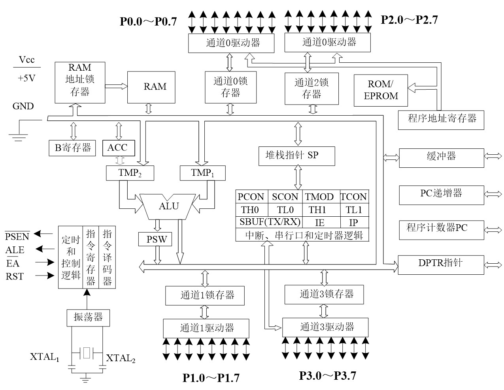

### 寄存器组

#### PSW程序状态字寄存器

| 7    | 6        | 5        | 4            | 3            | 2    | 1    | 0        |
| ---- | -------- | -------- | ------------ | ------------ | ---- | ---- | -------- |
| Cy   | AC       | F0       | RS1          | RS0          | OV   | -    | P        |
| 进位 | 辅助进位 | 用户标志 | 寄存器组选择 | 寄存器组选择 | 溢出 | -    | 奇偶标志 |

##### 工作寄存器组

| RS1, RS0   | 寄存器组号 | 片内RAM地址 |
| ---------- | ---------- | ----------- |
| 00(复位值) | 0          | 00~07H      |
| 01         | 1          | 08~0FH      |
| 10         | 2          | 10~17H      |
| 11         | 3          | 18~1FH      |

#### SP堆栈指针

```verilog
module SP_reg();
    reg [7:0] SP;
    always @(posedge clk) begin
        if (!rstn) begin
            SP <= 07H;
        end
        else if (PUSH) begin
            SP <= SP + 1;				//先加后存
            RAM[SP] <= input_data;
        end
        else if (POP) begin
            output_data <= RAM[SP];
            SP <= SP - 1;
        end
    end
endmodule
```

### 存储器结构

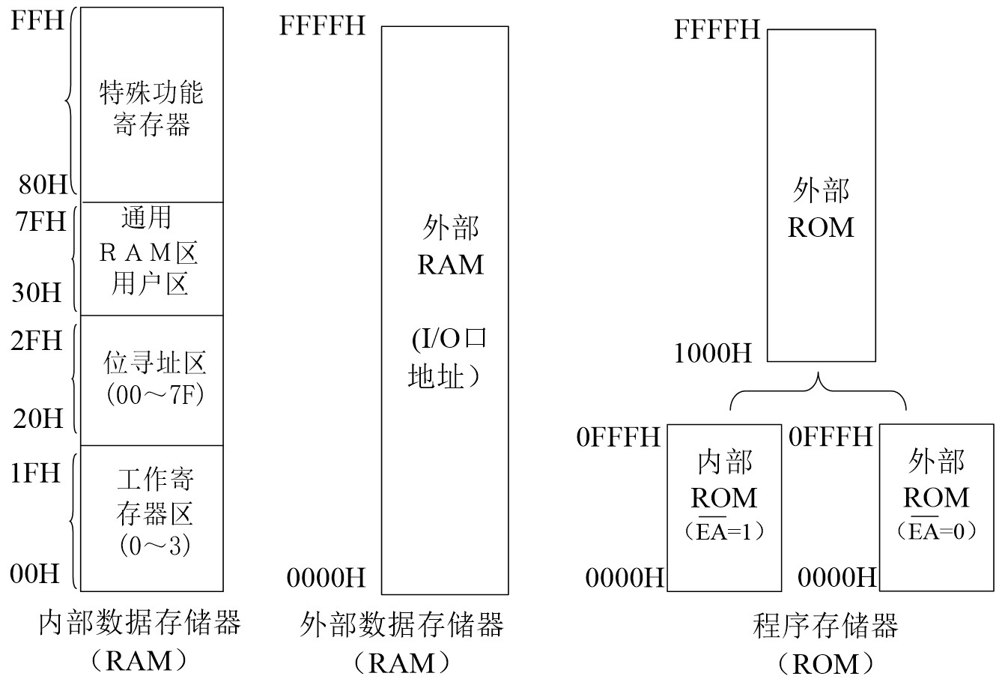

- 全局复位`0000H`
- 中断入口地址`3+8n`(n为中断向量号)

##### 特殊功能寄存器(SFR)地址

| 标识符号                    | 地址(十六进制) | 名称                       |
| --------------------------- | -------------- | -------------------------- |
| ACC                         | 0E0            | 累加器                     |
| B                           | 0F0            | B寄存器                    |
| [PSW](#PSW程序状态字寄存器) | 0D0            | 程序状态字                 |
| [SP](#SP堆栈指针)           | 81             | 堆栈指针                   |
| DPTR                        | 82,83          | 数据指针(16位)             |
| [IE](#IE中断允许寄存器)     | 0A8            | 中断允许控制寄存器         |
| [IP](#IP中断优先寄存器)     | 0B8            | 中断优先控制寄存器         |
| P0                          | 80             | P0口寄存器                 |
| P1                          | 90             | P1口寄存器                 |
| P2                          | 0A             | P2口寄存器                 |
| P3                          | 0B             | P3口寄存器                 |
| PCON                        | 87             | 电源控制及波特率选择寄存器 |
| SCON                        | 98             | 串行口控制寄存器           |
| SBUF                        | 99             | 串行口数据缓冲寄存器       |
| [TCON](#TCON控制寄存器)     | 88             | 定时控制寄存器             |
| TMOD                        | 89             | 定时器方式选择寄存器       |
| TL0                         | 8A             | 定时器0低8位               |
| TH0                         | 8C             | 定时器0高8位               |
| TL1                         | 8B             | 定时器1低8位               |
| TL1                         | 8D             | 定时器1高8位               |

### 工作时序

$$
1机器周期=6状态周期(时钟周期)=12震荡周期
$$

## 并行I/O端口

### P0

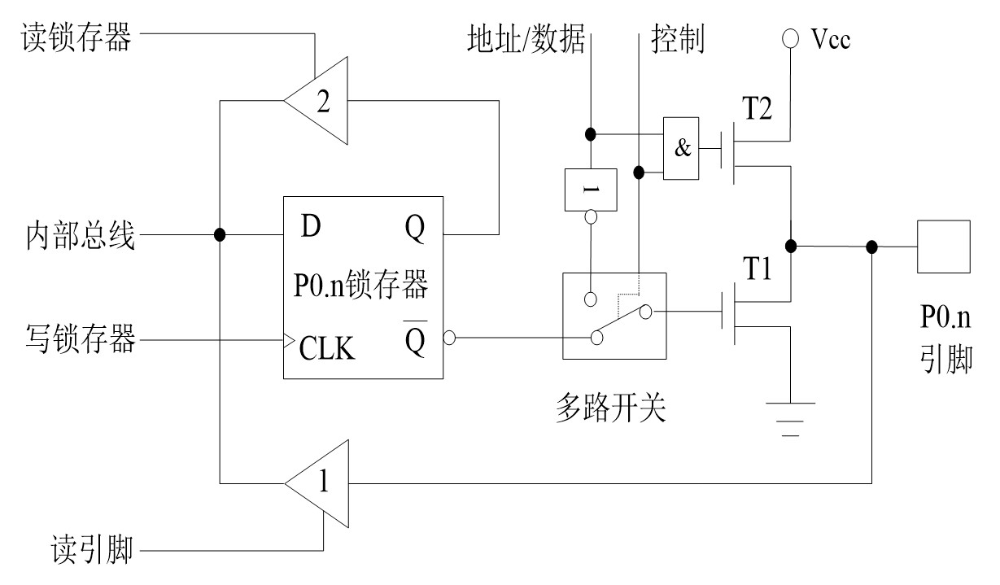

#### 1.作为普通I/O口

- 输出为漏极开路电路, **需要外接上拉电阻**(5k~10k)才可正常工作
- 输入需要**先将写锁存器中写入'1'**才可正常读入

#### 2. 作为地址/数据总线

- 输出为推挽式输出, 提高负载能力, 无需外接上拉电阻
- 输入同普通I/O口

### P1

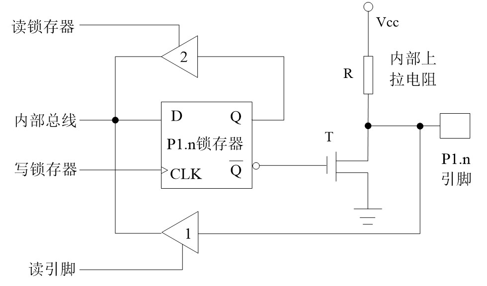

P1口与P0区别主要在P1口用内部上拉电阻代替了P0中的T1场效应管. 

- 读引脚时需要**先将写锁存器中写入'1'**才可正常读入

### P2

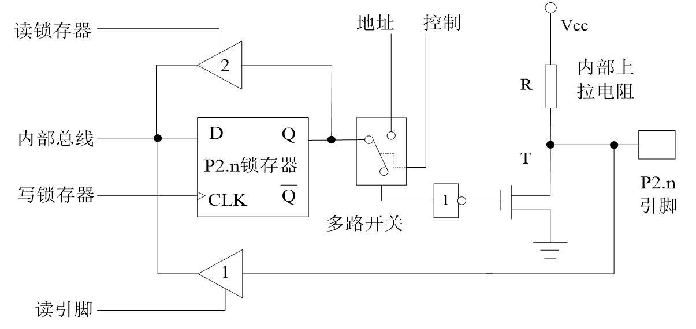

P2口与P1口主要区别为P2口可作为高8位地址输出. 

- 读引脚时需要**先将写锁存器中写入'1'**才可正常读入

### P3

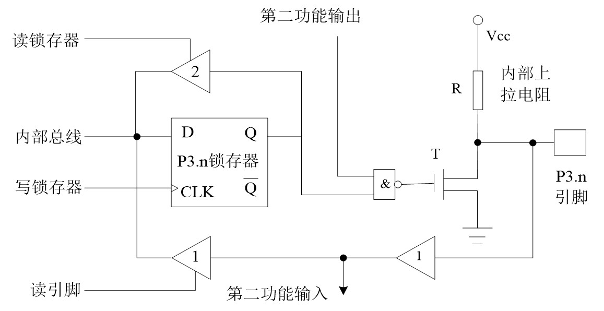

P3口与P1口主要区别为P3口需要配置处于第一还是[第二功能](#P3口第二功能)的运行状态下, 其它与P1口一样

## 中断系统

### 中断相关寄存器

#### TCON寄存器

| 7    | 6    | 5    | 4    | 3    | 2    | 1    | 0    |
| ---- | ---- | ---- | ---- | ---- | ---- | ---- | ---- |
| TF1  | TR1  | TF0  | TR0  | IE1  | IT1  | IE0  | IT0  |

- TF1/0: 定时/计数器T1/0的溢出中断标记. 由硬件置位
- TR1/0: 定时/计数器T1/0的开关控制位. 高电平开启, 低电平关闭. 由软件置位
- IE1/0: INT1/0中断请求标志位. 由硬件置位
- IT1/0: INT1/0触发方式控制位. 高电平为负跳变触发, 低电平为负电平触发. 由软件置位
- 具体见[定时/计数器部分](#TCON控制寄存器)

#### SCON寄存器

| 7    | 6    | 5    | 4    | 3    | 2    | 1    | 0    |
| ---- | ---- | ---- | ---- | ---- | ---- | ---- | ---- |
| SM0  | SM1  | SM2  | REN  | TB8  | RB8  | TI   | RI   |

- TI/RI: 串行口发送, 接收中断
- 具体见[串口通信部分](#SCON串口控制寄存器)

#### IE中断允许寄存器

| 7    | 6    | 5    | 4    | 3    | 2    | 1    | 0    |
| ---- | ---- | ---- | ---- | ---- | ---- | ---- | ---- |
| EA   | -    | -    | ES   | ET1  | EX1  | ET0  | EX0  |

- EA: 中断总控制位
- ES: 串行口中断控制位
- ET1/0: 定时/计数器T1/0中断控制位
- EX1/0: 外部中断1/0中断控制位
- *以上均为高电平开启中断, 低电平关闭*

#### IP中断优先寄存器

| 7    | 6    | 5    | 4    | 3    | 2    | 1    | 0    |
| ---- | ---- | ---- | ---- | ---- | ---- | ---- | ---- |
| -    | -    | -    | PS   | PT1  | PX1  | PT0  | PX0  |

- PS: 串行口
- PT1/0: 定时/计数器T1/0
- PX1/0: 外部中断1/0

**默认中断优先级:** 根据中断号小的优先处理

IP寄存器中置1的中断情况为高优先级, 会被优先处理(多个高优先级根据默认中断优先排序), 再处理低优先级的中断

### 中断编程

#### 主程序

```c
void main()
{
    EA=1;		// 打开总中断
    EX0=1;		// 打开外部中断0
    IT0=1;		// 设置触发方式为下降沿
    ...
    while(1);
}
```

中断服务程序

```c
void INT() interrupt 中断号 using 寄存器工作组
{
    EA=0;		// 根据需要关闭总中断或者对应中断
    ...			// 中断服务程序
    EA=1;		// 重新开启中断
}
```

| 中断号 | 中断源    | 中断向量(8n+3) |
| ------ | --------- | -------------- |
| 0      | 外部中断0 | 0003H          |
| 1      | 定时器0   | 000BH          |
| 2      | 外部中断1 | 0013H          |
| 3      | 定时器1   | 001BH          |
| 4      | 串行口    | 0023H          |

## 定时/计数器

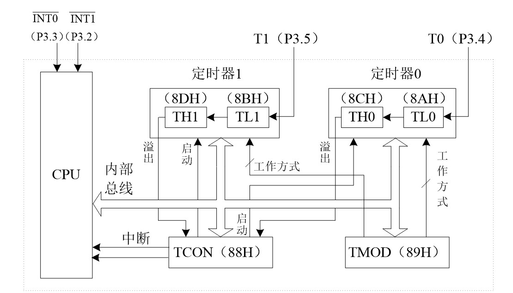

8051内部有两个16位可编程定时/计数器, 定时器脉冲来自**机器周期**(晶振频率的12分频)

### 相关寄存器

#### TCON控制寄存器

| 7    | 6    | 5    | 4    | 3    | 2    | 1    | 0    |
| ---- | ---- | ---- | ---- | ---- | ---- | ---- | ---- |
| TF1  | TR1  | TF0  | TR0  | IE1  | IT1  | IE0  | IT0  |

可按位寻址

- TF1/0: 定时/计数器T1/0的溢出中断标记. 
  - 中断服务方式: 由硬件自动置位, 清除
  - *软件查询方式: 需由软件清0*
- TR1/0: 定时/计数器T1/0的开关控制位. 高电平开启, 低电平关闭. 由软件置位
- IE1/0: INT1/0中断请求标志位. 由硬件置位
- IT1/0: INT1/0触发方式控制位. 高电平为负跳变触发, 低电平为负电平触发. 由软件置位

#### TMOD工作方式寄存器

| 7    | 6    | 5    | 4    | 3    | 2    | 1    | 0    |
| ---- | ---- | ---- | ---- | ---- | ---- | ---- | ---- |
| GATE | C/~T | M1   | M0   | GATE | C/~T | M1   | M0   |
| 定时 | 计数 | 器   | 1    | 定时 | 计数 | 器   | 0    |

- M1,0: 工作方式选择
- C/~T: 定时/计数控制. 0为定时方式, 1为计数方式
- GATE: 0时定时器不受外部控制, 1时定时器需要在P3.2(P3.3)引脚处于高电平时开始计数

### 工作方式

#### 方式0

13位定时/计数器, 最大数值8192

#### 方式1

16位定时/计数器, 最大数值65536

#### 方式2

自动重装8位定时/计数器, 最大数值256

TH作为初值寄存器, TL用于计数, 每次溢出后自动将TH装载入TL中

#### 方式3

只适用于定时/计数器T0, 如果设置T1在方式3下则不会工作. 

TH和TL分别为一个8位定时/计数器, 最大数值256

- TH占用原先T1的中断请求位, 所以T1一定不能有中断请求以免混乱, 但可工作在方式0,1,2下
- TH只能是定时器, TL可以设置为计数器

### 编程方式

#### 中断方式

##### 主程序

```C
void main()
{
    TMOD = 0x01;				// 设置定时器0为工作方式1
    TH0 = (65536 - 50000)/256;	// 使用(最大值-计数时长)/256方式赋值高8位
    TL0 = (65536 - 50000)%256;	// 示例中为50ms
    EA = 1;					    // 开总中断
    ET0 = 1;					// 开T0中断
    TR0 = 1;					// 启动T0
    while(1);
}
```

##### 定时器0中断服务程序

```c
void tim0() interrupt 1
{
    TH0 = (65536 - 50000)/256;
    TL0 = (65536 - 50000)%256;	 // 重新赋初值
    ...						   	 // 服务程序
}
```

#### 查询方式

```c
void main()
{
    TMOD = 0x10;
    TR1 = 1;
    while(1)
    {
        TH1 = (65536 - 50000)/256;	// 装入初值
        TL1 = (65536 - 50000)%256;
        while(!TF1);				// 等待溢出
        ...
        TF1 = 0;					// 软件清除标志位
    }
}
```

## 串口通信接口

### 相关寄存器

#### SCON串口控制寄存器

| 7    | 6    | 5    | 4    | 3    | 2    | 1    | 0    |
| ---- | ---- | ---- | ---- | ---- | ---- | ---- | ---- |
| SM0  | SM1  | SM2  | REN  | TB8  | RB8  | TI   | RI   |

- SM0/1: 串口工作方式选择
    - {SM0,SM1}=工作方式

- SM2: 多机通信控制位
    - 0: 单片机通信
    - 1: 多机通信

- REN: 接收允许位
    - 高电平允许

- TB8/RB8: 发送/接收数据第9位
    - SM2=0, 则TB8/RB8为发送/接收数据的奇偶标志位
    - SM2=1
        - TB8/RB8=1, 则发送/接收的是地址信息
        - TB8/RB8=0, 则发送/接收的是数据信息

- TI/RI: 发送/接收中断标志. 硬件置位, 软件清位

#### PCON电源控制寄存器

| 7    | 6     | 5    | 4    | 3    | 2    | 1    | 0    |
| ---- | ----- | ---- | ---- | ---- | ---- | ---- | ---- |
| SMOD | SMOD0 | LVDF | POF  | GF1  | GF0  | PD   | IDL  |

- SMOD: 高电平时波特率翻倍, 低电平时波特率为原值

#### SBUF串口缓冲寄存器

SUBF包括两个8位寄存器, 字节地址均为99H. 分为发送寄存器和接收寄存器, 在物理结构上是完全独立的, 依靠写入还是读取区分两个寄存器. 

### 工作方式

#### UART方式0

UART 作为一个8位的移位寄存器使用, 波特率为$F_{osc}/12$.

RXD发送数据(从LSB开始), TXD发送同步移位脉冲. 不支持全双工

输入/出时序图: 

<table>
<tbody>
<tr>
<td style="width: 50%;">
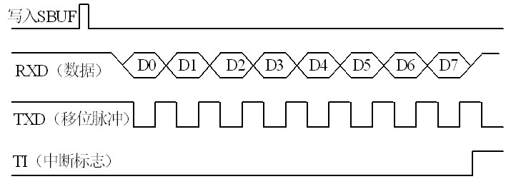
</td>
<td style="width: 50%;">
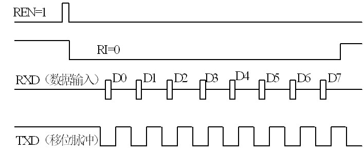
</td>
</tr>
<tr>
<td style="width: 50%;" align="center">uart0输出</td>
<td style="width: 50%;" align="center">uart0输入</td>
</tr>
</tbody>
</table>

#### UART方式 1

10位数据的异步通信口.

TXD为数据发送引脚, RXD为数据接收引脚.

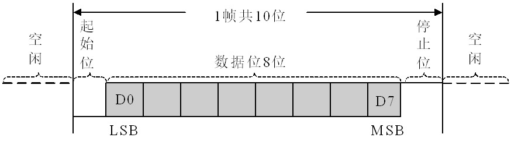

#### UART方式2

方式2为11位数据的异步通信口, 波特率为$F_{osc}/64*(SMOD+1)$.

TXD为数据发送引脚, RXD为数据接收引脚.

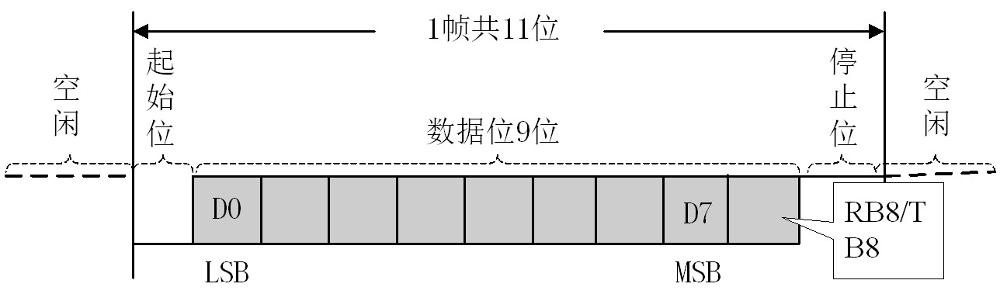

#### UART方式3

除了波特率可调外与方式2完全相同

### T1定时器波特率生成

$$
方式1或3波特率 = \frac{F_{osc}}{32 \times 12 \times (256-TH1)} \times (SMOD+1)
$$


