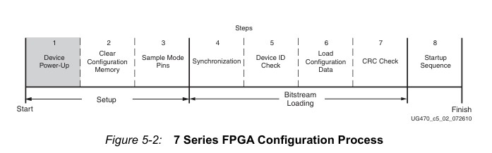

> 本文是[bin文件解析](../bin文件解析)的姊妹篇

## 启动配置序列

众所周知，FPGA是个掉电即丢失的逻辑芯片，其上的用户逻辑通常存储于外置的非易失性存储器中（通常是flash），而负责将用户逻辑从片外加载至片内的是一个纯硬件状态机，也被称为配置控制逻辑（Configuration Control Logic）。

根据[ug470](https://docs.amd.com/v/u/en-US/ug470_7Series_Config)中所述，配置过程分为8个阶段



### 1.上电

上电部分交给单板硬件设计的哥们详细看啦，主要就是上电时序和电压。

### 2.清除配置内存

全局重置，包括：

- 配置存储器
- BRAM
- 触发器
- 除了少数配置引脚之外，其余IO引脚置为高阻态

### 3.采样模式引脚

采集引脚`M[2:0]`的状态，确定采用何种配置模式

|配置模式	        |M[2:0]	|总线位宽	|CCLK方向|
|:---:              |:---:  |:---:      |:---:   |
|Master Serial	    |000	|X1	        |输出|
|Master SPI	        |001	|X1，X2，X4	|输出|
|Master BPI	        |010	|X8，X16	|输出|
|Master SelectMAP	|100	|X8，X16	|输出|
|JTAG   	        |101	|X1	        |无效|
|Slave SelectMAP	|110	|X8，X16，X32	|输入|
|Slave Serial	    |111	|X1	        |输入|

> 无论处于何种配置模式下，均可以使用JTAG模式进行调试，并且优先级最高。
> 接下来默认使用`Master SPI`模式，因为这种模式最普遍。

### 4.同步

#### 总线位宽识别

对于`Master SPI`、`Master BPI`、`Master SelectMAP`、`Slave SelectMAP`四个模式，总线宽度默认初始值为8bit，真正的总线宽度将会由2个32bit的数据`00 00 00 BB` `11 22 00 44`来自动判断。

对于到来的总线数据的低8位，如果第一次是`0xBB`，第二次是`0x11`，则该总线位宽为8位。如果第二次是`0x22`，则总线位宽为16位。如果第二次是`0x44`，则总线位宽为32位。确认外部总线宽度后，将切换到对应的总线宽度并锁定。

#### 同步字识别

在正式开始配置前，必须向配置逻辑发送一个特殊的32位同步字`AA 99 55 66`，提醒器件即将到来的配置数据，并将配置数据与内部配置逻辑对齐。同步前配置输入引脚上的任何数据都会被忽略，自动检测总线位宽序列除外。

### 5.设备ID检查

配置开启前的最后检查，要配的设备对不对。ID的构成如下:

```text
vvvv：fffffff：aaaaaaaaa：ccccccccccccc1 
    V=版本 
    f=7位系列代码 
    A=9位阵列代码(包括4位子系列和5位设备代码) 
    C=公司代码
```

> IDCODE可以在ug470中找到，或者去[此网站](https://bsdl.info/index.htm)搜索

### 6.加载配置数据

终于开始正式加载用户逻辑了，具体加载流程可以看bin文件解析中[FDRI配置帧区](../bin文件解析/#fdri-配置帧区)。

### 7.CRC校验

加载完毕后最终检验，CRC校验将会包括所有写入的配置帧。

### 8.启动序列

根据用户配置的启动序列完成启动前准备，序列内容包括：

- 等待MMCM锁定
- 等待DCI匹配
- 使能全局写入启用信号（GWE），开启全部RAM和FF
- 释放全局三态信号，开启全部IO
- 释放`DONE`引脚
- 拉高End Of Startup(EOS)断言信号


## 多镜像启动

多镜像启动功能主要用于需要在线升级的设计中。在升级过程中，如果存在某些意外情况导致升级失败（比如突然掉电、被静电打坏），需要有一个稳定的镜像负责基本的系统启动和升级功能，以防直接变砖需要拿来jtag烧进去。

这个稳定的镜像常被称为`Golden`镜像，实际运行的镜像被称为`Update`镜像。一般在Flash中的地址布局为：

```text
0x00000000 ┌──────────────────────────┐
           │                          │
           │          GOLDEN          │
           │                          │
0x01000000 ├──────────────────────────┤
           │                          │
           │          UPDATE          │
           |                          |
0x01FFFFFF └──────────────────────────┘
```

### Golden入口

上电复位释放后，Master SPI 从 Flash 地址 `0x00000000` 开始读取。Golden区域开头的配置如下：

```text
0x00000130: AA995566  SYNC
0x00000134: 20000000  NOP
0x00000138: 3003E001  TYPE-1 WRITE BSPI count=1, data=0x0000026C
0x00000140: 30008001  TYPE-1 WRITE CMD count=1, data=0x00000012; CMD=0x00000012
0x00000148: 20000000  NOP
0x0000014C: 30022001  TYPE-1 WRITE TIMER count=1, data=0x40010000
0x00000154: 30020001  TYPE-1 WRITE WBSTAR count=1, data=0x00010000; WBSTAR=0x00010000
0x0000015C: 30008001  TYPE-1 WRITE CMD count=1, data=0x0000000F; CMD=0x0000000F (IPROG)
0x00000164: 20000000  NOP
```

对应xdc配置：

```text
set_property BITSTREAM.CONFIG.CONFIGFALLBACK ENABLE [current_design]
set_property BITSTREAM.CONFIG.TIMER_CFG 0x00010000 [current_design]
set_property BITSTREAM.CONFIG.NEXT_CONFIG_ADDR 0x01000000 [current_design]
```

#### 看门狗计时器

`0x0000014C`处为看门狗寄存器写入指令，写入值为`40010000`，表示开启配置时看门狗，看门狗超时值为`0x10000`。

该看门狗负责整个配置流程的时限，只有进入配置序列最后阶段`DONE`信号拉高后，才会喂狗并关闭该定时器。

> 看门狗时钟为内部的一个50MHz左右的时钟经256分频后得到的，ug中频率声明为`125KHz-380KHz`。

#### 跳转Update镜像

`0x00000154`处写入热启动镜像地址，注意该处是实际flash地址的高位，实际地址由该值左移8位得到`ADDR = 0x00010000 << 8 = 0x01000000`。

`0x0000015C`处写入`IPROG`指令，该指令是开始FPGA内部重配置。配置逻辑会重新开始一轮类似上电配置的流程，包括复位内部逻辑（不包括载入控制逻辑）、读取同步字、配置用户逻辑、校验等等。

### Update镜像

Update 镜像从 Flash `0x01000000` 开始。Update区域的开头配置如下：

```text
0x01000130: AA995566  SYNC
0x01000134: 20000000  NOP
0x01000138: 3003E001  TYPE-1 WRITE BSPI count=1, data=0x0000026C
0x01000140: 30008001  TYPE-1 WRITE CMD count=1, data=0x00000012; CMD=0x00000012 (RESERVED)
0x01000148: 20000000  NOP
0x0100014C: 30022001  TYPE-1 WRITE TIMER count=1, data=0x40010000
0x01000154: 30020001  TYPE-1 WRITE WBSTAR count=1, data=0x00000000; WBSTAR=0x00000000
0x0100015C: 30008001  TYPE-1 WRITE CMD count=1, data=0x00000000; CMD=0x00000000 (NULL)
0x01000164: 20000000  NOP
```

对比Golden镜像的相同位置，Update镜像没有写`WBSTAR`和`IPROG`，这表示它不会跳转至别处启动了。之后就是完整的启动流程。

### Update失败时的回退

> 以上都是前菜，也就是“不出意外的情况下”，那么接下来才是重头戏，“诶呀！坏了”会怎么办。

前文中有提到，在整个配置过程中有很多校验部分，包括CRC、IDCODE等等，如果发生了错误，那么配置流程将会直接停止，整块FPGA也会表现为`NOT Programed`。这并不是生产环境所希望，甚至说是禁止发生的。由于jtag下载线不是随时可用的，jtag下载口可能都是被封在设备内部的，重新烧录这一块“砖”会变得很麻烦，所以我们也需要“自动救砖”模块。

xdc配置：
```text
set_property BITSTREAM.CONFIG.CONFIGFALLBACK ENABLE [current_design]
```

对应bin文件中：

```text
0x010001AC: 3000C001  TYPE-1 WRITE MASK count=1, data=0x00000001
0x010001B4: 3000A001  TYPE-1 WRITE CTL0 count=1, data=0x00000001
```

在`0x010001AC`和`0x010001B4`处共同写入了`CTL0`寄存器，该寄存器中`[10]`位负责控制`fallback`，即配置失败是是否返回默认比特流（Golden）。注意该处的使能是**低电平使能**。

> 虽然ug470中写着默认值为1，但是在开启xdc中`set_property BITSTREAM.CONFIG.CONFIGFALLBACK ENABLE [current_design]`后的比特流并不会对该位进行修改，如上一个代码块中所示。如果不在xdc中开启反而会显式往该位写1进行关闭操作，二进制文件中为：`3000c001 00000401 3000a001 00000401`。

如果Update在配置过程中发生CRC错误、IDCODE不匹配、看门狗超时或同步字错误，配置控制逻辑将自动从`0x00000000`处开始重配置，相关信息将会保存至`BOOTSTS`寄存器中。

下面列举几种可能的错误情形：

| update情况 | 回退路径 |
| ---------- | -------- |
| 没有update镜像 | golden看门狗超时 |
| update镜像存在错误 | CRC校验错误 |
| update镜像不完全   | update看门狗超时 |
| update镜像存在两个版本 | CRC校验错误 |
| update镜像版本错误 | IDCODE校验错误 |
| ...                | ...            |

虽然看门狗定时器只有一个，但是还是建议golden和update中都设置一下，以防根本没有update镜像导致直接卡死。

在fallback状态下，硬件将忽略golden中的跳转`IPROG`命令和硬件看门狗配置，如果golden本身存在问题无法完成启动流程，那么就真没救了。

