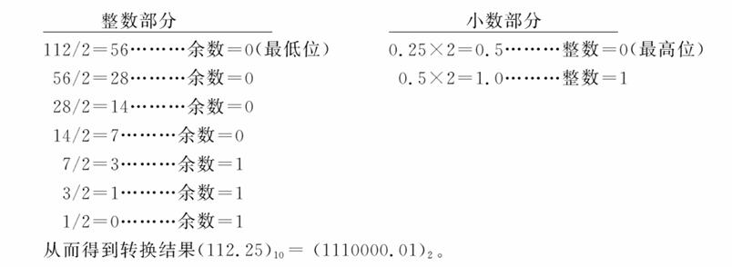
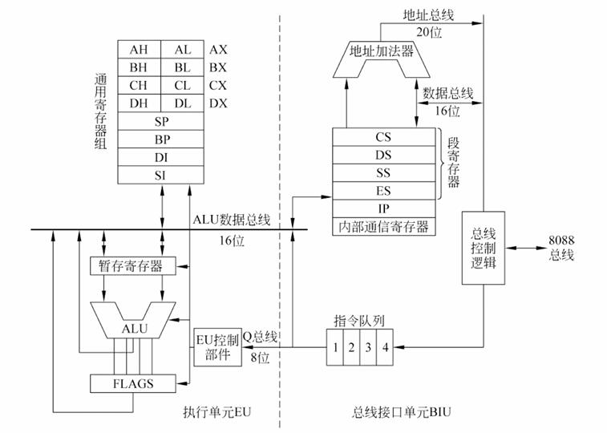
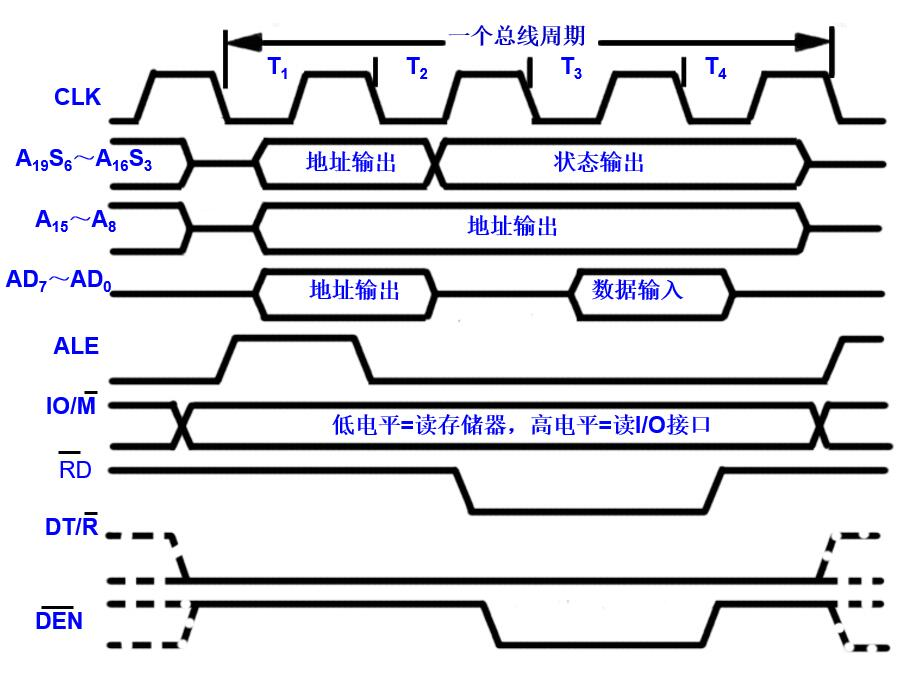
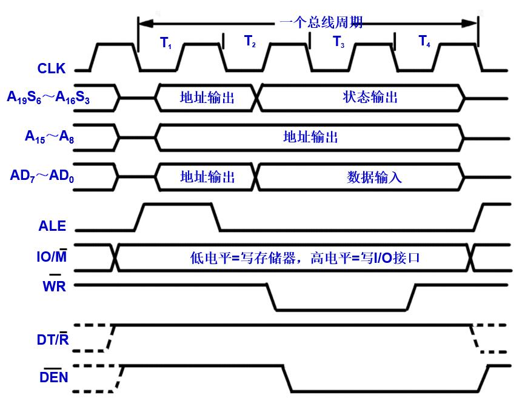
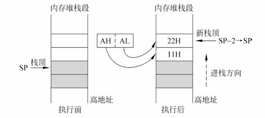
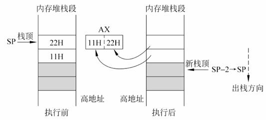
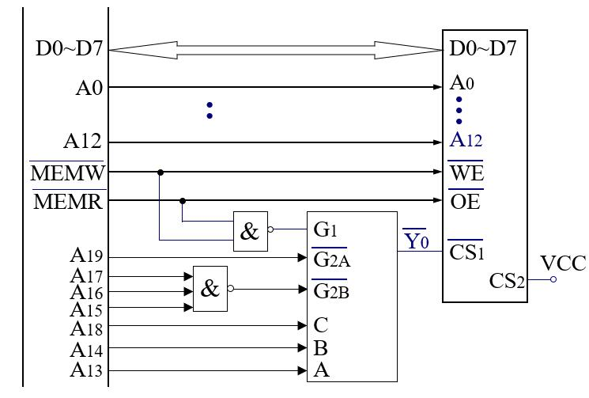

## 一 基础知识概论
### 1 二进制、十进制、十六进制间的相互转换
主要是二-十进制转换: **整数部分除2取余, 小数部分乘2取整**


### 2 原反补码转换
- 原码: 用第一位表示符号位, 其余位表示数值
- 反码: 正数的反码与原码相同, 负数的反码是对原码除符号位外的各位取反
- 补码: 正数的补码与原码相同, 负数的补码是对原码的各位取反, 然后加1

### 3 BCD码, ASCII码
- BCD码: 用4位二进制数表示一个十进制数的一位
- ASCII码: 用7位或8位二进制数表示一个字符

> ASCII码中, *0-9*--*30H-39H*, *A-Z*--*41H-5AH*, *a-z*--*61H-7AH*


## 二 微处理器及总线的概念
### 1 微处理器的基本结构


#### 1.1 执行单元EU
执行单元EU的主要功能是: 执行指令, 分析指令, 暂存中间运算结果并保留结果的特征. 它由**算术逻辑单元(运算器)ALU**、**通用寄存器**、**标志寄存器**和EU控制电路组成. EU在工作时不断地从指令队列中取出指令代码, 对其译码后产生完成指令所需要的控制信息. 数据在ALU中进行运算, 运算结果的特征保留在标志寄存器FLAGS中. 
#### 1.2 总线接口单元BIU
总线接口单元BIU负责CPU与存储器、I/O接口之间的信息传送. 它由**段寄存器**、**指令指针寄存器**、指令队列、地址加法器以及总线控制逻辑组成. 8088的指令队列长度为4字节, 8086的指令队列长度为6字节. 

### **2 8086内部寄存器**
8086CPU内部有14个16位寄存器, 其中有8个16位通用寄存器, 4个16位变址寄存器, 1个16位指令指针寄存器, 1个16位标志寄存器.
#### 2.1 通用寄存器
##### 数据寄存器
- AX(Accumulator): 累加器, 用于存放运算结果
- BX(Base): 基址寄存器, 用于存放数据存储区的基地址
- CX(Count): 计数寄存器, 用于存放循环次数
- DX(Data): 数据寄存器, 用于存放数据

##### 地址指针寄存器
- SP(Stack Pointer): 栈指针寄存器, 用于存放栈顶地址
- BP(Base Pointer): 基址指针寄存器, 用于存放栈基地址

##### 变址寄存器
- SI(Source Index): 源变址寄存器, 用于存放源数据地址
- DI(Destination Index): 目的变址寄存器, 用于存放目的数据地址

#### 2.2 段寄存器
- CS(Code Segment): 代码段寄存器, 用于存放代码段的段地址
- DS(Data Segment): 数据段寄存器, 用于存放数据段的段地址
- SS(Stack Segment): 栈段寄存器, 用于存放栈段的段地址
- ES(Extra Segment): 附加段寄存器, 用于存放附加数据段的段地址

#### 2.3 控制寄存器
##### 指令指针寄存器IP
IP(Instruction Pointer)称为指令指针寄存器, 用以存放预取指令的偏移地址. CPU取指令时总是以CS为段基址, 以IP为段内偏移地址. 当CPU从CS段中偏移地址为(IP)的内存单元中取出指令代码的一个字节后, IP*自动*加1, 指向指令代码的下一个字节. *用户程序不能直接访问IP.*

##### 标志寄存器FLAGS
FLAGS称为标志寄存器或程序状态字(PSW), 它是16位寄存器, 但只使用其中的9位. 这9位包括6个状态标志和3个控制标志.
###### 状态标志位
| 标志位 | 名称 | 说明 |
| :-- | :-- | :-- |
| CF | 进位标志 | 加(减)法运算时, 若最高位向前有进(借)位, 则为1 |
| PF | 奇偶标志 | 运算结果的低8位中1的个数为偶数时, 则为1 |
| AF | 辅助进位标志 | 加(减)法运算时, 若第4位向第5位中有进位, 则为1 |
| ZF | 零标志 | 运算结果为0时, 则为1 |
| SF | 符号标志 | 运算结果的最高位为1时, 则为1 |
| OF | 溢出标志 | 运算结果超出了带符号数的表示范围时, 则为1 |

###### 控制标志位
| 标志位 | 名称 | 说明 |
| :-- | :-- | :-- |
| TF | 陷阱标志 | 当为1时激活单步执行指令方式, 每条指令运行结束后自动产生中断 |
| IF | 中断允许标志 | 当为1时允许CPU响应外部中断请求 |
| DF | 方向标志 | 当为1时串传送指令中SI和DI自动减1, 为0时自动加1 |

### 3 8086的寻址方式
8086对外地址线有20位, 其计算方式为: 
<p align="center">物理地址 = 段基址 << 4 + 段内偏移</p>

### 4 8086的两种工作模式
8086CPU有两种工作模式: 最大模式和最小模式.
- 当MN/~MX=1时, CPU工作在最小模式下. 此时, 构成的系统中只允许有一个处理器, 所有控制信号直接由8086提供. 
- 当MN/~MX=0时, CPU工作在最大模式下. 此时, 构成的系统中除了有8086之外, 还可以接另外的处理器（如8087数学协处理器）. 在最大模式下, CPU并不直接向外界提供全部控制信号, 而由S0、S1、S2通过8288总线控制器提供. 

### 5 8086的最小模式下总线引脚结构
#### A16~A19/S3~S6
地址/状态复用引脚（输出、三态）. 
当8088输出地址时, 这4个引脚上送出地址的最高4位A16～A19. 
当8088输出状态时, 这4个引脚送出状态信号S3～S6, 其中S6始终为逻辑0, S5指示中断允许标志位IF的状态, S4、S3的指示CPU当前正在使用的段寄存器, 其编码见下表. 
| S4 | S3 | 段寄存器 |
| :-- | :-- | :-- |
| 0 | 0 | ES |
| 0 | 1 | SS |
| 1 | 0 | CS或未使用 |
| 1 | 1 | DS |

#### A8~A15
地址（输出、三态）. 
CPU访问存储器或I/O接口时, 从这些引脚送出地址信号A8～A15. 

#### AD0~AD7
地址/数据复用引脚（双向、三态）。
当ALE=1时，这些引脚上传输的是地址，而不是数据。

#### IO/~M
IO/存储器控制（输出、三态）。
低电平表示CPU当前访问的是存储器，高电平表示访问的是I/O接口。

#### ~WR
写控制（输出、三态）。
低电平表示CPU正在对存储器或I/O接口进行写操作。

#### DT/~R
数据传送方向控制（输出、三态）。
用于确定数据传送的方向。高电平时表示CPU向存储器或I/O接口发送数据；低电平表示CPU从存储器或I/O接口接收数据。此信号常用于控制总线收发器的传送方向。

#### ~DEN
数据允许（输出、三态）。
低电平表示数据总线上有有效数据。它在每次访问内存或I/O接口以及在中断响应期间有效。它常用作数据总线驱动器的片选信号。

#### ALE
地址锁存允许（输出、三态）。
高电平表示地址线上有效地址。它常作为锁存控制信号将A0～A19锁存到地址锁存器。

#### ~RD
读控制（输出、三态）。
低电平表示CPU正在对存储器或I/O接口进行读操作。

#### READY
准备就绪（输入、高电平有效）。
它是被访问的内存或I/O接口发出的响应信号，高电平表示存储器或I/O设备已准备好，可以进行数据传送。若存储器或或I/O设备没准备好，则可将此引脚拉低。CPU在总线周期的T3采样READY引脚，若为低电平，CPU将自动插入1个或多个等待周期Tw。直到READY变为高电平后，CPU才脱离等待状态，继续执行后续操作。

#### INTR
可屏蔽中断请求（输入、高电平有效）。
CPU在每条指令的最后一个周期对此引脚进行采样，以决定是否进入中断响应周期。此信号可用软件屏蔽。

#### NMI
非屏蔽中断请求（输入、上升沿有效）。
此信号不能用软件屏蔽。若此信号有效，CPU在当前指令执行结束后就进入NMI中断过程。

#### RESET
系统复位（输入、高电平有效）。
为使CPU完成内部复位过程，该信号至少要保持4个时钟周期。复位后CPU内部寄存器的状态如下表所示。当RESET返回低电平时，CPU将重新启动。 

#### ~INTA
中断响应（输出、低电平有效）。
CPU对INTR信号的响应。在响应过程中，CPU在此引脚连续送出两个负脉冲，可用作外部中断源的中断向量码的读选通信号。

#### HOLD
总线保持请求（输入、高电平有效）。
当某一总线主控设备要占用系统总线时，通过此引脚向CPU提出请求。

#### HLDA
总线保持响应（输出、高电平有效）。
CPU对HOLD请求信号的响应：所有三态引脚变为高阻态，同时使此引脚变为高电平，表示处理器已放弃对总线的控制。当CPU检测到HOLD信号无效后，就立即使此引脚变为低电平，同时恢复对总线的控制。

#### ~SS0
系统状态信号输出。
它与IO/#M和DT/#R信号决定了最小模式下当前总线周期的状态。三者的状态组合所表示的处理器操作见下表。
| IO/~M | DT/~R | ~SS0 | 操作 |
| :-- | :-- | :-- | :-- |
| 1 | 0 | 0 | 发出中断响应信号 |
| 1 | 0 | 1 | 读I/O端口 |
| 1 | 1 | 0 | 写I/O端口 |
| 1 | 1 | 1 | 暂停 |
| 0 | 0 | 0 | 取指令 |
| 0 | 0 | 1 | 读内存 |
| 0 | 1 | 0 | 写内存 |
| 0 | 1 | 1 | 无操作 |

### 6 总线及工作时序
#### 6.1 工作时序
总线周期：CPU完成一次访问内存（或接口）操作所需要的时间。
> 一个总线周期至少包括4个时钟周期

<table>
<tbody>
<tr>
<td style="width: 50%;">

</td>
<td style="width: 50%;">

</td>
</tr>
<tr>
<td style="width: 50%;" align="center">读总线周期</td>
<td style="width: 50%;" align="center">写总线周期</td>
</tr>
</tbody>
</table>

#### 6.2 总线结构
- 根据传送信息的类型分：**数据总线**、**地址总线**和**控制总线**. 
- 按层次结构分: **CPU总线**、**系统总线**和**外部总线**.

## 三 8086指令系统
### 1 寻址方式
#### 1.1 立即寻址
用立即数表示操作数, 指令中直接给出操作数的值. 
```assembly
MOV AX, 1234H
```

#### 1.2 直接寻址
用指令中给出的地址作为操作数的地址. 
```assembly
MOV AX, [1234H]
```
> 注意"[  ]"用以表示地址而非数据

#### 1.3 寄存器寻址
以寄存器中的内容作为操作数. 
```assembly
MOV AX, BX
```

#### 1.4 寄存器间接寻址
以寄存器中的内容作为地址, 从该地址中取出数据. 
```assembly
MOV AX, [SI]
```

#### 1.5 寄存器相对寻址
以间址寄存器中的内容加上一个常数作为地址, 从该地址中取出数据. 
```assembly
MOV AX, [DATA+SI]
MOV AX, DATA[SI]
MOV AX, [SI]+DATA
```

#### 1.6 基址-变址寻址
以基址寄存器(BX/BP)和变址寄存器(SI/DI)的内容相加作为地址, 从该地址中取出数据. 
```assembly
MOV AX, [BX][SI]
```

#### 1.7 基址-变址-相对寻址
以基址寄存器(BX/BP)和变址寄存器(SI/DI)的内容相加, 再加上一个常数作为地址, 从该地址中取出数据. 
```assembly
MOV AX, [BX][SI]+DATA
MOV AX, [BX+DATA][SI]
```

#### 1.8 隐含寻址
操作数的地址在指令中隐含, 无需给出地址. 
如"MUL BX"指令, 操作数为AX和BX, 无需给出地址.


### 2 基本指令
#### 2.1 数据传送指令
##### **数据传送指令MOV**
```assembly
MOV dest, src
```
- 两操作数**字长必须相同**
- 两操作数不允许同时为存储器操作数
- 两操作数不允许同时为段寄存器
- 在源操作数是立即数时，目标操作数不能是段寄存器
- IP和CS不作为目标操作数，FLAGS一般也不作为操作数在指令中出现

##### **栈控制指令POP/PUSH**
```assembly
POP dest
PUSH src
```
- 指令的操作数必须是16位的
- 操作数可以是寄存器或存储器两单元，但不能是立即数
- PUSH CS指令合法，而POP CS指令非法
- PUSH和POP指令在程序中一般成对出现
- PUSH指令的操作方向是从高地址向低地址，而POP指令的操作正好相反

> 堆栈: 内存中一块特定区域
> 1. 每次存取都是一个字(16位)
> 2. 栈顶指针SP指向栈顶元素
> 3. PUSH: SP=SP-2, 再将数据存入栈顶
> 4. POP: 先取出栈顶数据, 再SP=SP+2
> 5. 遵循后进先出(LIFO)原则
> <table>
<tbody>
<tr>
<td style="width: 50%;">

</td>
<td style="width: 50%;">

</td>
</tr>
<tr>
<td style="width: 50%;" align="center">入栈</td>
<td style="width: 50%;" align="center">出栈</td>
</tr>
</tbody>
</table>

##### **寄存器交换指令XCHG**
```assembly
XCHG OPRD1, OPRD2
```
- 两操作数必须有一个是寄存器操作数
- 不允许使用段寄存器
- 两个操作数字长必须相同

#### 2.2 输入输出指令
##### **输入输出指令IN/OUT**
```assembly
IN acc, port
IN acc, DX

OUT port, acc
OUT DX, acc
```
- port为**8位**立即数端口地址
- DX寄存器中的值为**16位**端口地址

#### 2.3 取偏移地址指令
##### **取偏移地址指令LEA**
```assembly
LEA reg, mem
```
- 源操作数必须是一个存储器操作数
- 目标操作数必须是16为通用寄存器, 通常是间址寄存器

#### 2.4 算术运算指令
##### **加法指令ADD**
```assembly
ADD OPRD1, OPRD2
```
要求与[MOV指令](#数据传送指令mov)基本相同
- 段寄存器不能作为加法指令的操作数
- ADD指令对全部6个[状态标志位](#状态标志位)进行更新

##### **带进位加法指令ADC**
```assembly
ADC OPRD1, OPRD2
```
- 与ADD指令基本相同, 只是在加法运算时, **还会加上CF标志位的值**

##### **加1指令INC**
```assembly
INC OPRD
```
- OPRD不能是段寄存器或者立即数
- INC指令对全部除了CF以外5个[状态标志位](#状态标志位)进行更新

##### **无符号乘法指令MUL**
```assembly
MUL OPRD
```
- OPRD不能是立即数
- 乘法指令采用隐含寻址，隐含的是存放被乘数的累加器AL或AX及存放结果的AX(低16位)，DX(高16位)
- 更新CF和OF标志位

##### **有符号乘法指令IMUL**
```assembly
IMUL OPRD
```
- 同[MUL指令](#无符号乘法指令mul)

#### 2.5 逻辑运算指令
##### **测试指令TEST**
```assembly
TEST OPRD1, OPRD2
```
- 在不写回操作数的情况下，对两个操作数进行逻辑与运算
- **TEST指令对全部6个[状态标志位](#状态标志位)进行更新**

#### 2.6 转移指令
##### **无条件转移指令JMP**
```assembly
JMP label
```

##### **为0跳转指令JZ**
```assembly
JZ label
```

#### 2.7 循环控制指令
##### **循环指令LOOP**
```assembly
LOOP label
```
相当于
```assembly
DEC CX
JNZ label
```

#### 2.8 中断控制指令
##### **中断指令INT**
```assembly
INT n
```
- n为中断向量号
- INT 21H为[DOS系统调用](#DOS系统调用)

##### **中断返回指令IRET**
```assembly
IRET
```
- 用于中断服务程序结束时返回主程序

#### 2.9 处理器控制指令
##### **CLI/STI**
```assembly
CLI
STI
```
- CLI指令禁止CPU响应外部中断请求
- STI指令允许CPU响应外部中断请求

##### **CLD/STD**
```assembly
CLD
STD
```
- CLD指令将DF标志位清零, 串操作从低地址向高地址
- STD指令将DF标志位置1, 串操作从高地址向低地址

##### **HLT**
```assembly
HLT
```
- 使CPU进入停机状态

> 全部指令参考[附录](#全部指令)

## 四 汇编语言程序设计
### 1 特殊运算符
#### OFFSET
```assembly
MOV SI, OFFSET DATA
```
- 用于取得数据的偏移地址
- 相当于 `LEA SI, DATA`

#### SEG
```assembly
MOV AX, SEG DATA
```
- 用于取得数据的段地址

#### PTR
```assembly
CALL DWORD PTR [BX]
MOV AL, BYTE PTR [SI]
```
- 用于指定操作数的类型
- 多用于确保操作数的类型与指令要求的类型一致


### 2 数据定义伪指令
#### 2.1 格式
```assembly
[变量名] 伪操作 操作数 [, 操作数 ...]
DATA DB 11H,33H
STR DB 'HELLO'
DATA2 DW ?
```
#### 2.2 伪操作
1. DB(Data Byte): 每个操作数占**一个**字节
2. DW(Data Word): 每个操作数占**两个**字节
3. DD(Data Doubleword): 每个操作数占**四个**字节
4. DQ(Data Quadword): 每个操作数占**八个**字节
5. DT(Data Ten Bytes): 每个操作数占**十个**字节, 存储的是压缩BCD数

#### 2.3 重复操作符
```assembly
[变量名] 伪操作 重复次数 DUP (操作数 [, 操作数 ...])
DATA1 DB 20 DUP (30H)
DATA2 DB 20,0,20 DUP (?)
```

### 3 题目
#### 3.1 从键盘上读入一串大写字母，并显示相应的小写字母串
```assembly
DSEG SEGMENT
  STRING DB 20,0,20 DUP(?)
DSEG ENDS

CSEG SEGMENT
  ASSUME CS:CSEG,DS:DSEG
START: 	
  MOV AX,DATA
	MOV DS,AX       ; DS=DATA

	LEA DX,STRING
	MOV AH,0AH
	INT 21H         ; 读入字符串

	XOR CX,CX
	MOV CL,STRING+1
	MOV BX,DX       
LPP: 	
  MOV AL,[BX+2]
	INC BX          ; BX指向下一个字符

	ADD AL,20H      ; 大写转小写

	MOV DL,AL
	MOV AH,2
	INT 21H         ; 显示字符

	LOOP LPP

	MOV AH,4CH
	INT 21H         ; 中断
CSEG ENDS
	END START
```

#### 3.2 求从DATA开始的5个无符号字节数的和，结果放在SUM字单元里
```assembly
DSEG SEGMENT
  DATA DB 10,20,30,40,50
  SUM DW  ?
DSEG ENDS

CSEG SEGMENT
  ASSUME CS: CSEG,DS: DSEG 
START: 	
  MOV AX,DSEG
	MOV DS,AX       ; DS=DSEG

	LEA SI, DATA    ; SI作为数据指针
	MOV CX,5        ; CX作为计数器
	XOR AX,AX       ; AX作为累加器, 清零
LPP:	
  ADD AL,[SI]     ; 累加
	ADC AH,0        ; 进位加
	INC SI          ; SI指向下一个数据
	LOOP LPP

  MOV SUM,AX      ; 结果存入SUM

	MOV AH,4CH
	INT 21H         ; 中断
CSEG ENDS
	END START
```

#### 3.3 试编写求两个无符号双字长数之和的程序.  两数分别在 MEM1 和 MEM2 单元中,和放在 SUM 单元
```assembly
DSEG SEGMENT 
  MEM1 DW 1122H,3344H 
  MEM2 DW 5566H,7788H 
  SUM DW 2 DUP(?) 
DSEG ENDS 

CSEG SEGMENT 
  ASSUME CS:CSEG,DS:DSEG 
START:   
  MOV AX,DSEG 
	MOV DS,AX 
	LEA BX,MEM1 
	LEA SI,MEM2 
	LEA DI,SUM      ; 初始化指针寄存器
	MOV CL,2        ; 计数器
  CLC             ; CF=0, 确保加法正确
AGAIN:   
  MOV AX,[BX] 
	ADC AX,[SI]     ; AX=[BX]+[SI]+CF
	MOV [DI],AX     ; 结果存入SUM

	ADD BX,2 
	ADD SI,2 
	ADD DI,2        ; 指针寄存器指向下一个数据, 注意双字长需要加2
	LOOP AGAIN 
	HLT 
CSEG ENDS 
  END START
```


## 五 存储器系统
### 1 存储器的分类
<table style="border-collapse: collapse; width: 100%; border-color: #000000; border-style: solid; float: left;" border="1">
<tbody>
<tr>
<td style="width: 24.2927%; text-align: center; vertical-align: middle;" rowspan="7">内存储器</td>
<td style="width: 18.9114%; text-align: left; vertical-align: middle;" rowspan="2" width="218">随机存储器RAM</td>
<td style="width: 18.9114%;" width="184">静态存储器SRAM</td>
<td style="width: 18.9114%;" width="174">双稳态触发器结构, 寄存器</td>
<td class="xl65" style="height: 27.6pt; width: 18.9114%; vertical-align: middle;" rowspan="2" width="64" height="36">掉电丢失</td>
</tr>
<tr>
<td style="width: 18.9114%;" width="184">动态存储器DRAM</td>
<td style="width: 18.9114%;" width="174">电容存储, 内存</td>
</tr>
<tr>
<td style="width: 18.9114%; text-align: left; vertical-align: middle;" rowspan="5" width="218">只读存储器ROM</td>
<td style="width: 18.9114%;" width="184">掩膜ROM</td>
<td style="width: 18.9114%;" width="174">只读, 不可更改</td>
<td class="xl65" style="height: 69pt; width: 18.9114%; vertical-align: middle;" rowspan="5" width="64" height="90">掉电不丢失</td>
</tr>
<tr>
<td style="width: 18.9114%;" width="184">可编程PROM</td>
<td style="width: 18.9114%;">在一次编程后只读</td>
</tr>
<tr>
<td style="width: 18.9114%;">可读写EPROM</td>
<td style="width: 18.9114%;">可重复写入, 使用光擦除</td>
</tr>
<tr>
<td style="width: 18.9114%;">电可擦除EEPROM</td>
<td style="width: 18.9114%;">可重复写入, 使用电擦除</td>
</tr>
<tr>
<td style="width: 18.9114%;">闪存FLASH</td>
<td style="width: 18.9114%;">U盘</td>
</tr>
</tbody>
</table>

### 2 存储器与CPU的连接
根据题目中给出的地址, 将高位不变的部分接入74138中, 将对应的输出接入存储器的CS片选端, 例如:
地址范围为: `38000H~39FFFH`
其高位不变部分为\[19:13\]: `0011 100`


## 六 输入输出和中断系统


