> 参考FIVB "[Official Volleyball Rules 2021-2024](https://www.fivb.com/wp-content/uploads/2024/03/FIVB-Volleyball_Rules_2021_2024_pe.pdf)", 请以该文件为准!

## 简要规则

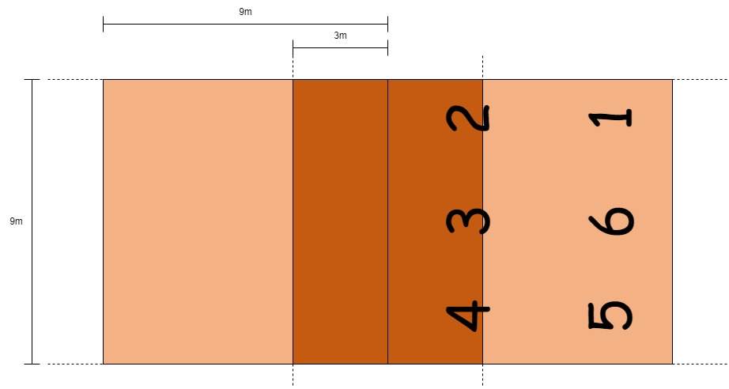

排球是一项由两队在被球网隔开的比赛场地上进行的运动. **比赛的目的是将球击过网, 使球落在对方场地上, 并阻止对手将球落在我方场地上.**

球队在场上有**六名**球员, 记为1~6号位. 只有网前的三名球员(2,3,4号位)可以网附近跳跃、扣球或拦网, 后场球员**只有从攻击线(又称三米线)后面跳起**才能将球击过网. 

球以**发球**的方式进行, 此后每队有**3次**击球机会(除了拦网接触)将球击过网, 直到球在球场上落地、出界或球队未能正确回球为止. 

当接发球队获得一分时, 场上球员需**顺时针轮换一个位置**并获得发球权(由轮转到1号位的球员发球). 

比赛采用**五局三胜**制, 前四局比赛为25分, 决胜局为15分. 球队**必须领先2分**才可获得胜利, 否则继续进行, 没有上限. 

## 常见词汇

### 进攻球路

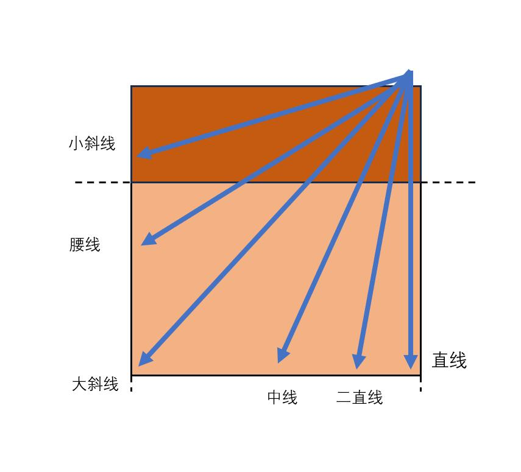

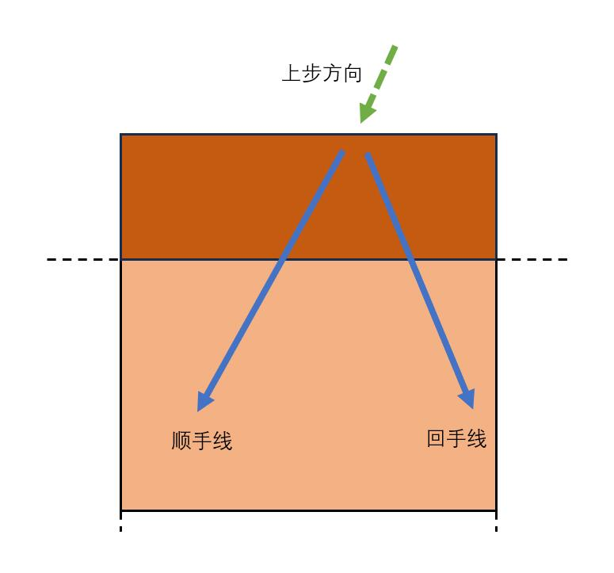

### 进攻节奏

"节奏指的是进攻者的助跑开始时机"——《排球少年》

#### 第三节奏

攻手在二传出手后助跑起跳

一般是给四号位主攻手，常见于需要一锤定音的关键球、或者一传不到位的调整球，球点高，球路长，考验主攻手的个人处理球能力和最简单粗暴的力量

#### 第二节奏

攻手在二传传球时助跑起跳

常见于副攻三号位或二号位半高球，比第三节奏的球球点要低，副攻用一步踏跳或者两步踏跳

#### 第一节奏(快攻)

攻手在二传还未传球时助跑起跳

四号位有平拉开，三号位的近体、短平、背快、背飞

#### 负节奏

参见小太阳和影山

### 进攻战术

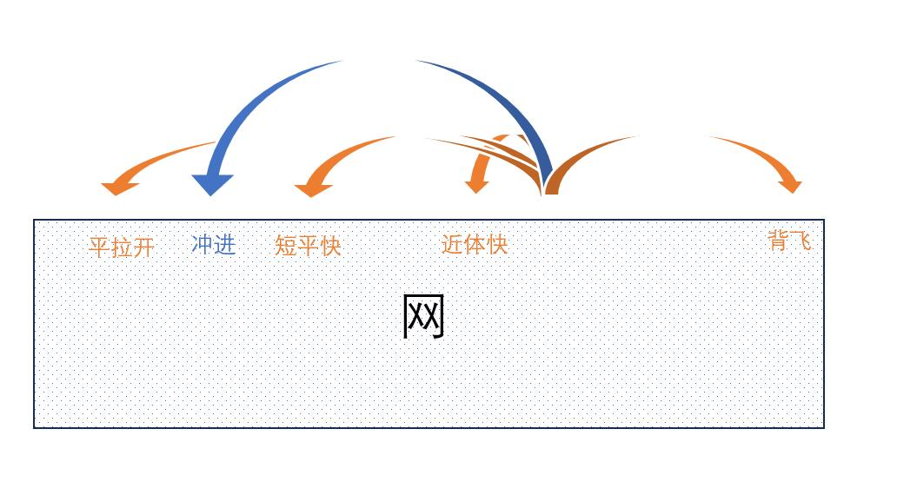

二传身前身后的传法一般有相似的两套, 战术也有相似的两套

现代排球战术越来越多, 接下来以关键词介绍一些战术

#### 交叉(错)

指两名攻手上步路线发生交叉的进攻方式, 一般由较外侧的攻手向近体快冲刺做掩护, 内侧攻手交叉跑动打半高球

#### 拉

一般指攻手上步的最后一步(或者空中)突然改变位置以晃开拦网

#### 冲

一般指攻手通过冲跳使得起跳点和击球点错开的扣球

#### 加塞

指攻手插入掩护队员和二传手之间打半高球

#### 梯次进攻

多名攻手采用先后起跳的方式诱骗对方拦网队员起跳以达到空网目的

#### 立体进攻

指除了二传手和自由人以外4名队员同时起跳进攻

### 上网/远(开)网

上网指球过于靠近球网导致二传无法获得舒服的传球姿势或者攻手无法选择球路

远(开)网与之相反

### 对位

指1、4，2、5，3、6号位之间的关系, 一般将同种位置球员安排在对位以保证前排在任一轮次下都可以各司其职

### 反轮

指主攻在2号位, 接应在4号位的轮次

### 调整攻

指攻手击打非从网前二传手传来的高球

### 超手

球从防守队员拦网的手的上方飞过，落入到对方场地内

### 卧果

指攻手来球从拦网手与拦网手方的网之间下落

### 保护

一般指己方进行暴露性强攻时队员在网前准备接起对方拦回球的行为

### 吊心

排球比赛在进攻方扣球进攻的时候，防守方的防守人阵型一般会呈现一个马蹄形，而正中间的位置会空出来，这个部位就属于防守阵型的“心”

### 飘球

指发出的球不旋转而且是不规则的飘晃飞行的一种发球方法

### 跳发球

指采用助跑起跳的方式，在空中将球直接击入对方场区的发球方法

是最具进攻性的发球方式

### 探头

指当一传或防守等击球直接飞到网口时，对方队员直接在网上沿完成进攻性击球的技术动作

### 二次球

指二传手进行进攻性击球, 主打一个出其不意

### 球头

指二传手传出的球在最高点处依然有着横向速度, 便于攻手基于球的前半段轨迹判断其落点

### 接应

指接应二传, 之前司职替补二传手但是近年来逐渐转换为强攻手, 由自由人担当替补二传手

## 详细规则

### 比赛的准备

#### 抽签

在比赛开始前由第一裁判员主持抽签, 决定第一局首先发球的队伍和场区. 

抽签获胜方可以选择以下一个: 

1. 发球或者接发球
2. 场区

另一方挑选剩下部分. 

决胜局比赛前应再次抽签. 

#### 组织热身

#### 登记首发阵容

### 位置

#### 球员位置

##### 发球时

在发球时球员必须站在本方场区内

##### 比赛中

在比赛中每队必须始终保持6名队员进行比赛

#### 球员相对位置

发球队员**击球时**, 双方队员（发球队员除外）必须在本场区内按轮转次序站位. 击球后无位置要求. 

位置关系**仅存在于相邻的两个球员间**(例如4和5号位之间则不存在位置关系), 应满足: 

1. 每一名前排队员至少有一只脚的一部分，比同列后排队员的双脚距离中线更近
2. 每一名右（左）边队员至少有一只脚的一部分，比同排中间队员的双脚距右（左）
    边更近

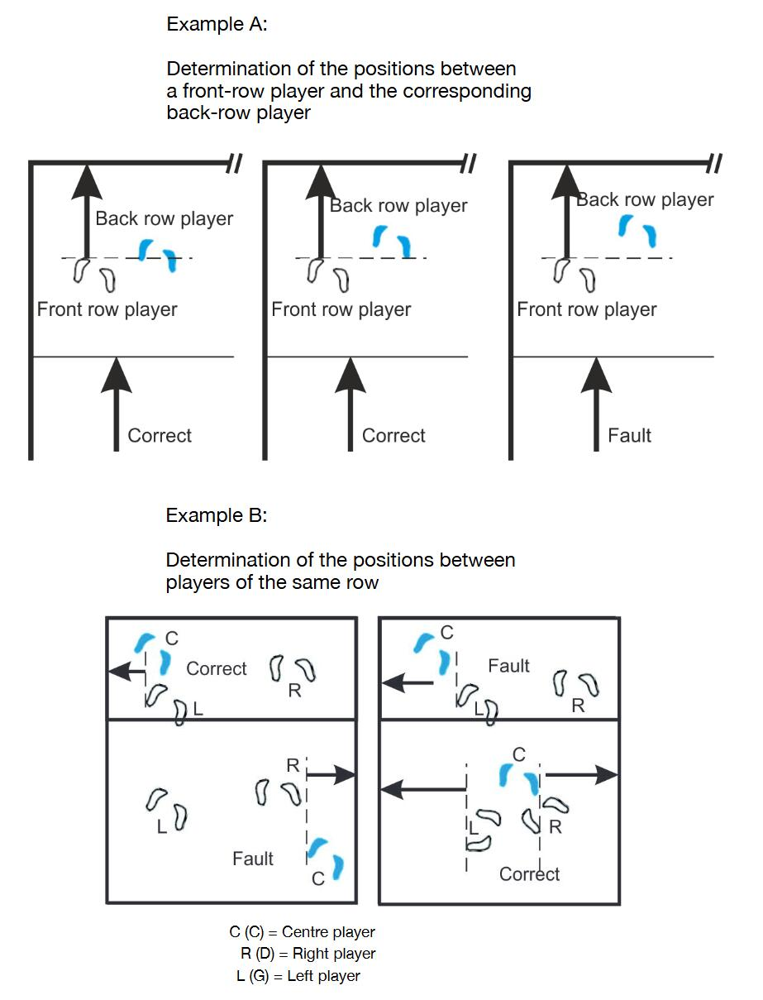

当出现位置错误时的处理如下: 

1. 该队伍被判罚一分，对方获得发球权
2. 恢复到正确位置

*当发球队员击球时的犯规与对方位置错误同时发生时，认为**发球犯规在先***

### 发球

后排靠右的队员在发球区[^发球区]内将球击出而进入比赛的行动是发球

[^发球区]: 发球区指两条边线的延长线之间，以及底线以后的区域

#### 首先发球方

- 第一局和第五局由抽签选定发球权的队伍首先发球
- 其他各局由前一局未首先发球的队伍首先发球

#### 发球球员

- 当发球队胜一球时，原发球队员(或其替补队员)继续发球
- 当接发球队胜一球时，获得发球权并轮转，由轮转置1号位的球员发球

#### 发球击球规则

1. 球被抛起或持球手撤离后，必须在球落地前，用一只手或手臂的任何部分将球击出[^发球试图]
2. 球只能被抛起或撤离一次，但拍球或在手中摆弄球是允许的
3. 发球队员在击球时或发球起跳时，不得踏及场区（包括端线）和发球区以外的地面。击球后可以踏及或落在场区内或发球区以外
4. 发球队员必须在第一裁判员鸣哨允许发球后8秒内将球击出
5. 裁判员鸣哨允许发球前的发球无效

[^发球试图]: 在新的规则中发球试图已被移除, 抛起不击球也被视为违规

#### 发球掩护

1. 发球队伍的队员不得利用个人或集体掩护阻挡对方观察发球队员和球的⻜行路线
2. 发球时，发球队伍的队员个人或集体挥臂、跳跃或移动，或集体密集站立并在球通过球网
    垂直平面前做出了同时隐蔽发球队员和球的⻜行路线的动作时，构成了发球掩护

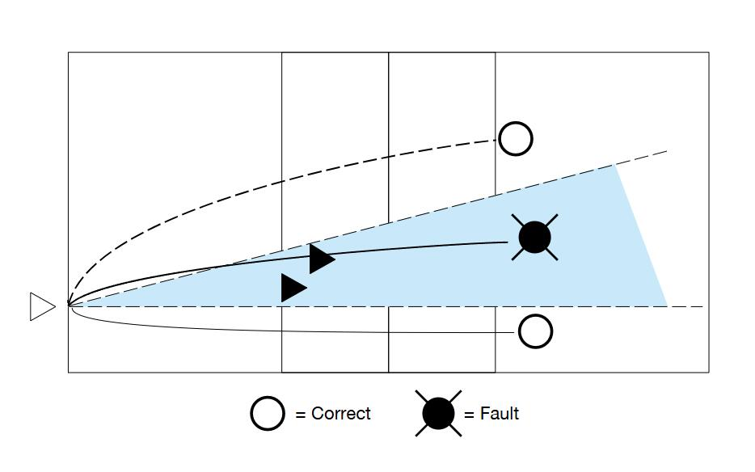

> 任何准备防守或者保护自己的行为是允许的

#### 发球的犯规

##### 发球犯规

1. 发球队伍发球次序错误
2. 违反[发球击球规则](#发球击球规则)

##### 发球后犯规

1. 界外球
2. 发球掩护

> 判罚优先级为: 发球犯规 > [位置错误](#位置) > 发球后犯规

### 界内/外球

#### 界内球

球在任意时刻任意部分**触及**比赛场区的地面包括界线为界内球

#### 界外球

- **球接触地面的所有部分全部在界线之外**
- 球触及场外物体、天花板或非场上比赛队员
- 球触及标志杆、网绳、网柱或球网标志带以外的部分
- 球的整体或部分从过网区以外过网([除了此规则](#球从非过网区进入无障碍区))
- 球的整体从网下空间穿过

> 需要注意的是排球看的是**接触地面的部分**, 并非投影. 通过鹰眼挑战可以看到判定的阴影都是由于在触地瞬间发生滚动而形成的椭圆形, 而非投影的正圆.
>
> 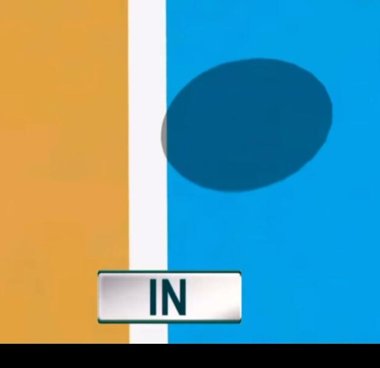

### 击球

比赛队伍必须在其本场区及空间内击球（规则10.1.2除外），但可以越出，在本方无障碍区救
球

#### 球队的击球

比赛中，队员与球的**任何触及都视为击球**. 每支队伍**最多击球3次**（拦网除外）将球击回对方场区. 

1. 一名队员**不得连续击球两次**(拦网的触球除外)
2. 多名队员同时触球被记为触碰到球员的个数次
3. 网上争球不造成持球违例, 不计入击球次数
4. 队员不得在比赛场地之内借助同伴或任何物体支持进行击球. 但是队员可以挡住或拉住另一名即将犯规（如触网、网下穿越等）的同队队员

#### 击球的性质

1. 球可以触及身体的**任何部位**
2. 球不能被接住和／或抛出, 球可以向任何方向弹出
3. 球可以触及身体的不同部位，但必须是**同时**. 下列情况除外
    1. 拦网时，一名队员或多名队员可以在一个动作中连续触球
    2. 在第一次击球时，允许身体不同部位在一个动作中连续触球

#### 击球的犯规

1. 四次击球：一个队伍连续击球四次
2. 借助击球：队员在比赛场地内借助同伴或任何物体的支持进行击球
3. 持球：球被接住和／或抛出，而不是被弹击出
4. 连击：一名队员连续击球两次，或者球连续触及身体不同部位

### 球通过球网

#### 有效过网区

过网区是球网垂直平面的一部分, 其范围下至球网上沿, 两侧置标志杆机器延长线, 上至天花板

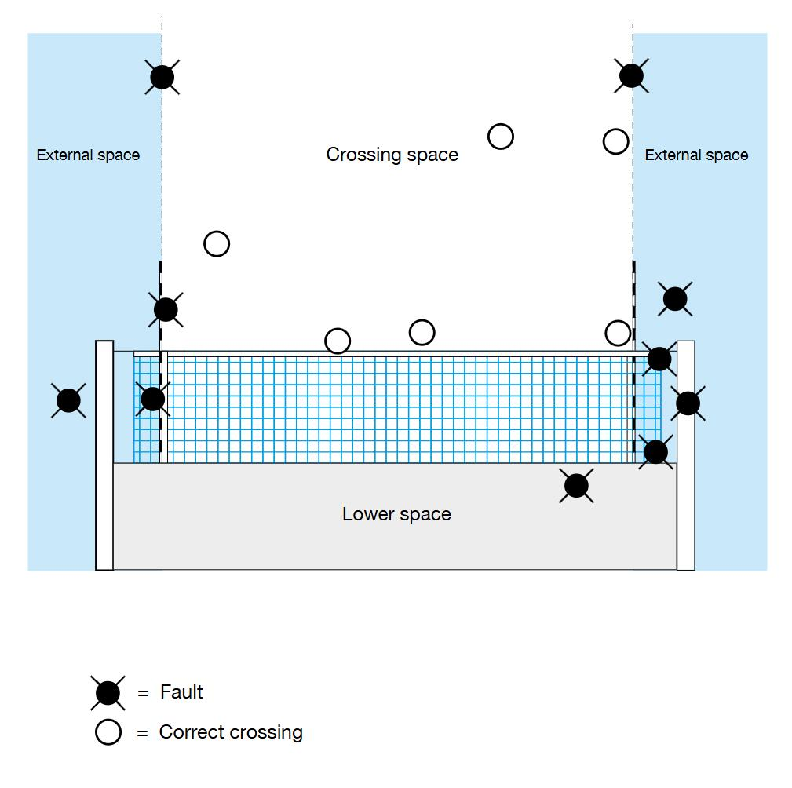

球的整体必须从过网区穿越视为有效通过, 通过时可以接触球网(界内部分). 

#### 特殊情况

##### **球入球网**

在该队的三次击球内再击

##### **球从网下飞向对方场区**

在球的整体越过网所在的垂直平面前, 可以将球击回

##### **球从非过网区进入无障碍区**

在不能判定为界外球时, 可在下列情况下将球击回本方场地: 

1. 队员不得触及对方场区
2. 球被击回时，球的整体或部分**必须从同侧非过网区通过**

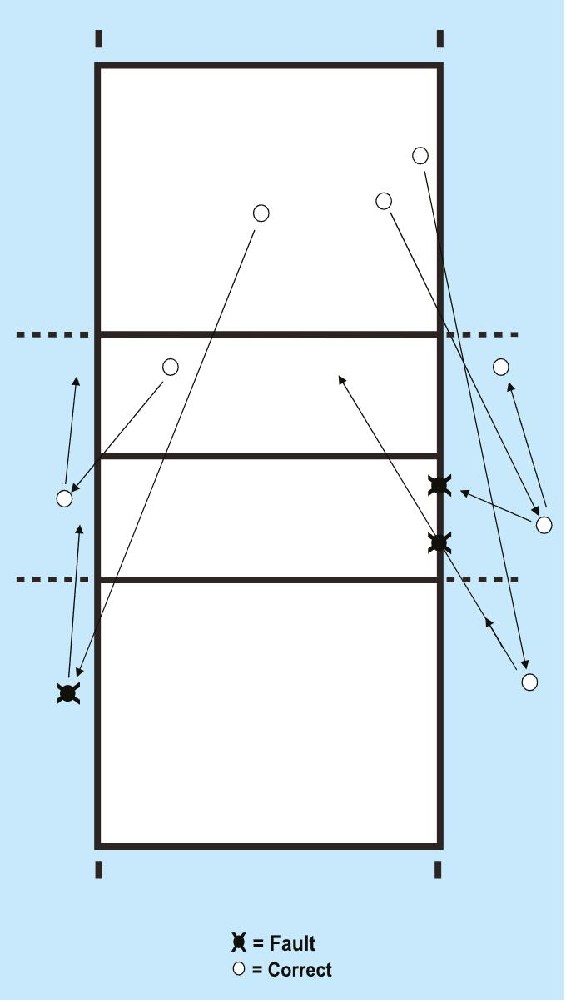

### 队员与球网

#### 触网

1. **队员在击球动作过程中[^击球动作]触及球网标志杆之间的任何部分时，均视为犯规**
2. 队员可以触及网柱、网绳或球网本身标志杆以外的部分和物体，但不得干扰比赛[^干扰比赛]
3. **由于球击入球网而造成的球网触及队员，不为犯规**

[^击球动作]: 任何靠近正在运动的球并试图自行击球以及安全落地并准备下一个击球动作过程的队员，都被视为处于击球动作过程中，即使没有触球.
[^干扰比赛]: 包括但不限于:  在队员的击球动作过程中触及球网标志杆之间的任何部分或标志杆本身; 利用球网标志杆之间的任何部分提供支持或受力; 造成了对本方有利; 妨碍了对方合法的击球试图; 抓住球网......

#### 网下穿越

1. 在不干扰对方比赛的情况下，允许队员在网下穿越进入对方空间
2. 穿越中线进入对方场区:
    1. 队员的单脚（或双脚）越过中线触及对方场区的同时，其余部分接触中线或置于中
        线上空是允许的
    2. 队员脚以上的身体任何其他部位，触及对方场区是允许的，但不得干扰对方比赛
3. 比赛成死球后，队员可以进入对方场区
4. 在不干扰对方比赛的情况下，队员可以穿越进入对方的无障碍区

#### 越过球网

1. 拦网时允许拦网队员越过球网触球，但不得在对方进攻性击球前或击球时干扰对方
2. 进攻性击球后允许手过网，但击球时必须在本场区空间

#### 队员在球网附近的犯规

- 对方进攻性击球前或击球时，在对方空间触及球或对方队员
- 从网下穿越进入对方空间并干扰对方比赛
- 队员的双脚（或单脚）全部越过中线进入对方场区

### 进攻性击球

除发球和拦网外，所有直接向对方的击球都是进攻性击球，球的整体通过球网垂直平面或触及对方球员，则认为完成进攻性击球

#### 进攻性击球的限制

1. 前排队员可以对任意高度的球完成进攻性击球，但触球时必须在本场区空间
2. 后排队员可以在进攻线后对任意高度的球完成进攻性击球，但是起跳时脚不得踏及或越过进攻线
3. 后排队员也可以在前场区完成进攻性击球，但触球时球的一部分必须低于球网上沿
4. 接发球队伍队员不得在前场区内对高于球网上沿的对方发球完成进攻性击球
5. 队员在高于球网处，不能对同队伍自由防守队员在前场区用上手传出的球完成进攻性击球

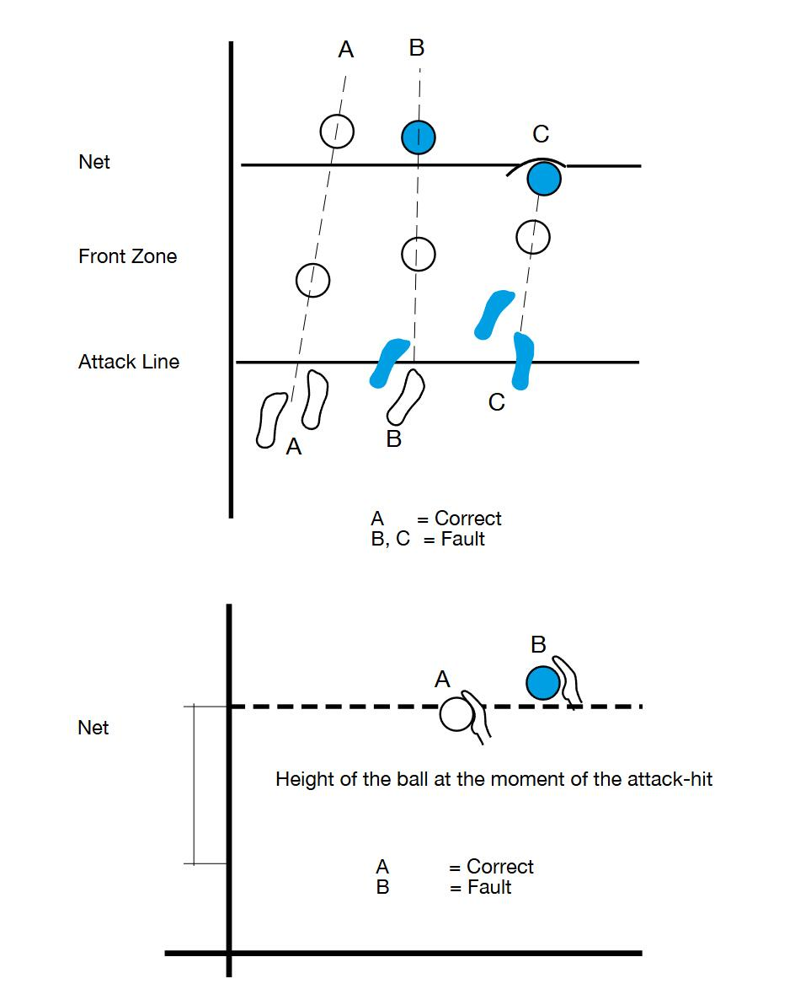

### 拦网

拦网是队员靠近球网在高于球网处阻挡对方来球的行动，与触球点是否高于球网无关，只
有前排队员可以完成拦网，**触球时身体必须有一部分高于球网上沿**

#### 拦网触球

- 在一个动作中，球可以连续（迅速而连贯地）触及一名或多名的拦网队员
- 拦网时队员可以将手或手臂伸过球网，但不得干扰对方击球。过网拦网的触球必须在对方进攻性击球之后
- 拦网的触球不算作球队的三次击球的一次，拦网触球后该队伍还可以击球三次
- 拦网后可以由任何一名队员进行第一次击球，包括拦网时已经触球的队员

#### 拦网犯规

1. 在对方的进攻性击球前或者击球的同时，在对方空间完成拦网
2. 后排队员或自由防守队员完成拦网或者参加了完成拦网的集体
3. 拦对方的发球
4. 从标志杆以外伸入对方空间拦网
5. 自由防守队员试图进行个人或参加集体拦网

### 比赛间断

间断是完整的比赛过程后至下一次裁判员鸣哨发球之间的时间

常规的比赛间断只有暂停和换人, 每局比赛中，**每支队伍最多可以请求两次暂停和六人次换人**

**只有教练或教练缺席时场上队⻓**可以请求正常比赛间断

#### 暂停

- 所有被请求的暂停时间均为**30秒**
- 请求暂停，必须在比赛成死球后、裁判员鸣哨允许发球前，并**使用相应的手势**
- 在同一次比赛间断中，可以请求一次或两次暂停

#### 换人

一名队员离开比赛场地，而由另一名队员经记录员登记后占据其位置的行为称换人（自由
防守队员的替换除外）

- 每局开始阵容中的队员，在同一局中可以退出比赛和再上场一次，而且**只能回到原阵容的**
    **位置**
- 替补队员每局只能上场比赛一次，替换首发阵容的队员。而且他／她**只能由被他／她替换**
    **下场的队员来替换**

#### 局间

- 所有局间休息均为3分钟
- **每局结束后比赛队伍交换场区**
- **决胜局中某一队伍获得8分时两队交换场区，不休息**，队员保持交换前的位置继续比赛。如果未能及时交换场区，则应在发现错误时立即交换，保留交换场区时两队已得的比分

### 自由防守队员

自由防守队员的服装颜色不能与其他队员服装颜色有任何的相同

任何时候只能有一名自由防守队员在场上

#### 自由防守队员涉及的规则

1. 自由防守队员可以替换后排的任何一名队员
2. 他／她不可以在任何位置上（包括场区和无障碍区）完成球整体高于球网上沿的进攻性击球
3. 他／她不能进行发球、拦网和拦网试图
4. 如果自由防守队员在前场区进行上手传球，其他队员在球的整体高于球网上沿的情况下不能进行进攻性击球, 同样的传球行为在进攻区外(包括在进攻区外起跳)无妨
5. 涉及到自由防守队员的替换不计算在换人次数之内, 但涉及到一个自由防守队员的两次替换之间必须有一个完整的比赛过程(即1分的归属)

## 裁判

### 裁判组的站位

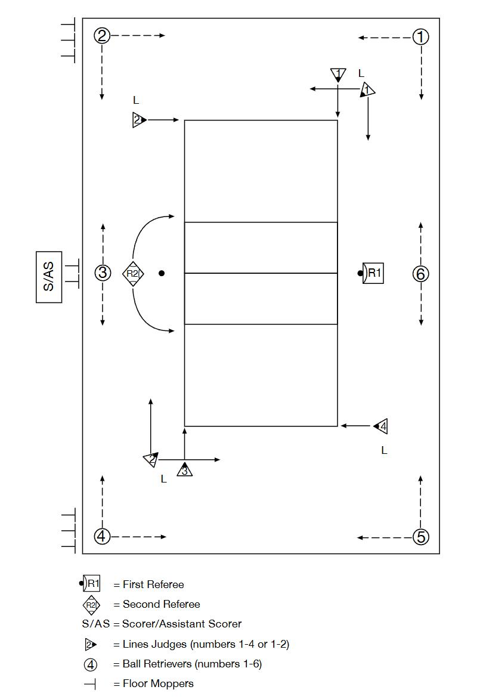

### 裁判员的指责

#### 第一裁判

1. 检查场地、器材和比赛用球
2. 主持双方队⻓的[抽签](#抽签)
3. 掌握两队伍的热身
4. 向队伍提出警告
5. 对不良行为和延误比赛进行处置
6. 判定:
    - 发球犯规和发球队伍位置错误，包括发球掩护
    - 比赛中击球的犯规
    - 高于球网和球网上部的犯规，以及主要是进攻一方的触网犯规(或者靠近他／她一侧的触网犯规)
    - 后排队员或自由防守队员的进攻性击球犯规
    - 自由防守队员在前场区及延⻓区进行上手传球后，同伴在球高于球网处完成进攻性击球犯规
    - 球的整体从网下空间穿越
    - 后排队员完成拦网，或自由防守队员试图拦网
    - 球的整体或部分从过网区以外过网，⻜入对方场区，或者触及他／她一侧的标志杆
    - 发出的球或者某队伍的第三次击球从他／她一侧的标志杆上方或者标志杆外⻜入对方场区
7. 比赛结束后，检查记录表并签字

#### 第二裁判

1. 掌管非场上人员
2. **允许比赛间断请求**
3. 掌握及告知各队暂停和换人的次数
4. 检查球是否符合比赛要求
5. **判定:**
    - 网下穿越进入对方场区和空间
    - 接发球队位置错误
    - 拦网一侧的队员触网犯规或触及第二裁判员一侧的标志杆
    - 后排队员完成拦网和自由防守队员试图拦网犯规，或后排队员和自由防守队员进攻性击球犯规
    - 球触及场外物体
    - 第一裁判员难以观察时，球触及地面
    - 球的整体或部分从过网区以外过网，⻜入对方场区，或触及他／她一侧的标志杆
    - 发出的球或者某队伍的第三次击球从他／她一侧的标志杆上方或者标志杆外⻜入对方场区
6. 比赛结束后，检查记录表并签字

#### 记录员

1. 按照规定程序登记有关比赛和比赛队伍的情况
2. **每局比赛前登记各队伍的首发阵容**
3. **记录得分、暂停、换人情况**
4. **掌握各队伍的发球次序，发现发球次序错误时，应在发球击球后立即通知裁判员**
5. 认可暂停、换人的请求，并通知第二裁判员
6. 对违背规则的非正常比赛间断请求要通知裁判员
7. 每局结束及决胜局8分时，向裁判员宣布
8. 记录警告、处罚的情况和不符合规定的请求
9. **掌握局间休息**
10. **取得双方队长和裁判员的签字**

#### 助理记录员

1. 记录有关自由防守队员的替换
2. 协助记录员的工作
3. 操作记录台上的手动记分牌
4. 监督记分牌的正确显示
5. 掌握技术暂停开始和结束的时间
6. 比赛结束后，检查记录表并签字

#### 司线员

1. 各自负责自己一侧的底线和边线
2. 判断: 
    - 当球落在他们所负责的线附近时，示以界内或界外
    - 触及接球队员身体后出界的球，示以触手出界
    - 示意球触及标志杆、发球和第三次击球后球从过网区外过网等
    - 示意发球击球时队员的脚踏出场区（发球队员除外）
    - 发球队员脚的犯规
    - 队员在击球动作过程中或干扰比赛的情况下，触及他／她一侧的标志杆高于球网上沿80厘米的部分
    - 球从标志杆外过网，并进入对方场区，或触及他／她一侧的标志杆

### 裁判员的手势

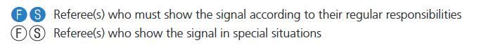

#### 允许发球

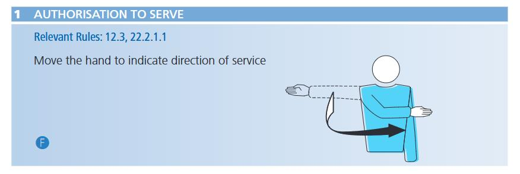

#### 发球队伍

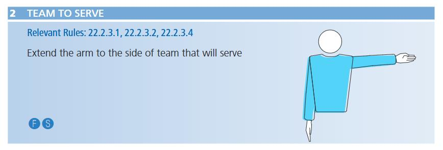

#### 交换场地

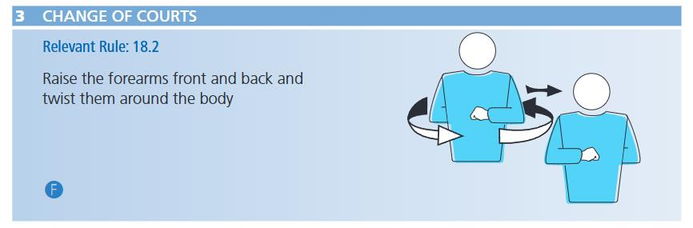

#### 暂停

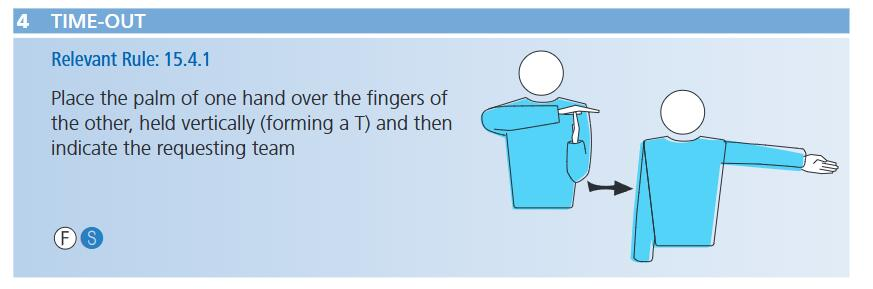

#### 换人

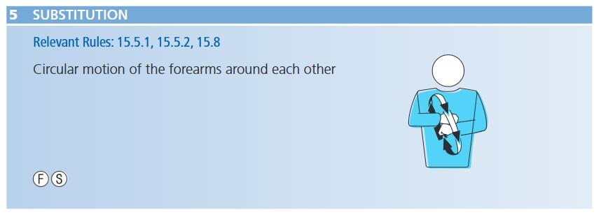

#### 一局(场)比赛结束

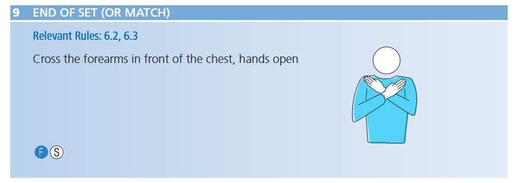

#### 发球未抛起

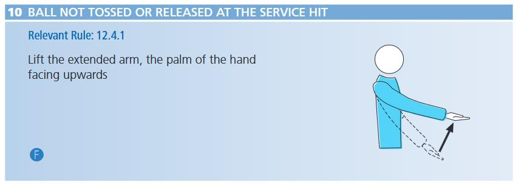

#### 发球超时

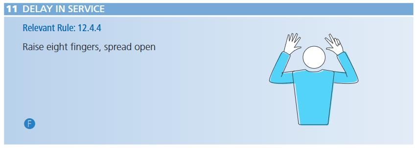

#### 拦网违例或者发球掩护

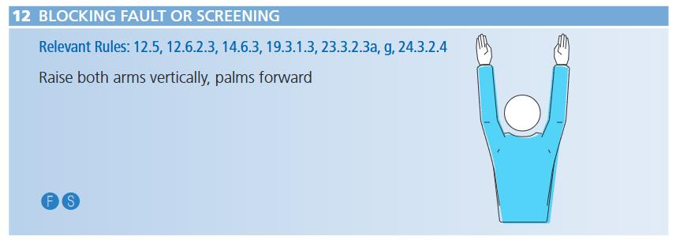

#### 轮转或者位置错误

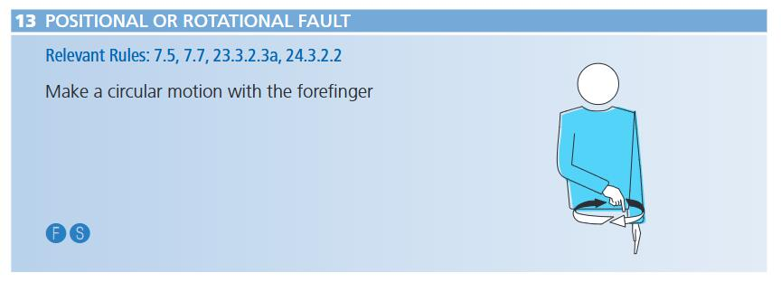

#### 界内球

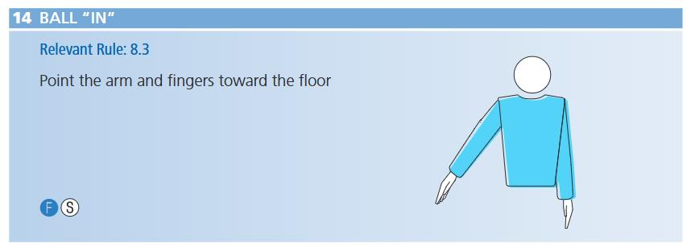

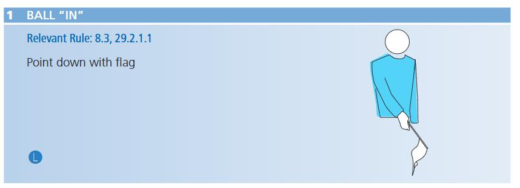

#### 界外球

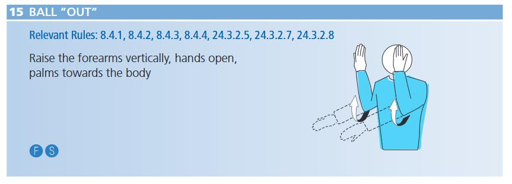

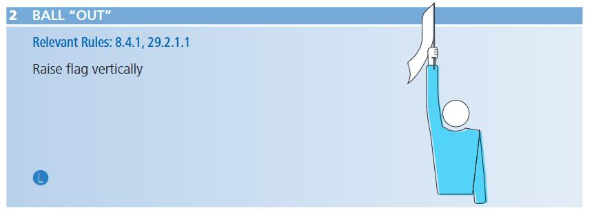

#### 持球

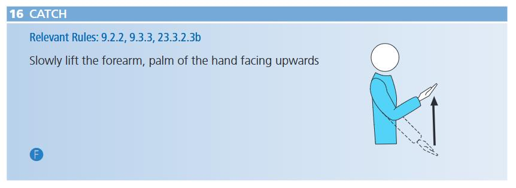

#### 二次击球

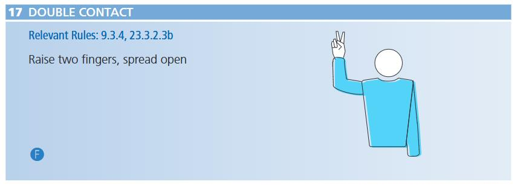

#### 四次击球

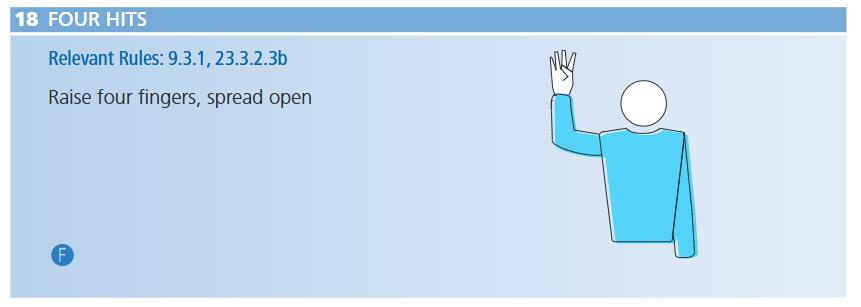

#### 触网或发球未过网

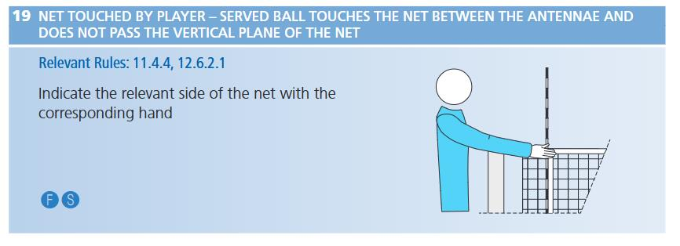

#### 过网犯规

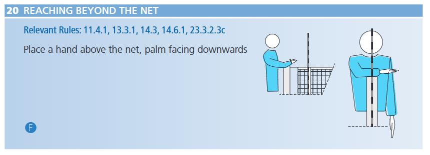

#### 进攻性击球犯规

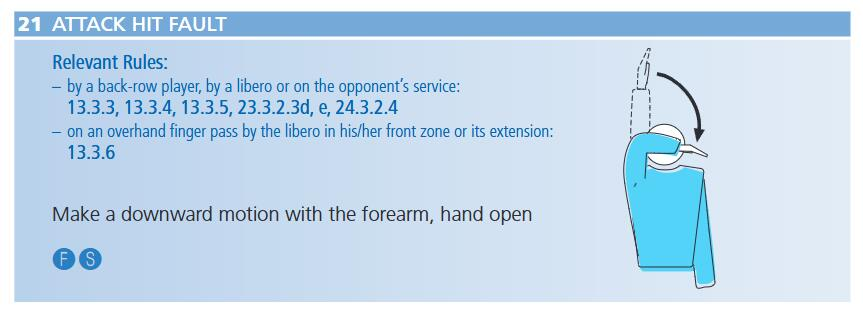

#### 网下穿越、球从网下通过、发球队员脚的犯规或发球击球时队员的脚不在场区之内

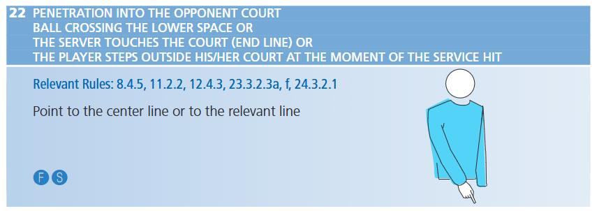

#### 公正球

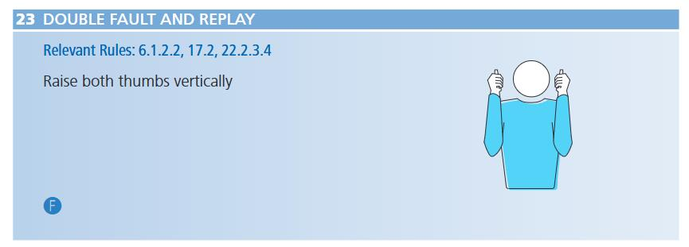

#### 触手出界

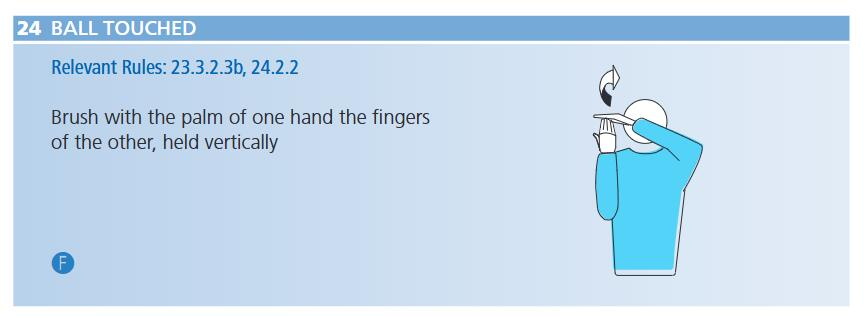

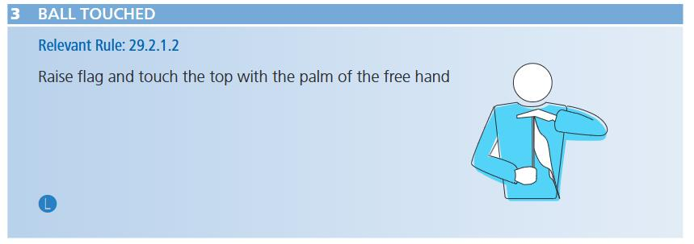

#### 司线员: 球通过球网时的犯规、球触及场外物体的犯规或发球队员脚的犯规

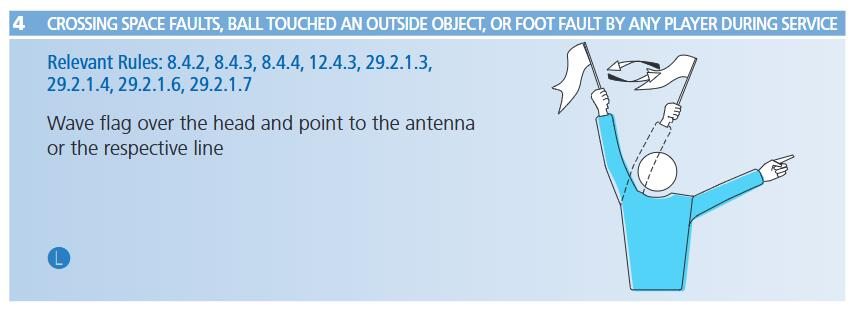

#### 司线员: 无法判断

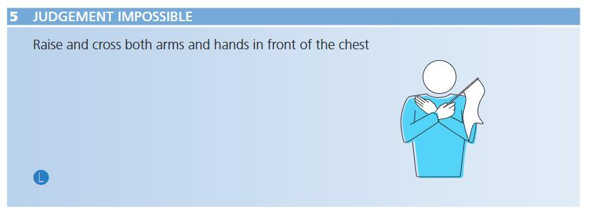