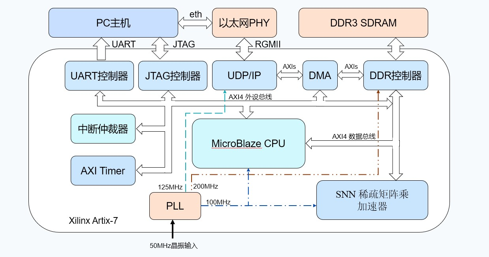
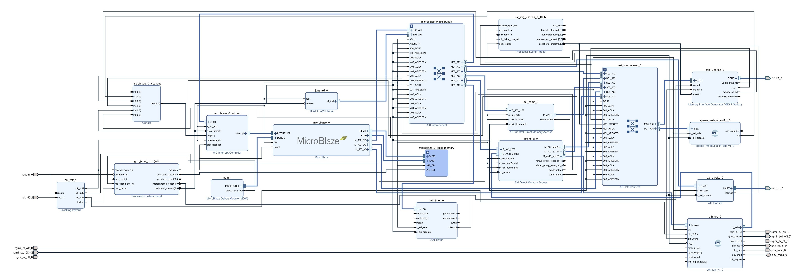
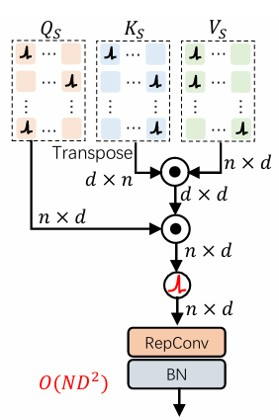
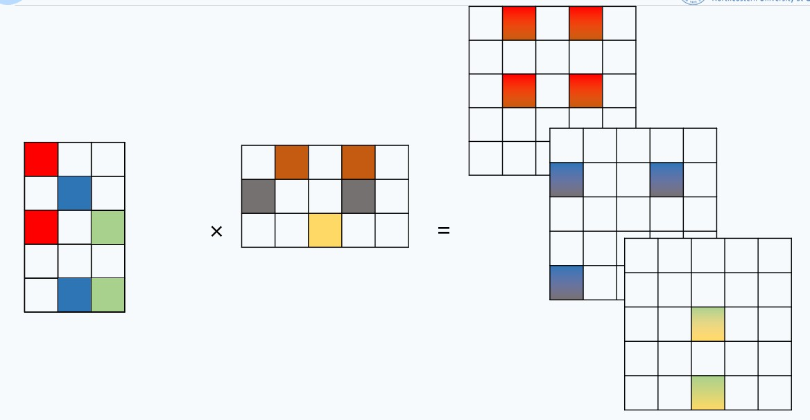
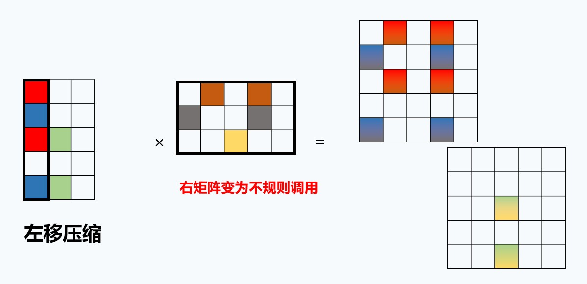
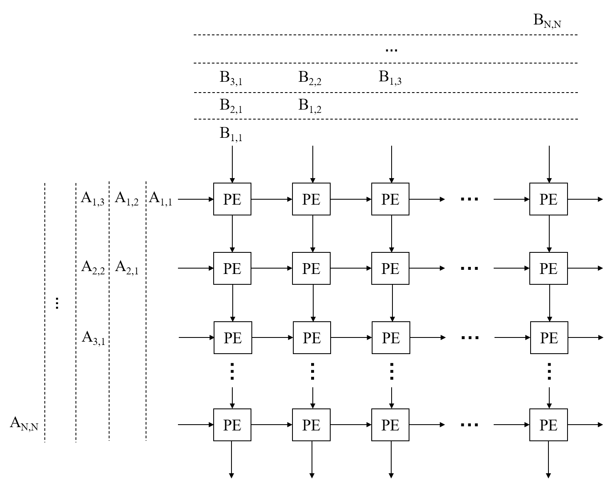
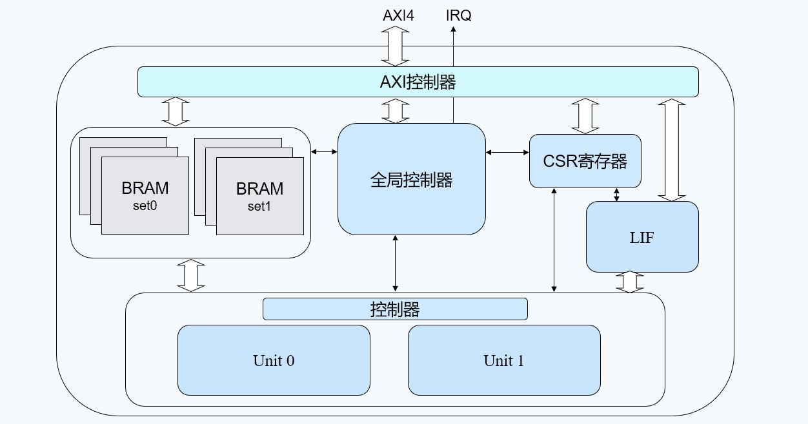
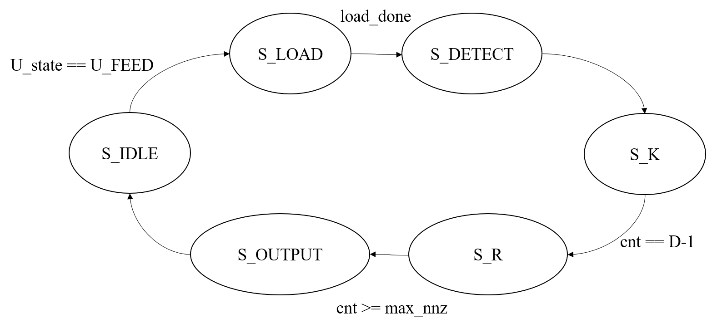
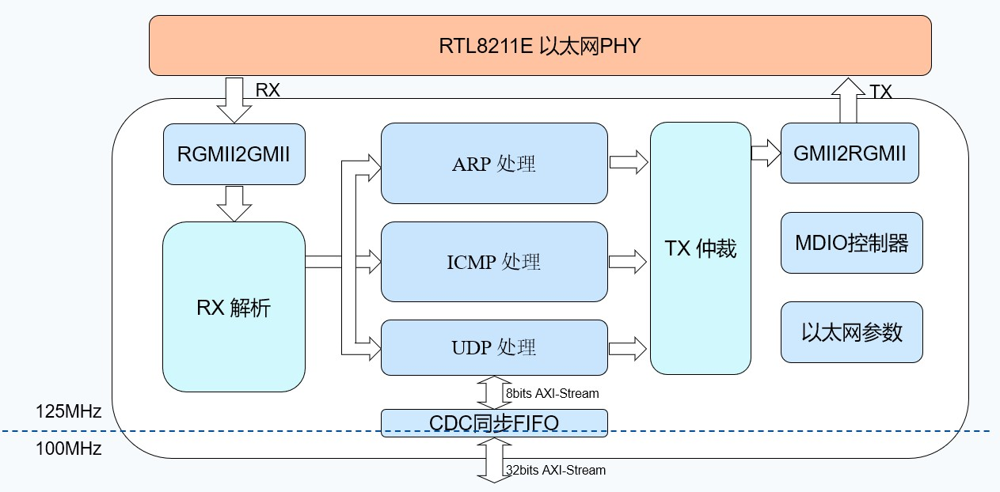

> AI真是太好用了，代码大部分都是由TRAE调GLM5.1和GPT5.3-Codex写的。总体而言GLM更适合发散添加功能，GPT更适合严谨的调试与debug。
>
> 写一篇记录一下本科的最后一舞吧~可惜答辩不大好没有拿到优秀
>
> github仓库：https://github.com/Vincent-ice/SDSA-FPGA

## 一. 干了啥

### 整体架构



上图中除了`UDP/IP`和`SNN`是RTL以外，其余都是IP核。

> 由于我没有ZYNQ的板子，只能在a7的板子上搭了个当PS侧的软核



### 运行流程

软核中运行主循环分为4步

#### 1）等待接收UDP包

由软核配置DMA，一旦接收到UDP包后将payload直接传至DDR中RX缓冲区。

#### 2）解析UDP包

从DDR中读取UDP包，解析其数据包类型。

#### 3）处理数据包

根据数据包类型处理数据，例如`LOAD`则加载入对应地址，`START`则启动计算。

#### 4）回传ACK消息

将数据包指令处理完成的消息通过UDP包回送至PC。

## 二. RTL模块

### 1. SNN加速模块

> `rtl\snn\sparse_matmul_axi4_top.v`

说是脉冲Transformer加速，实际上只是计算$Q \times K^T \times V$的矩阵乘法计算器。~~绝对是写不完了~~



#### 算法核心

计算过程揉合了**[SpArch](https://arxiv.org/abs/2002.08947)算法**和**脉动阵列**两部分，$X = K^T \times V$使用脉动阵列，$R = Q \times X$使用SpArch算法。

> 整体对K、V矩阵的稀疏性挖掘不足

##### SpArch算法

由于一开始就使用外积数据流进行矩阵乘法，在搜索论文时搜到了这篇关于加速外积数据流计算矩阵乘法的论文，于是将其中的输入矩阵压缩方案加了进来。



在经典外积数据流中，以左矩阵的列向量与右矩阵的对应行向量进行外积操作生成一个中间矩阵。显然，大尺寸外积运算会产生巨大的中间结果，高稀疏度的矩阵会导致大量0让计算单元空转。SpArch使用了一种“**左移压缩**”（Left Shift Compression, LSC）的方式，即将左输入矩阵的多列压缩为一列。类似“俄罗斯方块”，矩阵的非零元素全都向左压缩，压缩过程中保留原始列的索引，因此不会影响最终运算的正确性。



从硬件层面上看，经典外积数据流计算一般以左矩阵的列向量进行迭代。在每次计算中，可以将单个矩阵元素的计算映射为一个MUX，左矩阵列向量中数据为`sel`，右矩阵行向量和0向量为输入。

```verilog
for (i = 0, i < N, i = i + 1) begin
    assign out = sel ? in : 'b0;
end
```

而在SpArch算法中，`in`将不来自于迭代次数对应的右矩阵行向量了，而是根据对应元素中保留的原始列索引选择右矩阵$X$中对应行向量。

```verilog
case (lsc_idx)
    0: in = X[0];
    1: in = X[1];
    ...
```

这种纯组合逻辑的方案会带来一个庞大的MUX阵列，只有在计算单元较小的情况下比较适合（大于16\*16就不大能接受了）。同时还需要右矩阵全部在reg或者bram中缓存。

##### 脉动阵列

既然SpArch中的右矩阵需要被缓存在边上，在原始计算公式中右矩阵又需要被计算，那么我就想到了脉动阵列这个东西。它天然就实现了存算一体，也可以只当作一块寄存器阵列直接加载多比特权重。同时，我们也不需要处理其计算完成后的数据保存问题。



> 本来打算联动$Q$的全零列和$K^T$的全零行，这两个任一全零就不用算了，直接跳过，但是脉动阵列的互联网络就更加复杂没调出来。

#### 控制逻辑

> 由于本人手里只有xc7a100t的板子，资源限制所以只实现了静态调度双计算单元的上板验证，计算单元为8\*8大小。



##### 计算单元

>  `rtl\snn\unit\sparse_matmul_top.v`

在单个计算单元中，计算$R = A \times B^T \times C$，我们的优化目标为尽可能减少计算周期，由于单元调用次数很多，每周期的压缩都会对总计算周期带来几百上千倍的缩减。

1. 左矩阵A的全零列清除。

    由于全零列的外积也为全零矩阵，所以可以直接跳过。在这里我们在左矩阵加载的同时探测全零列（采用列主序存储），并直接删去A的该列和B的对应行，这样可以直接减少迭代次数。

2. LSC与脉动阵列并行计算。

    LSC针对A矩阵，脉动阵列计算针对B、C矩阵，显然可以天然并行处理。




##### 调度模块

在较大的矩阵乘法中（例如64\*64大小），由于计算单元只能支持8\*8，所以必须进行矩阵分块操作。

对于一个16\*16大小的矩阵A、B、C，可以被切分为多个8\*8的块
$$
A = 
\begin{bmatrix}
 A_{0,0} & A_{0,1}\\
 A_{1,0} & A_{1,1}
\end{bmatrix}
$$
则结果矩阵R中的某个分块$R_{i,j}$可表示为：
$$
R_{i,j} = \sum_{k=0}^{1}\sum_{j=0}^{1}(A_{i,j} \times B_{j,k} \times C_{k,l})
$$
出于简单设计（~~我也没有学习什么调度算法~~），这里采用的静态奇偶列调度双计算单元，即`Unit 0`负责计算`$R_{i,0}, R_{i,2}, R_{i,4}...$`，`Unit 1`负责计算`$R_{i,1}, R_{i,3}, R_{i,5}...$`。这样不会添加过多的控制逻辑，也不会引发R矩阵写入冲突。

此外，在调度模块中，将会预分析当前块计算中的源数据是否全零，全零则直接跳过整块计算，不启动Unit。

##### 分块矩阵累加与LIF神经元

本设计中LIF神经元更新式为：
$$
V[t]= (V[t-1] >> \tau) + I[t]
$$
由于$I[t]=R$，所以我们可以利用分块矩阵累加的加法器计算神经元电压累加。将泄露后的电压直接作为R BRAM的初始值，在分块矩阵计算完毕后直接获得累加后的电压，仅需再增加一拍负责激发即可。

在每块数据准备导入Unit计算时，会先检测该块是否全零，全零则跳过计算。（只检测了A矩阵）

分块矩阵累加采用4-bank并行的流水线处理，保证处理速度大于unit结果输出速度。

##### 地址映射

| 偏移地址      | 寄存器名       | 读写属性 | 功能描述       |
| ------------- | -------------- | -------- | -------------- |
| 0x0000~0x0FFF | 状态控制寄存器 | R/W      | 各个控制寄存器 |
| 0x1000~0x1FFF | A BRAM         | W        | 矩阵 A         |
| 0x2000~0x2FFF | B BRAM         | W        | 矩阵 B         |
| 0x3000~0x3FFF | C BRAM         | W        | 矩阵 C         |
| 0x4000~0xFFFF | R BRAM         | R/W      | 矩阵 R         |

##### 状态控制寄存器

| 偏移地址 | 寄存器名 | 读写属性 | 复位值     | 比特描述                                   | 功能描述                                            |
| -------- | -------- | -------- | ---------- | ------------------------------------------ | --------------------------------------------------- |
| 0x0000   | CTRL     | R/W      | 0x00000000 | \[3\]IRQ使能                               | 控制寄存器                                          |
| 0x0004   | STATUS   | R        | 0x00000001 | \[0\]空闲，\[1\]运行，\[2\]完成，\[3\]错误 | 状态寄存器（指示引擎运行状态）                      |
| 0x0008   | CMD      | W        | -          | \[7:0\]命令编码                            | 命令寄存器（写入命令控制引擎）                      |
| 0x000C   | CFG      | R/W      | 0x00400040 | \[31:16\]矩阵行数，\[15:0\]矩阵列数        | 架构配置寄存器                                      |
| 0x0010   | LIF_TAU  | R/W      | 0x00000001 | \[15:0\]                                   | LIF神经元时间常数寄存器（左移位数，即除以$2^\tau$） |
| 0x0014   | LIF_VTH  | R/W      | 0x00000001 | \[15:0\]                                   | LIF神经元阈值电压寄存器                             |
| 0x0018   | LIF_VRST | R/W      | 0x00000000 | \[15:0\]                                   | LIF神经元复位电压寄存器                             |
| 0x001C   | LIF_STEP | R/W      | 0x00000001 | [7:0]                                      | LIF神经元时间步数寄存器                             |
| 0x0020   | LIF_EN   | R/W      | 0x00000000 | \[0\]                                      | LIF神经元使能寄存器                                 |
| 0x0024   | PP_SEL   | R/W      | 0x00000000 | \[1\]计算用的数据，\[0\]写入的数据         | 乒乓BRAM选择寄存器                                  |
| 0x0030   | IRQ      | R/W      | 0x00000000 | \[0\]完成中断，\[1\]错误中断               | 中断状态寄存器寄存器                                |
| 0x0040   | DEBUG    | R        | -          |                                            | 调试信息寄存器                                      |
| 0x0044   | COMP     | R        | -          |                                            | 压缩器反馈信息                                      |

### 2. UDP/IP协议栈

> 本模块在学计算机网络的时候做的，魔改自开发板例程。使用外置RTL 8211E千兆以太网PHY芯片，没有做MDIO配置，全靠PHY芯片上电自动协商，主打一个能传数据就行。
>
> `rtl\eth\eth_top.v`



为了硬件处理ARP和ICMP消息以及UDP解发包，网络参数直接硬编码在`eth_top.v`中，对外只通过AXIs传输纯净的UDP载荷。

#### RX解析模块

> `rtl\eth\eth\eth_layered_rx_dispatch.v`

模块负责进行CRC校验及包过滤，把指向FPGA的IP地址的数据包发送给对应协议的模块进行后续处理。

使用乒乓BRAM缓冲帧，提高吞吐率。提取包头信息（例如IP、MAC等信息供后续使用）。

#### UDP处理模块

接收处理被集成在`RX解析`模块中了，在检验完是发送至FPGA上的UDP包后，将纯净的payload直接发送至FIFO。

发送处理分两轮处理：

1. 由AXIs输入内部RAM，记录payload长度`pkt_len`
2. 根据`pkt_len`构造包头及checksum，发送至CRC生成模块

#### CDC同步FIFO

> `rtl\eth\axis\axis_async_fifo.v`

第一次正式处理CDC问题，建议直接用别人写好的，不过手撕CDC确实也是面试常问的问题。

这里采用经典的两级同步寄存器处理格雷码读写指针来实现多比特数据跨时钟域问题。简化了`将要满`和`即将空`的设计。将`tlast`信号作为数据的一部分实现跨时钟域。

## 三. IP核

### 1. MicroBlaze

软核这边由于不需要啥运算，基本只负责配置和部分数据搬运，因此使用了cache和高主频的配置。

使用auto生成，与之配套的中断、debug、reset、lmb总线都自动生成，无需额外的配置。

### 2. AXI Timer

为了性能计数而加，对于系统运行无影响。~~没错看门狗都没有加~~

### 3. JTAG AXI

注意要让它可访问DDR，否则软件无法加载至板上。

### 4. UART AXI

输出系统运行状态和调试信息用，配置时注意波特率。

### 5. AXI DMA

DMA这里最简单的配置即可。数据量其实没有用DMA的必要，但是想试着用一用。

### 6. MIG

最麻烦的一个，最好照着开发板教程设置，每个ddr芯片和PCB设计都不一样。

### 7. System RESET

复位信号是我没想到卡了很久的部分，整个系统一上电就卡在复位。

1. `dcm_locked`接时钟来源的PLL或者MMCM。只有在此口输入高电平时，代表时钟稳定，外部输入的复位信号起效果，否则永远处在复位状态。
2. 复位释放有先后顺序。`bus_struct_rst`和`interconnect_areset`最先释放，`peripheral_reset`和`peripheral_areset`其次，`mb_reset`最后。这个顺序与系统稳定启动有关，避免引发未初始化时数据处理带来的死锁、错误等问题。

## 三. 软件

软件完全AI代劳，AI写软件还是很权威的。

### 1. 裸机C程序

C程序中，注意地址映射要和block design中地址分配一致，且可被访问（图省事就全可访问了）。

**要特别注意的是数据地址不要把程序段覆盖了！！！**

> 在每次完成数据传输后，无法直接开启下一次数据传输。我找不到为啥，最后直接每次先复位再启动解决的，有点抽象（

### 2. 上位机Python程序

由于硬件只能逐条处理指令，所以上位机通过ACK信息来判断板上处理完上一条指令，并发送下一条指令。

为了调试方便，集成了参考对比工作。
