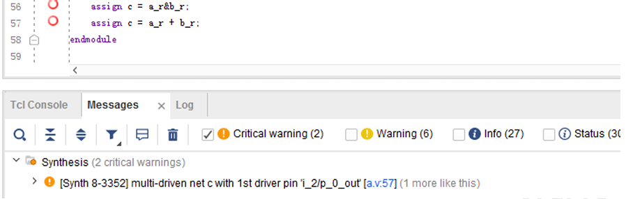
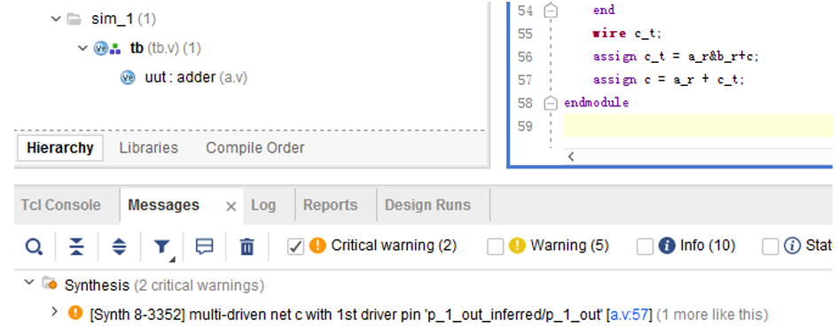

> 本文摘自龙芯杯团队赛发布包中的仿真调试说明及《CPU设计实战》

## 仿真调试
### 仿真调试概述
#### 写在前面
**首先的首先! 充分了解你的设计! 了解你的设计! 了解你的设计! 重要的事情说三遍!**
千万不要在不了解设计功能的情况下进行调试，这样会浪费大量的时间。

#### 一些小技巧
##### 记录所有信号的波形
在默认设置下, 只有被添加进波形窗口的信号才会被记录, 但是有时候我们需要记录所有信号的波形, 这时候就会发现新加入的波形并没有信号, 不得不重新运行一次仿真才能获得波形, 这样会浪费大量时间, 所以我们希望可以一次性记录所有信号的波形, 这样就可以避免重复运行仿真。
在Vivado工程视图下, 点击左侧"Project Manager" -> "Settings", 在弹出的设置界面中选择"Project Settings" -> "Simulation", 在右侧的"Simulation"选项卡中, 将"xsim.simulate.log_all_signals"复选框勾选, 这样就可以一次性记录所有信号的波形了。

##### 给重要时刻做标记
善用波形窗口的标记功能, 可以**避免回溯哪里出问题的时候浪费大量时间**。

##### 信号分组
当你的调试信号非常多的时候, 上下翻看信号十分容易出现混乱, 这时**建议可以将信号分组**, 比如把同一个模块或者同一个流水级的信号放在同一个group中, 这样可以试调试需求收起或展开。

##### 信号搜索
如果你需要从某一时刻向前或向后找一个多位宽信号等于某个值的时刻, 除非你十分确定它就在附近, 否则**强烈建议使用值查找方法**, 而不是手动翻找。

#### 调试思路概述
调试是指在我们设计的一个系统在执行功能出现了错误时，定位出错误的原因。比如我们设计了一个CPU，在运行一个测试程序时发现结果不对，这时就需要进行调试，以便后续进行纠正。可以看到全局上的调试原理是从结果推原因，*难点就是定位错误的源头*。 
本文档编写时采用的的调试思路是: **时间上先定错，空间上再定错**。一个设计在执行功能出现错误时，往往是在一个大片的时间段内该设计的电路的执行都不符合预期。“时间上先定错，空间上再定错”具体解释如下:  

1. **时间上先定错**: 在出错的大片时间段里，定位出源头部分，源头部分是一个较小的时间段。 
2. **空间上再定错**: 在源头时间段里，查看设计电路的控制部分和数据通路，定位是哪个信号带来的错误，或者是哪几个信号的组合带来的错误，或者是设计上哪里有疏忽带来的错误。

比如一个设计的 CPU 在执行测试程序出错了，这个程序是分很多指令的，这些指令是在时间上顺序执行的，我们首先需要找出第一个错误的的指令（也就是时间上定位错误），随后在 CPU 的数据通路和控制信号里定位该指令错误的原因（也就是空间上定位错误）。  
相对于空间上的定错，时间上的定错更加困难。特别是对CPU调试而言，更是如此，往往80%的精力都用于时间上定错了。 
时间上定错和空间上定错，是一种针对设计的整体调试的指导思想。但当我们仿真发现一个错误时，往往需要先去辨别错误时什么类型，并按照一定的方法追踪错误原因。

 
 

仿真出错情况按照波形直接观察结果可分为两类:  
1. 波形出错: 从波形图里直接观察，而不需要分析电路设计的功能，就能判断的错，比如波形中信号为
“X”。 
2. 逻辑出错: 波形直接观察很正常，但其电路执行结果不符合预期，属于逻辑出错，比如加法器运行结果不
对。 
“波形出错”为浅层次的出错，都是很容易查找到原因的。
**“逻辑出错”则是深层次的出错，是真正调试难点，其具体内容也是包罗万象。** 

### 波形出错
波形出错，细分又可归为以下几类:  
1. 发现信号为“Z”
2. 发现信号为“X”
3. 波形停止: 某一时刻开始仿真波形不再输出新内容, 而仿真仍在进行
4. 越沿采样: 上升沿采样到被采样数据在上升沿后的值
5. 其他，波形怪异: 仿真波形图显示怪异，与设计的电路功能无关的错误

#### 信号为“Z”
“Z”表示高阻，比如电路断路了就是显示为高阻，往往是模块调用的信号未连接导致的信号悬空，如下图:

上图示例中有一下几点比较重要：
1. 信号值为“Z”，为模块调用是信号未连接，未连接包括两种：**显式的未连接**，如图 1-1(a)中的.c()；**隐式的未连接**，如图 1-1(a)中模块adder调用时，a端口即未连接。“显式的未连接”一般是人为故意设置的，只针对 output 类接口；“隐式的未连接”则是疏忽，属于代码不规范，往往也是导致信号值为“Z”的主要原因。 
2. adder 模块里，a 端口未连接，导致 a 为“Z”，但 c 端口也未连接，c 却是固定值。这是因而 a 端口是input，c 端口是 output。output 类接口未连接是母模块里不使用该信号，可能是人为故意设置的。所有的input 类接口被调用时不允许悬空。
3. adder 模块里 a信号从 0时刻开始就是“Z”，而 a_r 信号确实在 100ns 左右才变成“Z”的。这是因而 a信号为端口，被调用时就未链接，故从0刻就为“Z”，但a_r信号是内部寄存器，从100ns时刻才使用a信号参与赋值，所以也变成了“Z”。 

针对以上以上几点，我们有一下几点建议：

> 1. RTL编写时注意代码规范，特别是模块调用时，按接口顺序一一对应。 
> 2. 所有input类接口被调用时不允许悬空。 
> 3. 一旦发现一个信号为“Z”，向前追踪产生该信号的因子信号，看是哪个为“Z”，一直追踪下去直到追踪到该模块里的input接口，随后进行修正。 
> 4. 有可能“Z”只出现在向量信号里的某几位上，也是一样的追踪，有可能调用时某个接口存在宽度不匹配也会带来该接口上某些位为“Z”。

#### 信号为“X”
“X”表示未赋值，比如寄存器未初始化，多驱动等，如下图:

在上图中，由于b_r信号声明后始终未赋值，导致其值为“X”，后续 c信号由于使用了b_r信号，导致其值也为“X”。

另外，Vivado对于多驱动（2个及2个以上电路单元驱动同一信号），仿真时也会产生“X”信号，如下图:

这种情况下追寻信号为“X”的原因可能不太好追，可以尝试先进行综合，观察下Critial warning，此时会报出多驱
动的警告, 如下图:

针对信号为“X”情况，我们有以下几点建议: 
> 1. 一旦发现仿真错误来自某个信号为“X”，则向前追踪产生该信号的因子信号，看是哪个为“X”，一直追踪下去直到追踪到某个信号未赋值，随后修正。 
> 2. 如果因子信号都没有为X的，则很可能是多驱动导致的，则综合排查Error和Critical warning。 
> 3. 寄存器型信号如果没有复位值，在复位阶段其值可能也为“X”，但可能这并不会带来错误。 
> 4. “X”和1进行或运算结果为1，“X”和0进行或运行结果为0。

#### 波形停止
波形停止是指仿真停止某一时刻，再也无法前进分毫，而仿真却显示不停地在运行，如下图:

另外一种波形停止的情况是tcl报错“FATAL_ERROR: Iteration limit 10000 is reached.”
 

波形停止基本都是由于“组合环路”导致的，所谓组合环路就是信号A的组合逻辑表达式中某个产生因子为B，而B的组合逻辑表达式中又用到了信号A，如上图源码c_t用到了c，而c又用到c_t。仿真器是在每个周期内计算该周期的所有表达式，组合逻辑循环嵌套，带来的是仿真器的循环计算，导致其无法退出该计算，带来了波形停止的现象。 
由于波形停止出现时，并不好排查哪里写出了组合环路，我们建议按以下处理： 
> 1. 一旦发现波形停止，则先对设计进行综合。 
> 2. 查看综合产生的Error和Critical warning，并尝试修正。比如上图示例中的组合环路，经过Vivado的综合
后变成了一个多驱动的关键警告，如下图:

另外，Vivado工程中有 TCL命令 report_timing_summary，会检查组合环路，并报出检查结果。但很遗憾，对于我们上图的示例，该命令并没有检查出组合环路，很有可能和综合时变成了多驱动有关。

#### 越沿采样
越沿采样在波形出错中是一个隐藏较深的出错，往往可能会和逻辑出错混在一起。初看起来，其波形也是很正常的，而且在发生越沿采样后，往往会再执行很长时间才会出错。因而需要大家先按照逻辑出错去调试，最后如果发现数据采样有些异常，就需要甄别下是否是越沿采样的错误了。 
越沿采样是指一个被采样的信号在上升沿采样到了其在上升沿后的值，一般情况下，认为这是一个错误，如下图:

上图示例中在105ns时刻，clk上升沿到来，a_r和a_r_r同时变为了 1（也就是a的值）。a_r在105时刻前是0，在 105时刻后是 1。从源码来看，a_r_r是在上升沿采样a_r的值，结果其在 105时刻采样到 a_r为1的值，也就是采样到了a_r在同一上升沿后的值。这就属于越沿采样。 
造成这一现象更深层的原因是Verilog里阻塞赋值“=”和非阻塞赋值“<=” 混用。上图源码中a_r采用阻塞赋值，而a_r_r采用非阻塞赋值。 
每一次赋值，分为两步：为计算等式左侧的表达式和赋值给右侧的信号，简记为计算和赋值。在一个上升沿到来时，所有由上升沿驱动的信号按以下顺序进行处理： 
1. 先处理阻塞赋值，先完成计算和赋值，同一信号完成计算后立马完成赋值。同一 always 块里的阻塞赋值从上到下按顺序串行执行，不同 always 块里的阻塞赋值依赖工具实现确定顺序串行执行，一一完成计算和赋值。 
2. 再进行非阻塞赋值的计算。所有非阻塞赋值其等式左侧的值都同时计算好。 
3. 上升沿结束时，所有非阻塞赋值同时完成最终的赋值动作。 
从以上描述可以看到，非阻塞赋值是在上升沿的最后一个时间步里完成处理的，晚于阻塞赋值的处理。所以上图示例中，a_r_r的赋值晚于a_r的赋值，造成了越沿采样的情况。
 

越沿采样，除非特意设计，一般我们认为是一个设计错误，针对越沿采样，我们有一下几点建议： 
> 1. RTL编写时注意代码规范，**所有always写的时序逻辑只允许采用非阻塞赋值**。 
> 2. 一旦发现越沿采样的情况，追踪被采样信号，直到追踪到某一个阻塞赋值的信号，随后进行修正。 

#### 波形怪异
目前未能想到的波形出错的类型都归为波形怪异。 
当出现波形怪异类的错时，需要区分其是仿真工具出错还是RTL代码出错： 
1. 观察出错的信号，看其生成因子，如果自我判断 RTL 应该没有，且波形显示确实太怪异（比如始终为
32’hxx?x0x?），则很有可能仿真工具出错。重启电脑甚至重建工程试试。 
2. 实在无法从波形里区分出是什么错。可以尝试先运行综合，看出综合后的 Error、Critical warning 和
warning。其中**Error是必须要修正的**，Critical warning是强烈建议要修正的，warning是建议能修则修的。 
3. 经常有些不符合规范的代码，Vivado也不会报出 Warning，需要大家仔细复核自己的代码。常见的隐蔽错
误有：对input信号进行了赋值，模块调用信号连接错误，reset信号接成了clock信号，等等。 

### 逻辑出错
逻辑出错则是包罗万象，错误类型是设计的电路功能有错，此时波形界面看起来是很正常的，我们需要利用波形观察各信号的变化，结合预定的电路功能进行定错。 
以数据和控制分开来看，逻辑出错可分为两类：**数据通路出错**和**控制信号出错**。其中数据通路通常属于较简单的错，比如加法器算两个加数的和，结果不对；而控制信号出错则往往比较难调，往往是设计时的边角问题考虑不周导致的，比如 CPU 的访存系统出错。这些都是逻辑上出错了，但是很不幸的是，在我们未能定位出该错误的源头时，我们往往不能判断出其是数据通路出错，还是控制信号出错。电路设计者在设计之初应当对整个电路
有较全面的认识和考虑，尽量减少控制信号出错的情况。 
逻辑出错时，不同的电路设计有其特定的调试手段，难以总结出统一的调试手段，**但他们的指导思想是一致的：时间上先定错，空间上再定错。** 

以下我们将针对CPU的逻辑出错调试作简单的说明，主要以流水线CPU为例进行说明。

#### 定位出错时间源头
首先需要各流水级信号分组抓出，比如抓出每级流水里的 PC 值、指令编码和执行结果。
流水级间的进入和退出的控制信号也尤其重要，必须抓出，CPU 初期调试往往都是流水线控制出错了。
 

具体调试时，可以采用一下方案： 
1. 在波形最后出错处，确认取回的指令和 PC 值是对应正确的，也就是确认取指正确，这时就需要对照反汇编程序test.s。 
2. 如果取指不正确，则往前追溯，直到第一个取指正确的地方。追溯的方法也有讲究，有时不能简单一条条指令追溯，因为第一个取指正确的地方可能在很早之前，必要的时候，应跨越一大段指令段，去确认取指是否正确。追溯过程就是程序段不停的压缩，直到找到第一个取指正确的地方，此时往往要用到仿真工具中加标签的方法。 
3. 找到第一条指令正确的地方后，可以先确认该指令执行结果是否正确。随后我们的调试目标是确认时间上第一个出错的地方是在该指令前还是在该指令后。确认方法就需要结合测试程序，比如判断该指令位于的函数，确认该函数是否应该执行，其进入条件是否正确。这里有很多种调试方法，需要根据具体情况具体分析，无法很好的总结分类，需要大家在实践中进行总结。总而言之，需要将测试程序代码和 CPU 结合起来联调。

以上方法是由后往前追，如果追溯过程中发现无法再追了，则可以考虑由前往后追。这里的“前”就需要大家好好定位了，甚至可能存在运气的成分，一定要确保这个“前”之前的程序执行时对，这样往后追才能追到正确的第一个错误的店，否则，只会将自己引向错误的方法。 
时间上的定错，要求大家对func测试程序有一定的了解和掌握。

#### 定位出错空间源头
在完成时间上的定错后，也就是找到一个执行出错的指令后，需要进行空间定错了。 

空间定错时需要大家对CPU微结构有更深入的理解。建议大家以空间划分的视角去理解CPU，特别是流水线CPU，每一流水级都是有对应的部件的，应当理解清楚各流水级的划分。 
空间定位时，有两种方法：
> 1. 从CPU流水前端向流水后端排查，确认指令在哪个流水级开始出错。首先要排查的就是取指是否正确。
> 2. 从 CPU 流水后端向流水前端排查，确认指令是从哪个流水级出错的。首先要排查的就是写回结果是否正确。

## 上板调试
当出现上板和仿真的行为不一致的时候, 调试起来就会变得**非常困难**, 请按照以下步骤进行调试:

### 复核生成、下载的bit文件是否正确
**请再次确认烧录的bit文件是否是最新正确的bit文件。**
bit文件默认在 \project\loongson.runs\impl_1\ 目录下的 soc_lite_top.bit 文件。

### 复核仿真结果是否正确
顶层不能出现“X”或“Z”, **特别是控制信号。**

### 检查时序报告
Vivado 界面左侧“IMPLEMENTATION” -> “Open Implemented Design” -> “Report Timing Summary”, 确保所有时序都是正的。

如果有负值, 可以点击数值查看具体路径(称为关键路径), 右键点击原理图查看具体路径, 根据路径分割关键路径使得时序满足。

一般我们用以下几个方法解决建立时间不满足问题:
> 1. 简化逻辑
> 2. 插入触发器
> 3. 降低时钟频率

时序报告阅读教程可[参考](https/blog.csdn.net/Bunny9__/article/details/119982706)或者自行百度。

### 修正warning
认真排查综合和实现时的Warning，特别是Critical Warning，*尽量修正*。
可以使用Vivado界面左侧"RTL ANALYSIS" -> "Run Linter"查看Linter Warning。

### 检查RTL代码
认真排查RTL代码规范，避免多驱动、阻塞赋值乱用、模块端口乱接、时钟复位信号接错......

### 调整随机种子复现上板错误
如果上板时发现在某一些随机种子下测试通过，在另一些随机种子情况下出错，请确认出错的随机种子，修改 rtCONFREG/confreg.v 里的 RANDOM_SEED 的定义，改为出错时的随机种子，随后进行仿真：如果有错，则调试；如果发现仿真没错，则在上板时找寻下一个出错的随机种子，同样设定好RANDOM_SEED后进行仿真，如果还是没错则转下一步。
最后的功能测试通过的要求是：上板后，*随意切换*拨码开关，均不会出错。

### 使用逻辑分析仪进行在线调试
**请先重点排查其他问题，最后再使用在线调试的方法**
~~这个真的超级超级麻烦~~
请[参考](https://bookdown.org/loongson/_book3/appendix-vivado-advanced-usage.html#sec-vivado-chipscope-debug)
 

如果还是解决不了直接转下一步

### 反思
**真的，现在除了反思还能干什么？**