## 一 绪论
### 1 数字通信系统
#### 1.1 数字通信系统的性能指标
- **有效性:** 信息速率(码元速率)或频带利用率
- **可靠性:** 差错率(误码率)

 **码元传输速率** $R_B$ 简称传码率，又称*符号速率*。它表示单位时间内传输码元的数目，单位是**波特（Baud）**，记为B。

例如，若1秒内传2400个码元，则传码率为2400B。

 **信息传输速率** $R_b$ 简称传信率，又称比特率。它表示单位时间内传递的平均信息量或比特数，单位是**比特/秒**，可记为bit/s、b/s或bps。

$$
R_b = R_B \times H \ \ (bps)
$$

式中，$H$ 是信源中每个符号所含的平均信息量（熵）[^1]。

等概传输时，熵有最大值，信息速率也达到最大，即: 

$$
R_b = R_B \times \log_2 M \ \ (bps)
$$

式中，$M$ 为符号的进制数。

> 二进制的码元速率和信息速率在数量上相等

[^1]:平均信息量（熵）的计算方式为: $H = - \sum_{i=1}^{n} p_i \log_2 p_i$​

 **频带利用率**是比较不同通信系统有效性的指标，它定义为单位带宽（每赫兹）内的传输速率

$$
\eta _b = \frac{R_b}{B} \;\;(bps/Hz) \quad 或 \quad \eta = \frac{R_B}{B} \;\;(B/Hz) 
$$

**误码率**的定义为接收的错误码元数在传输总码元数中所占的比例
$$
P_e = \frac{错误码元数}{传输总码元数}
$$
**误信率**的定义为接收的错误比特数在传输总比特数中所占的比例
$$
P_e = \frac{错误比特数}{传输总比特数}
$$

### 2 常见调制方式

<table style="border-collapse: collapse; width: 100%; margin-left: auto; margin-right: auto;" border="1">
<tbody>
<tr>
<td style="width: 74.851%; text-align: center;" colspan="3">调制方式</td>
<td style="width: 24.9503%; text-align: center;">用途</td>
</tr>
<tr>
<td style="width: 8.9503%; vertical-align: middle" rowspan="10">连续波调制</td>
<td style="width: 24.9503%; vertical-align: middle" rowspan="4">模拟调制(线性调制)</td>
<td style="width: 24.9503%;"><a href="#AM调幅调制">常规双边带调幅AM</a></td>
<td style="width: 24.9503%;">广播</td>
</tr>
<tr>
    <td style="width: 24.9503%;"><a href="#DSB双边带调制">双边带调幅DSB</a></td>
<td style="width: 24.9503%;">立体声广播</td>
</tr>
<tr>
    <td style="width: 24.9503%;"><a href="#SSB单边带调制">单边带调幅SSB</a></td>
<td style="width: 24.9503%;">载波通信、无线电台、数据传输</td>
</tr>
<tr>
<td style="width: 24.9503%;">残留边带调幅VSB</td>
<td style="width: 24.9503%;">电视广播、数据传输、传真</td>
</tr>
<tr>
<td style="width: 24.9503%; vertical-align: middle" rowspan="2">模拟调制(非线性调制)</td>
<td style="width: 24.9503%;"><a href="#fm频率调制">顿率调制FM</a></td>
<td style="width: 24.9503%;">微波中继、卫星通信、广播</td>
</tr>
<tr>
<td style="width: 24.9503%;"><a href="#pm相位调制">相位调制PM</a></td>
<td style="width: 24.9503%;">中间调制方式</td>
</tr>
<tr>
<td style="width: 24.9503%; vertical-align: middle" rowspan="4">数字调制</td>
<td style="width: 24.9503%;"><a href="#2ask振幅键控">振幅键控ASK</a></td>
<td style="width: 24.9503%;">数据传输</td>
</tr>
<tr>
<td style="width: 24.9503%;"><a href="#2fsk频移键控">频移键控FSK</a></td>
<td style="width: 24.9503%;">数据传输</td>
</tr>
<tr>
<td style="width: 24.9503%;"><a href="#2psk相移键控">相移键控PSK,DPSK,QPSK</a></td>
<td style="width: 24.9503%;">数据传输、数字微波、空间通信</td>
</tr>
<tr>
<td style="width: 24.9503%;">其他高效数字调制QAM,&nbsp; MSK</td>
<td style="width: 24.9503%;">数字微波、空间通信</td>
</tr>
<tr>
<td style="width: 8.9503%; vertical-align: middle" rowspan="7">脉冲调制</td>
<td style="width: 24.9503%; vertical-align: middle" rowspan="3">脉冲模拟调制</td>
<td style="width: 24.9503%;"><a href="#pam模拟脉冲调制">脉幅调制PAM</a></td>
<td style="width: 24.9503%;">中间调制方式,遥测</td>
</tr>
<tr>
<td style="width: 24.9503%;">脉宽调制PDM(PWM)</td>
<td style="width: 24.9503%;">中间调制方式</td>
</tr>
<tr>
<td style="width: 24.9503%;">脉位调制PPM</td>
<td style="width: 24.9503%;">遥测、光纤传输</td>
</tr>
<tr>
<td style="width: 24.9503%; vertical-align: middle" rowspan="4">脉冲数字调制</td>
<td style="width: 24.9503%;"><a href="#pcm脉冲编码调制">脉码调制PCM</a></td>
<td style="width: 24.9503%;">市话、卫星、空间通信</td>
</tr>
<tr>
<td style="width: 24.9503%;"><a href="#m增量调制">增量调制DM(△M)</a></td>
<td style="width: 24.9503%;">军用、民用数字电话</td>
</tr>
<tr>
<td style="width: 24.9503%;">差分脉码调制 DPCM</td>
<td style="width: 24.9503%;">电视电话、图像编码</td>
</tr>
<tr>
<td style="width: 24.9503%;">其他语音编码方式ADPCM</td>
<td style="width: 24.9503%;">中速数字电话</td>
</tr>
</tbody>
</table>

##  二 信道

### 1 信道分类

<table style="border-collapse: collapse; width: 99.927%;" border="1">
<tbody>
<tr>
<td style="width: 24.9943%; vertical-align: middle;" rowspan="6">信道</td>
<td style="width: 24.9943%; vertical-align: middle;" rowspan="2">狭义信道</td>
<td style="width: 49.9886%; vertical-align: middle;" colspan="2">有线信道</td>
</tr>
<tr>
<td style="width: 49.9886%; vertical-align: middle;" colspan="2">无线信道</td>
</tr>
<tr>
<td style="width: 24.9943%; vertical-align: middle;" rowspan="4">广义信道</td>
<td style="width: 24.9943%; vertical-align: middle;" rowspan="2">调制信道</td>
<td style="width: 24.9943%; vertical-align: middle;">恒参信道</td>
</tr>
<tr>
<td style="width: 24.9943%; vertical-align: middle;">随参信道</td>
</tr>
<tr>
<td style="width: 24.9943%; vertical-align: middle;" rowspan="2">编码信道</td>
<td style="width: 24.9943%; vertical-align: middle;">有记忆信道</td>
</tr>
<tr>
<td style="width: 24.9943%; vertical-align: middle;">无记忆信道</td>
</tr>
</tbody>
</table>

### 2 信道的数学模型

时变信道: 

$$
e_o(t)=k(t)e_i(t)+n(t)
$$

其中$k(t)$称为乘性干扰, $n(t)$称为加性干扰. 

- 若$k(t)$作随机变化，故又称信道为**随参信道**
- 若$k(t)$变化很慢或很小，则称信道为**恒参信道**

> **无记忆信道**: 前后码元发生的错误是相互独立的

### 3 信道特性对信号传输的影响

#### 恒参信道

$$
H( \omega ) = \lvert H( \omega ) \rvert e^{j \varphi ( \omega ) }
$$

无失真传输条件:

1. 幅频特性为常数(水平直线)
2. 相频特性为一条直线

#### 随参信道

**衰落**: 信号包络因传播发生起伏变化的现象称为衰落. 可分为**快衰落**和**慢衰落**. 

快衰落: 衰落起伏周期在秒或秒以下，且能与数字信号的一个码元周期相比较，这样的衰落称为快衰落. **多径传播**

慢衰落: 衰落起伏周期是若干天或若干小时. **天气, 季节变化**

频率选择性衰落：与频率有关的衰落称为频率选择性衰落。多径传播导致频率选择性衰落。

​	相关带宽为: $\Delta f=1/ \tau $(其中$\tau$为两条路径时间差)
​	为避免信号由于频率选择性衰落而衰减，载波频率应选在相关带宽中心位置

### 4 信道中的噪声

信道中存在的不需要的电信号称为**噪声**。信道中的噪声一般只考虑加性噪声。**热噪声**是电阻性元器件中的电子热运动产生的，是通信系统中的主要考虑的噪声。

**高斯白噪声**: 噪声幅值的统计特性服从高斯分布，功率谱密度在所有频率范围内是常数的噪声称为高斯白噪声。

### 5 信道容量

信道容量指信道能够传输的最大平均信息速率. 
$$
C_t = B \log_2(1+\frac{S}{N})=B \log_2(1+\frac{S}{n_0B})
$$
其中$B$为带宽, $S$为信号平均功率, $N$为噪声功率, $S/N$为信噪比, $n_0$为噪声的单边功率谱密度[^2]

> 信噪比一般使用单位dB表示, 换算方式为$n \; \mathrm {dB} = 10lg \frac{S}{N}$

[^2]: 单边功率谱密度为双边功率谱密度的2倍

## 三 模拟调制系统

### 1 幅度调制

#### 调制信号

##### **AM调幅调制**

时域表达式: 
$$
\begin{aligned}
s_{A M}(t)&=  {\left[A_{0}+m(t)\right] \cos \omega_{c}(t) } \\
& =A_{0} \cos \omega_{c}(t)+m(t) \cos \omega_{c}(t)
\end{aligned}
$$
频域表达式:
$$
S_{AM}(\omega ) = \pi A_0 [\delta (\omega +\omega _c)+\delta (\omega -\omega _c)]
+\frac{1}{2}[M(\omega +\omega _c)+M(\omega -\omega _c)]
$$
带宽: 
$$
B_{AM}=2B_m=2f_H
$$
已调信号功率为: 
$$
P_{AM}=\frac{A_0^2}{2}+\frac{\overline{m^2(t)} }{2}=P_c+P_s
$$

> $P_c$为载波功率, $P_s$为边带功率

调制效率: 
$$
\eta _{AM} = \frac{P_s}{P_{AM}}
$$

> 在$m(t)_{max}=A_0$(满调幅)下, 调制效率最大为$1/3$

可以使用**包络检波**或**相干解调**

##### **DSB双边带调制**

去除AM信号中的直流载波分量

时域表达式: 
$$
s_{DSB}(t) = m(t) \cos \omega_{c}(t) 
$$
频域表达式: 
$$
S_{DSB}(\omega ) = \frac{1}{2}[M(\omega +\omega _c)+M(\omega -\omega _c)]
$$
带宽: 
$$
B_{DSB}=B_{AM}=2B_m=2f_H
$$
已调信号功率为: 
$$
P_{DSB}=\frac{\overline{m^2(t)} }{2}=P_s
$$
可以使用**相干解调**

##### **SSB单边带调制**

去除DSB信号中一条边带

时域表达式: (相移法)
$$
s_{SSB}(t) = \frac{1}{2} m(t) \cos \omega _c t \mp \frac{1}{2} \widehat{m}(t)\sin \omega _c t   
$$

> $\wedge$为希尔伯特变换: $A_m \widehat{\cos } \omega _m t = A_m \sin \omega _m t$

频域表达式: (滤波法)
$$
S_{SSB} = S_{DSB}(\omega ) \; \cdot \; H(\omega ) 
$$

> $H(\omega)$为可滤去某一边带的带通滤波器的传输函数

带宽: 
$$
B_{SSB}=\frac{1}{2} B_{DSB}=f_H
$$
已调信号功率为: 
$$
P_{SSB}=\frac{1}{2} P_{DSB} =\frac{\overline{m^2(t)} }{4}
$$
可以使用**相干解调**

#### 解调

##### **相干解调**

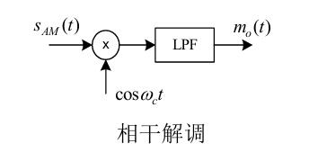

- 适用于所有线性调制信号的解调
- 需要一个与载波信号严格**同频同相**的相干载波

##### **包络检波**

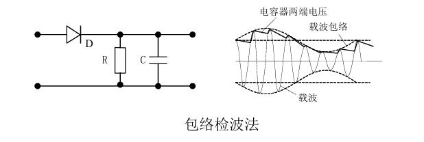

#### 抗噪声性能

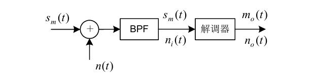
$$
\frac{S_o}{N_o} = G \frac{S_i}{N_i}
$$
其中$G$称为调制制度增益或信噪比增益, $N_i = n_0B$[^2]

- **DSB调制制度增益：**$G=2$
- **SSB调制制度增益：**$G=1$
- AM调制制度增益：$G \le 2/3$

- **相干解调下：**$N_o=1/4N_i$
- **包络检波下：**$S_o= \overline{m^2(t)}=2P_s;\ N_o=N_i$(大信噪比下)

> **门限效应:** 当包络检波器的输入信噪比降到一个特定数值后，输出信噪比急剧下降。门限效应是由包络检波器的非线性解调作用所引起的。相干解调的方法解调各种线性调制信号时不存在门限效应。

######  噪声计算题

设某信道具有均匀的双边噪声功率谱密度$Pn(f)=0.5×10^{-11} \mathrm {W/Hz} $，在该信道中传输抑制载波的双边带信号，并设调制信号$m(t)$的频带限制在$5 \mathrm {kHz}$，而载波为$100\mathrm {kHz}$，发射信号功率$S_T$为$60\mathrm {dBm}$，信道（指调制信道）损耗$α$为$70\mathrm {dB}$，试确定：

（1）该理想带通滤波器的中心频率和通带宽度；

（2）解调器输入端的信噪功率比；

（3）解调器输出端的信噪功率比；

（4）解调器输出端的噪声功率谱密度。 

解答: 

（1）为保证信号顺利通过并有效滤除噪声，带通滤波器的宽度等于已调信号的带宽， 即$B=2f_H=2 \times 5 \mathrm {kHz}=10 \mathrm {kHz}$，带通滤波器中心频率为$100 \mathrm {kHz}$

（2）解调器输入端噪声功率为：$N_{i}=2P_{n}\left( f\right) B=10^{-7}W$
$$
\begin{aligned}
60dBm=10 \lg {S_T}  \qquad &\Rightarrow \qquad S_T=10^3W \\
70dB=10\lg \dfrac{S_T}{S_i} \qquad &\Rightarrow  \qquad  S_i=10^{-4}W
\end{aligned}
$$
输入信噪比为: $\frac{S_i}{N_i}=1000$

（3）$\because G_{DSB}=2 \quad  \therefore \frac{S_o}{N_o}=2000$

（4）相干解调时，输出的噪声功率是输入噪声功率的1/4，即：$N_o=1/4N_i = 2.5\times 10^{-8}W$
$\therefore P_o(f)=\frac{N_o}{B}=5\times 10^{-12} W/Hz$

### 2 非线性调制

#### 调制信号

角度调制信号一般表达式为: 
$$
s_m(t)=A \cos [\omega _c t + \varphi (t)]
$$
其中$[\omega _c t + \varphi (t)]$称为瞬时相位, $\varphi (t)$称为瞬时相位偏移

##### **PM相位调制**

相位调制指瞬时相位偏移随调制信号$m(t)$作线性变化, 即
$$
s_{PM}(t)=A \cos [\omega _c t + K_p m(t)]
$$
在单音调制[^3]下, 调相指数$m_p=K_pA_m$, 表示最大的相位偏移

##### **FM频率调制**

频率调制指瞬时频率偏移随调制信号$m(t)$成比例变化, 即
$$
s_{FM}(t)=A \cos [\omega _c t + K_f \int_{- \infty }^{t}  m(\tau) \mathrm{d} \tau ]
$$
在单音调制[^3]下, 调频指数$m_f = \dfrac{K_fA_m}{\omega_m} = \dfrac{\Delta \omega }{\omega _m} = \dfrac{\Delta f}{f_m}$, 表示最大的相位偏移
$\Delta \omega = K_fA_m$ 为最大角频偏, $\Delta f = m_f \cdot f_m$为最大频偏

[^3]: 单音调制指调制信号为单一频率的正弦波, 即$m(t) = A_m \cos {\omega _m t} = A_m \cos{2 \pi f_m t}$​ 

带宽: 
$$
B _{FM} = 2(m_f +1)f_m = 2(\Delta f + f_m)
$$
已调信号功率为: 
$$
P_{FM} = \frac{A^2}{2} = P_c
$$

#### 抗噪声性能

在使用非相干解调, 大信噪比的条件下: 
$$
G_{FM} = 3m_f^2(m_f+1) \approx 3m_f^3
$$

> FM系统采用*预加重/去加重*技术可以提高解调器输出信噪比

## 四 数字基带传输系统 

### 1 数字基带信号

#### 波形

| 波形             | 1                      | 0                 |
| ---------------- | ---------------------- | ----------------- |
| 单极性不归零波形 | 正电平                 | 0                 |
| 双极性不归零波形 | 正电平                 | 负电平            |
| 单极性归零波形   | 占空比非1的正电平      | 0                 |
| 双极性归零波形   | 占空比非1的正电平      | 占空比非1的负电平 |
| 差分波形         | 相邻码元跳变           | 相邻码元不跳变    |
| 多电平波形       | 可用多个电平表示不同值 | /                 |

数字基带信号可表示为: 
$$
s(t) = \sum _{n= - \infty }^{\infty } a_ng(t-nT_s)
$$
其中$a_n$为第$n$个码元对应电平值, $T_s$为码元持续时间, $g(t)$为某种脉冲波形

#### 功率谱

双边功率谱密度为
$$
\begin{aligned}
P_{s}\left( f\right) &=P_{u}\left( f\right) +P_{v}\left( f\right) \\
&=f_{s}P\left( 1-P\right) \lvert  G_{1}\left( f\right) -G_{2}\left( f\right) \rvert ^{2} +\\
& \sum ^{\infty }_{m=-\infty }
 \lvert f_{s} [PG_1(mf_s)+(1-P)G_2(mf_s)] \rvert ^{2} \delta \left( f-mf_{s}\right) 
\end{aligned}
$$
其中$P_u(f)$为交变波功率谱密度, $P_v(f)$为稳态波功率谱密度, $P$为任一码元时间内$g_1(t)$出现的概率, $f_s=1/T_s$为码元速率, $G_1(t)和G_2(t)$为$g_1(t)和g_2(t)$的傅立叶变换

### 2 基带传输的常用码型

#### AMI码

传号交替反转码

将1交替变换为"+1"和"-1", 0保持不变

- 没有直流分量
- 连续0没有定时信息

#### HDB3码

三阶高密度双极性码

1. 当连0个数小于4时与AMI编码相同
2. 当连0个数超过3时, 将4个连0化作一小节, 定义为`B00V`, 称为破坏节, V称为破坏脉冲(一定有), B称为调节脉冲(看情况)
3. **V与前一个相邻的非0脉冲极性相同, 且相邻V码极性交替**
4. B用来调节使得3中的条件成立
5. V与后一个非0脉冲极性也要交替

- 保证定时信息的提取

#### 双相码

数字双相码又称曼彻斯特（Manchester）码

用一个周期的正负对称方波表示“0”(例如01)，而用其反相波形表示“1”(例如10)

- 带宽加倍

### 3 码间串扰

其它码元的波形蔓延到当前码元的抽样时刻上, 从而对当前码元的判决造成干扰

**无码间串扰条件(奈奎斯特第一准则):** 

时域条件: 
$$
h(kT_s) = \left\{\begin{matrix}
1, &k=0\\
0, &k \ne 0的其他整数
\end{matrix}\right.
$$

> $h(t)$仅在当前码元抽样时刻有值, 其它码元的抽样时刻均为0

频域条件: 
$$
\sum _i H(\omega + \frac{2 \pi i}{T_s})=C, \lvert \omega \rvert \le \frac{\pi}{T_s}
$$
或者:
$$
\sum _i H(f + R_Bi)=C, \lvert f \rvert \le \frac{R_B}{2}
$$

> 将$H( \omega )$经过切割, 平移, 叠加后可以等效为一个理想低通滤波器

### 4 无码间串扰的传输特性设计

#### 理想低通特性

传输特性: 
$$
H( \omega ) = \left\{\begin{matrix}
T_s, & \lvert \omega \rvert \le \frac{\pi}{T_s} \\
0, & \lvert \omega \rvert > \frac{\pi}{T_s}
\end{matrix}\right.
$$
冲击响应:
$$
h(t) = Sa(\frac{\pi t} {T_s})
$$
**带宽: (奈奎斯特带宽)**
$$
B = W_1 = \frac{1}{2T_s}=f_N
$$
**码元速率: (奈奎斯特速率)**
$$
R_B=1/T_s=2f_N
$$
频带利用率: 
$$
\eta  = 2 \mathrm{Baud/Hz}
$$

#### 余弦滚降特性

传输特性: 
$$
H( \omega ) = \left\{\begin{matrix}
T_s, & 0 \le \lvert \omega \rvert \le \frac{(1- \alpha )\pi}{T_s} \\
\frac{T_s}{2}[1+ \sin{\frac{T_s}{2 \alpha}(\frac{\pi}{T_s}- \omega )}],
&\frac{(1- \alpha )\pi}{T_s} \le \lvert \omega \rvert < \frac{(1+ \alpha )\pi}{T_s} \\
0, & \lvert \omega \rvert \ge \frac{(1+ \alpha )\pi}{T_s}
\end{matrix}\right.
$$
冲击响应: 
$$
h(t) = Sa(\frac{\pi t} {T_s}) \cdot \dfrac{\cos{ \alpha } \pi t / T_s}{1-4 \alpha ^2 t^2 / T_s^2}
$$
式中$\alpha$为**滚降系数**, 定义为
$$
\alpha = \frac{f_\Delta }{f_N}
$$
式中$f_N$为奈奎斯特带宽, $f_\Delta$为超出奈奎斯特带宽的扩展量

**带宽:** 
$$
B= (1+\alpha )f_N
$$
码元速率同奈奎斯特速率: 
$$
R_B=2f_N
$$

**频带利用率:** 
$$
\eta = \frac{2}{1+ \alpha }
$$

### 5 抗干扰性能

#### 二进制双极性基带系统

总误码率: 
$$
P_e = P(1)P(0/1)+P(0)P(1/0)
$$
最佳门限电平: [^4]
$$
V_d^*=\frac{\sigma _n ^2}{2A} \ln{\frac{P(0)}{P(1)}}
$$
其中$\sigma _n ^2$为噪声平均功率

**当$P(0)=P(1)=1/2$时有:** 
$$
\begin{aligned}
V_d^* &= 0 \\
P_e &= \frac{1}{2}erfc(\frac{A}{\sqrt{2} \sigma _n } ) 
\end{aligned}
$$

#### 二进制单极性基带系统

最佳门限电平: [^4]
$$
V_d^*= \frac{A}{2} + \frac{\sigma _n ^2}{A} \ln{\frac{P(0)}{P(1)}}
$$
**当$P(0)=P(1)=1/2$时有:** 
$$
\begin{aligned}
V_d^* &= \frac{A}{2} \\
P_e &= \frac{1}{2}erfc(\frac{A}{2\sqrt{2} \sigma _n } ) 
\end{aligned}
$$

[^4]: 使误码率最小的判决门限称为最佳判决门限电平

### 6 眼图

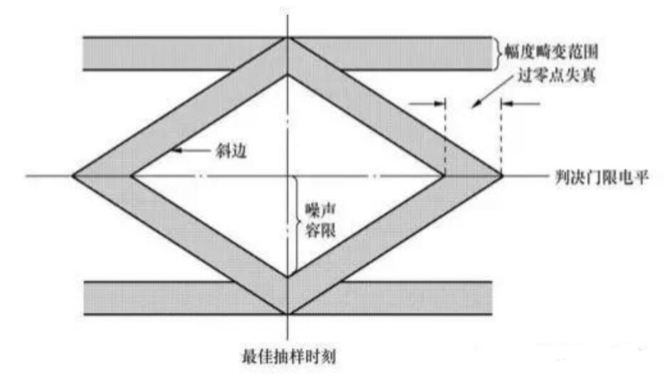

### 7 部分响应系统

奈奎斯特第二准则: 人为地, 有规律地在码元的抽样时刻**引入码间串扰**, 并在接收端判决前加以消除, 从而达到改善频谱特性, 压缩传输频带, 使频带利用率提高到理论上最大值($2B/Hz$)

部分响应系统存在码间干扰。采用**预编码, 相关编码方法**可以消除差错传播问题。

例如: 差分码$b_k = a_k \oplus b_{k-1} \qquad \oplus$ 为模2加法

### 8 时域均衡

使用相近的几个码元进行某些运算作为判决的输入电平

提高基带传输系统的**可靠性**, **减小码间串扰**。

## 五 数字带通传输系统

### 1 二进制数字调制

#### 2ASK振幅键控

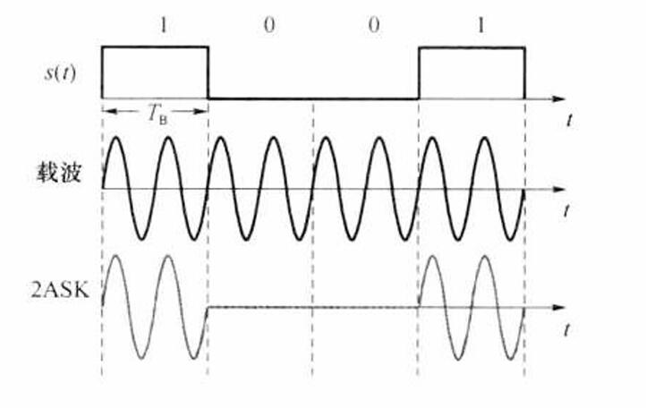

时域表达式: 
$$
e_{2ASK}(t)= \sum _n a_n g(t-nT_s) \cos{\omega _c t}
$$
信号产生: 模拟相乘法和数字键控法
信号解调: 相干解调和非相干解调

第一零点带宽: 
$$
B= 2f_s=2R_B
$$
抗干扰性能: 

​	相干解调最佳判决门限与误码率为
$$
\begin{aligned}
b^* &= \frac{a}{2} \\
P_e &= \frac{1}{2} erfc( \sqrt{\frac{r}{4}}) \approx \frac{1}{\sqrt{\pi r}}e^{-\frac{r}{4}}
\end{aligned}
$$
​	非相干解调最佳判决门限与误码率为
$$
\begin{aligned}
b^* &= \left\{\begin{matrix}
 \sqrt{\frac{r}{2}} & r \gg 1 \\
 \sqrt{2}           & r \ll 1
\end{matrix}\right.  \\
P_e &= \frac{1}{2}e^{-\frac{r}{4}}
\end{aligned}
$$
其中$r=\frac{a^2}{2\sigma ^2}=\frac{S_i}{N_i}$为信噪比

#### 2FSK频移键控

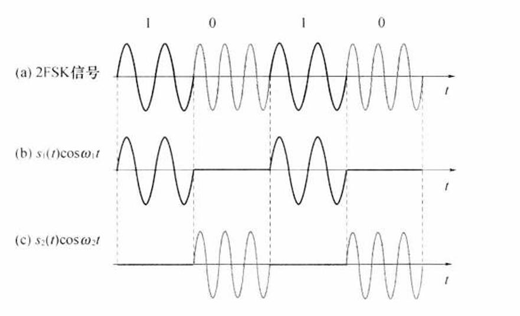

时域表达式: 
$$
e_{2FSK}(t)=\left\{\begin{matrix}
A \cos{(\omega _1 t+\phi _n)},  & 发送1时 \\
A \cos{(\omega _2 t+\theta _n)},  & 发送0时
\end{matrix}\right.
$$
信号产生: 模拟相乘法和数字键控法
信号解调: 相干解调, 非相干解调, 过零检测法, 差分检波法

第一零点带宽: 
$$
B=\lvert f_2 - f_1 \rvert +2f_s
$$
抗干扰性能

​	相干解调
$$
P_e = \frac{1}{2} erfc( \sqrt{\frac{r}{2}}) \approx \frac{1}{\sqrt{2\pi r}}e^{-\frac{r}{2}}
$$
​	非相干解调
$$
P_e = \frac{1}{2}e^{-\frac{r}{2}}
$$

#### 2PSK相移键控

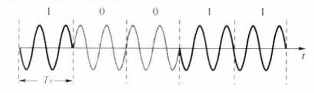

时域表达式:
$$
e_{2PSK}(t)=\left\{\begin{matrix}
A \cos{(\omega _c t)},  & 发送概率为P \\
-A \cos{(\omega _c t)},  & 发送概率为1-P
\end{matrix}\right.
$$
信号产生: 模拟相乘法和数字键控法
信号解调: 相干解调

第一零点带宽:
$$
B = 2f_s =2R_B
$$
抗干扰性能:

​	相干解调
$$
P_e = \frac{1}{2} erfc( \sqrt{r})
$$

#### 2DPSK差分相移键控

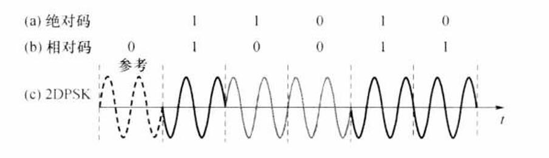

时域表达式同[2PSK](#2PSK相移键控)

信号产生: 码变换+模拟相乘法 和 码变换+数字键控法
信号解调: 相干解调+码反变换法 和 差分相干解调法

第一零点带宽同[2PSK](#2PSK相移键控)

抗干扰性能: 

​	相干解调
$$
P_e = erfc( \sqrt{r})
$$
​	非相干解调
$$
P _e = \frac {1}{2} e^{-r}
$$

#### **性能比较**

<table style="border-collapse: collapse; width: 100%; margin-left: auto; margin-right: auto;" border="1">
<tbody>
<tr>
<td style="width: 24.9395%; text-align: center; vertical-align: middle;" rowspan="3">调制方式</td>
<td style="text-align: center; vertical-align: middle; width: 74.8186%;" colspan="3">误码率</td>
</tr>
<tr>
<td style="text-align: center; vertical-align: middle; width: 49.8791%;" colspan="2">相干解调</td>
<td style="text-align: center; vertical-align: middle; width: 24.9395%;" rowspan="2">非相干解调</td>
</tr>
<tr>
<td style="width: 24.9395%; text-align: center; vertical-align: middle;">通式</td>
<td style="width: 24.9395%; text-align: center; vertical-align: middle;">大信噪比</td>
</tr>
<tr>
<td style="width: 24.9395%; text-align: center; vertical-align: middle;">2ASK</td>
<td style="width: 24.9395%; text-align: center; vertical-align: middle;">$ \frac{1}{2} erfc( \sqrt{\frac{r}{4}}) $</td>
<td style="width: 24.9395%; text-align: center; vertical-align: middle;"> $\frac{1}{\sqrt{\pi r}}e^{-\frac{r}{4}} $</td>
<td style="width: 24.9395%; text-align: center; vertical-align: middle;">$\frac{1}{2}e^{-\frac{r}{4}}$</td>
</tr>
<tr>
<td style="width: 24.9395%; text-align: center; vertical-align: middle;">2FSK</td>
<td style="width: 24.9395%; text-align: center; vertical-align: middle;">$\frac{1}{2} erfc( \sqrt{\frac{r}{2}})$</td>
<td style="width: 24.9395%; text-align: center; vertical-align: middle;">$ \frac{1}{\sqrt{2\pi r}}e^{-\frac{r}{2}}$</td>
<td style="width: 24.9395%; text-align: center; vertical-align: middle;">$\frac{1}{2}e^{-\frac{r}{2}}$</td>
</tr>
<tr>
<td style="width: 24.9395%; text-align: center; vertical-align: middle;">2PSK</td>
<td style="width: 24.9395%; text-align: center; vertical-align: middle;">$\frac{1}{2} erfc( \sqrt{r})$</td>
<td style="width: 24.9395%; text-align: center; vertical-align: middle;">$\frac{1}{\sqrt{4\pi r}}e^{-r}$</td>
<td style="width: 24.9395%; text-align: center; vertical-align: middle;">&nbsp;</td>
</tr>
<tr>
<td style="width: 24.9395%; text-align: center; vertical-align: middle;">2DPSK</td>
<td style="width: 24.9395%; text-align: center; vertical-align: middle;">$erfc( \sqrt{r})$</td>
<td style="width: 24.9395%; text-align: center; vertical-align: middle;">$\frac{1}{\sqrt{\pi r}}e^{-r}$</td>
<td style="width: 24.9395%; text-align: center; vertical-align: middle;">$\frac{1}{2}e^{-r}$</td>
</tr>
</tbody>
</table>

### 2 多进制数字调制系统

$$
R_b=R_B \log _2 M
$$

在相同的码元速率下，多进制信息速率比二进制系统高；在相同信息速率下，多进制传输速率比二进制低，即$T_S$加大，码元能量增加，能减小由于信道特性引起的码间干扰的影响。

## 信源编码

模数转换步骤: **抽样, 量化, 编码**

### 模拟信号的抽样

抽样定理: 能恢复原信号的最小抽样速率为: 
$$
\begin{aligned}
低通信号: & \qquad  f_s=2f_H \\
带通信号: & \qquad  f_s \approx 2B = 2(f_H-f_L)
\end{aligned}
$$

### PAM模拟脉冲调制

PAM 是脉冲载波的幅度随调制信号变化的一种调制方式，它是一种模拟调制方式。

抽样方式分为抽样的平顶抽样和自然抽样。

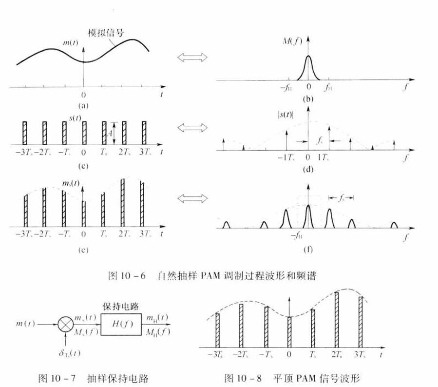

### 量化

#### 均匀量化

设模拟抽样信号取值范围在$a$到$b$之间, 量化电平数为$M$, 则量化间隔为: 
$$
\Delta v = \frac{b-a}{M}
$$
信号$m_k$的平均功率可表示为: 
$$
S_0 = E(m_k^2) = \int _a ^b m_k^2 f(m_k) \mathrm{d}m_k
$$
其中$f(m_k)$为信号抽样值$m_k$的概率密度

> 均匀量化在小信号情况下信噪比小

#### 非均匀量化

为了**提高**小信号的量化信噪比

先将信号抽样值压缩, 再进行均匀量化

##### **13折A律编码**

$$
y=\left\{\begin{matrix}
\frac{Ax}{1+\ln A}   & 0<x \le \frac{1}{A}  \\
\frac{1+ \ln Ax}{1+ \ln A}   & \frac{1}{A} \le x \le 1
\end{matrix}\right.
$$

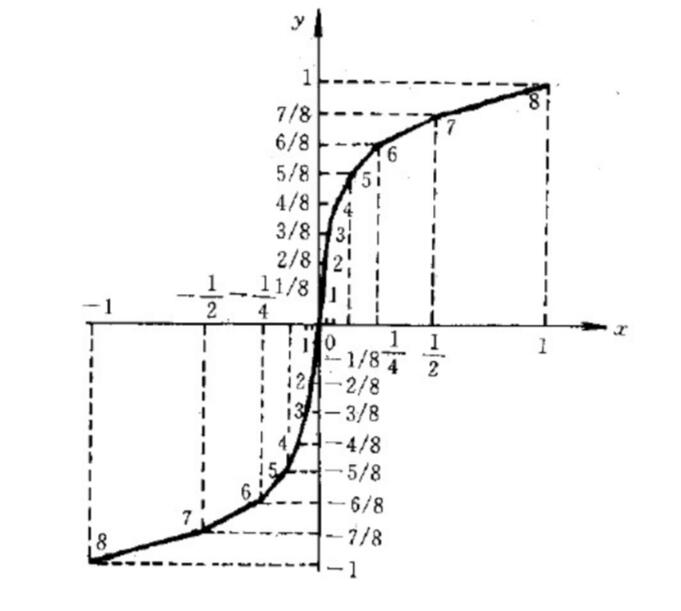

##### **15折μ律编码**

$$
y=\frac{\ln (1+ \mu x)}{\ln (1+ \mu )} \qquad \mu=255
$$

### PCM脉冲编码调制

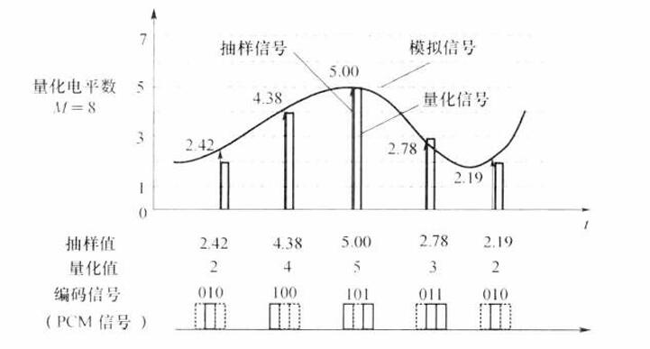

模拟信号抽样, 量化, 变换成二进制符号的基本过程

PCM编码使用折叠二进制码[^5]

[^5]: 折叠二进码的特点是正、负两半部分，除去最高位后，呈倒影关系、折叠关系. 用最高位表示信号的正、负极性，而用其余的码表示信号的绝对值. 

#### **A律13折的8位编码**

设抽样脉冲值为$n$, 编码为$C[ 7:0]$

则$C$的定义为

- $C[7]=(n>0)$
- $C[6:4]=x$满足$2^{(x+3)} \le n < 2^{(x+4)}\; (n \ge 16)或x=0 \; (n<16)$
- $C[3:0]=y$满足$2^{(x+3)}+y \cdot 2^{(x-1)}$是距离$n$最近的值

| 量化段序号 | 电平范围(Δ) | 段落码 | 段落起始电平(Δ) | 16均匀量化间隔(Δ) |
| :--------: | :---------: | :----: | :-------------: | :---------------: |
|     8      |  1024~2048  | 1 1 1  |      1024       |        64         |
|     7      |  512~1024   | 1 1 0  |       512       |        32         |
|     6      |   256~512   | 1 0 1  |       256       |        16         |
|     5      |   128~256   | 1 0 0  |       128       |         8         |
|     4      |   64~128    | 0 1 1  |       64        |         4         |
|     3      |    32~64    | 0 1 0  |       32        |         2         |
|     2      |    16~32    | 0 0 1  |       16        |         1         |
|     1      |    0~16     | 0 0 0  |        0        |         1         |

**量化误差:** 抽样值与量化电平之差的绝对值

**均匀量化11位码:** 即量化电平的11位二进制值

均匀量化12位码: 均匀量化11位码最后加个0 (将分度值由△细化为1/2△)

**码元速率:** 
$$
R_b = f_s \cdot N
$$
其中$f_s$为抽样速率, $N$为编码二进制位数

**奈奎斯特带宽:**
$$
B = \frac{R_b}{2} = \frac{f_s \cdot N}{2}
$$
**第一零点带宽:**
$$
B = \frac{1}{\tau} = \frac{R_b}{ \eta }
$$
其中$\eta$为传输矩形波占空比

### △M增量调制

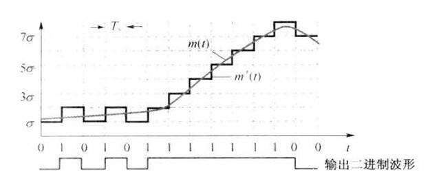

增量调制的最大跟踪斜率: 
$$
K = \sigma \cdot f_s
$$

### TDM时分复用

 TDM是利用时间分片方式来实现在同一信道中传输多路信号的一种方法

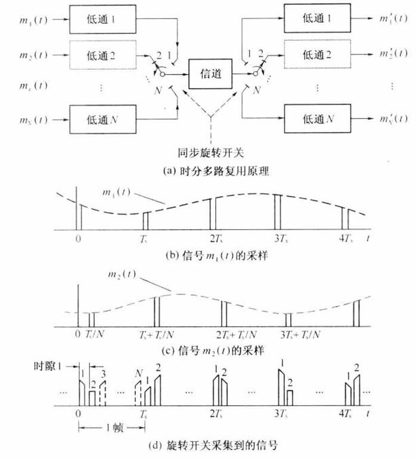

## 差错控制编码

是一种信道编码技术，目的是提高系统的**可靠性**。

>  注意与信源编码的比较，信源编码目的是提高通信系统的有效性

差错控制编码的方式：**检错重发、前向纠错、反馈校验和检错删除**。 

- **码重**：码组中非“0”码元数目称为码重
- **码距**：两个码字中对应位上数字不同的位数称为码距
- **最小码距**：某种编码中各个码组之间距离的最小值, 记为$d_0$
- **最小码距与检纠错能力的关系**
  - 检出$e$个错误，要求：$d_0 \ge e+1$
  - 纠正$t$个错误，要求：$d_0 \ge 2t+1$
  - 检出$e$个错误，纠正$t$个错误，$e>t$，要求：$d_0 \ge e+t+1$
- **编码效率**：(n, k)为分组码，其中k是信息元的个数，n为码长，则编码效率为$\frac{k}{n}$

### 简单的差错控制编码

奇偶监督码(RS-232)、二维奇偶监督码和恒比码。其它常用差错控制码有商品条形码、QR二维码（手机扫码）、身份证号码、累加和校验。 

### 线性分组码

#### 汉明码

一种能够纠正一位错码且编码效率较高的线性分组码

$(n,k)$的分组码中, $k$是信息元的个数, $n$为码长, $r=n-k$为监督位个数. 需满足:
$$
2^r-1 \ge n \qquad 或 \qquad 2^r \ge k+r+1
$$

##### 构造关系

以$(7,3)$分组码为例: 

记码元为$a_6a_5 \dots a_0$, 其中$a_6a_5a_4a_3$为信息位, $a_2a_1a_0$为监督位

编码时应满足: 
$$
\left\{\begin{matrix}
a_2=a_6 \oplus a_5 \oplus a_4 \\
a_1=a_6 \oplus a_5 \oplus a_3 \\
a_0=a_6 \oplus a_4 \oplus a_3
\end{matrix}\right.
$$
解码时计算校正子: 
$$
\left\{\begin{matrix}
S_1=a_2 \oplus a_6 \oplus a_5 \oplus a_4 \\
S_2=a_1 \oplus a_6 \oplus a_5 \oplus a_3 \\
S_3=a_0 \oplus a_6 \oplus a_4 \oplus a_3
\end{matrix}\right.
$$

| $S_1S_2S_3$ | 错码位置 | $S_1S_2S_3$ | 错码位置 |
| ----------- | -------- | ----------- | -------- |
| 001         | $a_0$    | 101         | $a_4$    |
| 010         | $a_1$    | 110         | $a_5$    |
| 100         | $a_2$    | 111         | $a_6$    |
| 011         | $a_3$    | 000         | 无       |

#### 矩阵形式

**监督关系**可表示为: 
$$
\mathbf{H^T \cdot A = 0^T}
$$
其中$\mathbf{H}$为$n \times k$的监督矩阵, $\mathbf{A}=[a_{(k-1)} a_{(k-2)} \dots a_0]$

**典型监督矩阵:** 
$$
\mathbf{H = [PI_r]} 
$$
其中$\mathbf{P} $为 $r \times k$的矩阵, $\mathbf{I_r}$为$r \times r$的单位方阵

**典型生成矩阵:**
$$
\mathbf{G = [I_k Q]}
$$
其中$\mathbf{I_k}$为$k \times k$阶单位方阵, $\mathbf{Q=P^T}$

由生成矩阵可以得出整个码组:
$$
\mathbf{A = MG}
$$
**校正子:**
$$
\mathbf{S = B H^T}
$$

#### 性质

- 具有**封闭性**，即任意两个许用码组之和仍为一许用码组
- **最小码距等于码组非全零码组的最小码重**

### 循环码

循环码是线性分组码的子类，它除了具有分组码的一般性质外，还具有**循环性质**，即循环性是指任一码组循环一位以后，仍然是该码中的一个码组。

#### 生成多项式

$$
g(x) = a_{n-1}x^{n-1} + a_{n-2}x^{n-2} + \dots + a_1x + a_0
$$

生成多项式$g(x)$的**性质**: (用于判断$g(x)$)

- **$g(x)$是$(n-k)$次多项式**
- $g(x)$的常数项不为零
- $g(x)$是$(x^n+1)$的一个因式

#### 生成矩阵

$$
\mathbf{G}(x)= 
\begin{bmatrix}
x^{k-1}g(x) \\
x^{k-2}g(x) \\
\vdots  \\
xg(x) \\
g(x)
\end{bmatrix}
$$

#### 编码方法

1. $x^{n-k} \times m(x)$
2. $g(x) \div (x^{n-k} \times m(x))$得到商式$Q(x)$和余式$r(x)$
3. 输出编码$T(x) = x^{n-k}m(x) + r(x)$

## 同步原理

### 载波同步

#### 有辅助导频

锁相环PLL

#### 无辅助导频

##### 平方环法

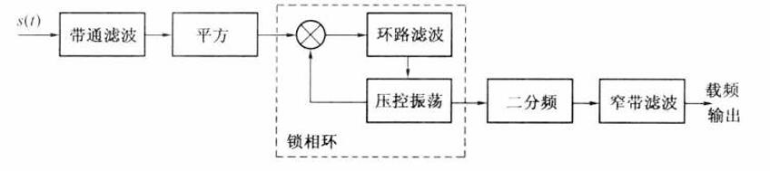

**相位含糊问题：**在平方环法提取载波时，由于分频器的随机状态的不确定性， 其输出载波电压有180°相位差的可能性，这种现象称为相位含糊。科斯塔斯环 法也存在相位含糊问题。对于相位调制，解决相位含糊问题的方法是差分相移。

##### 科斯塔斯环(Costas)

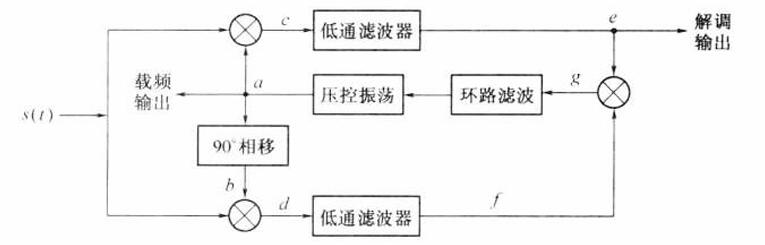

##### 再调制法

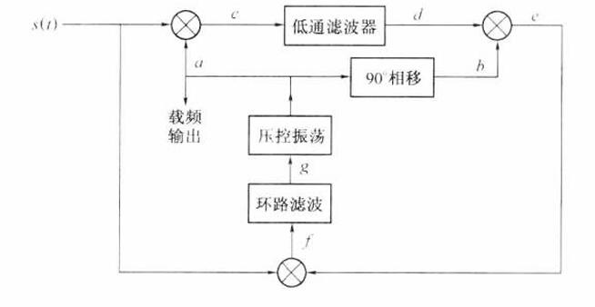

### 码元同步

#### 外同步

插入导频, 接收端使用窄带滤波器提取

#### 自同步法

##### 开环码元同步法

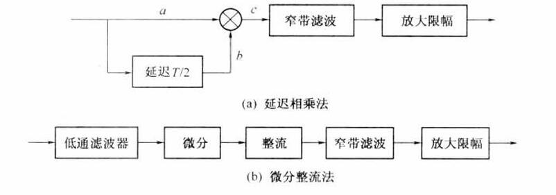

##### 闭环码元同步法

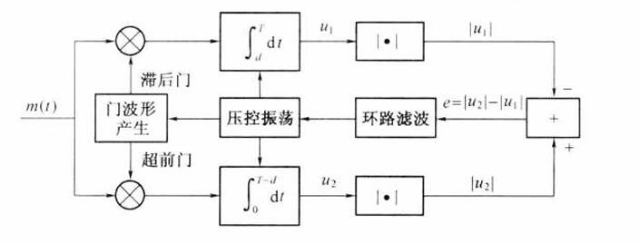

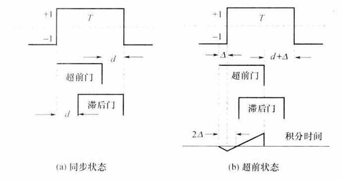

### 群同步

#### 集中插入

集中插入在信息码组的前头, 要求同步码的自相关特性曲线具有**尖锐的单峰特性**，以便容易从接收码元序列中识别出来

#### 分散插入

较短

#### 起止式同步
