> 写一半写不下去了, 这高频真难复习

## 绪论

### 通信系统的组成

### 无线电波的频段划分表

| 波段        | 波长               | 频率                | 频段        | 主要传播方式和用途                                      |
| ----------- | ------------------ | ------------------- | ----------- | ------------------------------------------------------- |
| 长波(LW)    | $10^3 \sim 10^4 m$ | $30 \sim 300 kHz$   | 低频(LF)    | 地波﹔远距离通信                                        |
| 中波(MW)    | $10^2 \sim 10^3 m$ | $300kHz \sim 3 MHz$ | 中频(MF)    | 地波、天波﹔广播、通信、导航                            |
| 短波(SW)    | $10 \sim 100m$     | $3 \sim 30MHz$      | 高频(HF)    | 天波、地波﹔广播、通信                                  |
| 超短波(VSW) | $1 \sim 10m$       | $30 \sim 300MHz$    | 甚高频(VHF) | 直线传播、对流层散射﹔通信、电视广播、调频广播、雷达    |
| 分米波(USW) | $10 \sim 100 cm$   | $300MHz \sim 3GHz$  | 特高频(UHF) | 直线传播、散射传播;通信、中继与卫星通信、雷达、电视广播 |
| 厘米波(SSW) | $1 \sim 10 cm$     | $3 \sim 30GHz$      | 超高频(SHF) | 直线传播﹔中继和卫星通信、雷达                          |
| 毫米波(ESW) | $1 \sim 10 mm$     | $30 \sim 300GHz$    | 极高频(EHF) | 直线传播﹔微波通信、雷达                                |

> 主讲$300kHz \sim 300MHz$左右的频段

### 信号调制

可见[通信原理](https://vincent-ice.github.io/study-materials/posts/通信原理/)的对应部分

## 高频电路基础

### 高频震荡回路

#### 串联谐振回路

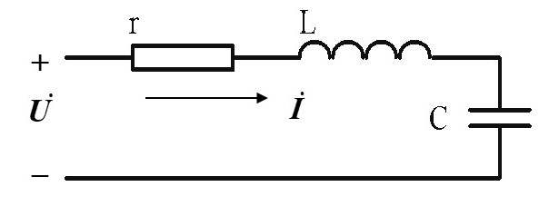

串联阻抗为: 

<table style="border-collapse: collapse; width: 100%; margin-left: auto; margin-right: auto;" border="1">
<tbody>
<tr>
<td style="width: 48.9094%;  text-align: center; vertical-align: middle;">$Z_s = r + j \omega L + \frac{1}{j \omega C}$</td>
<td style="width: 48.9094%;  text-align: center; vertical-align: middle;">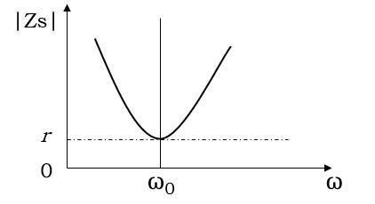</td>
</tr>
</tbody>
</table>
**串联电抗为:** 

<table style="border-collapse: collapse; width: 100%; margin-left: auto; margin-right: auto;" border="1">
<tbody>
<tr>
<td style="width: 48.9094%;  text-align: center; vertical-align: middle;">$X=\omega L - \frac{1}{\omega C}$</td>
<td style="width: 48.9094%;  text-align: center; vertical-align: middle;">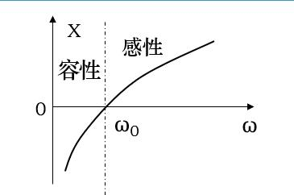</td>
</tr>
</tbody>
</table>
**谐振(角)频率为:**
$$
\omega _0 = \frac{1}{\sqrt{LC}} (rad/s) \qquad f_0 = \frac{1}{2 \pi \sqrt{LC}} (Hz)
$$
**品质因数:**

反应了L和C中的储存的能量与电阻r消耗能量的比值
$$
Q = \frac{\omega _0 L}{r}=\frac{1}{r \omega _0 C}
$$
广义失谐量:
$$
\xi = 2Q \frac{\Delta \omega }{\omega _0}=2Q \frac{\Delta f}{f_0}
$$
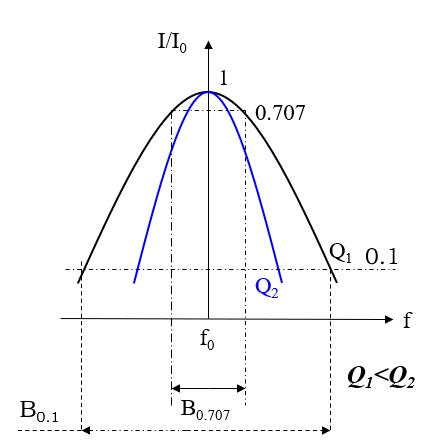

**通频带:**[^1]
$$
B_{0.7}=2 \Delta f = \frac{f_0}{Q}
$$
**矩形系数:**[^2]
$$
K_{r0.1}=\frac{B_{0.1}}{B_{0.7}} \approx 9.95
$$

[^1]: 将回路电流值下降为谐振值的$1/\sqrt{2}$时对应的频率范围称为回路的通频带
[^2]: 0.1带宽和0.707带宽的比值叫矩形系数K, 用于衡量一个谐振电路对其他频率的抑制能力

#### 并联谐振回路

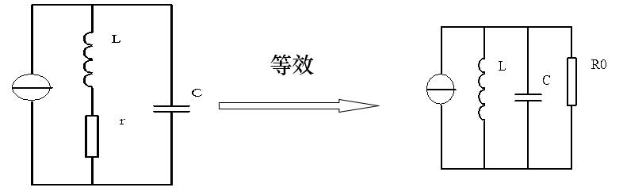

$$
\mathbf{R_0 = \frac{L}{rC}} 
$$

并联阻抗: 
$$
Z_p=\frac{(r+j \omega L)\frac{1}{j \omega C}}{r+ j \omega L + \frac{1}{j\omega C}}
$$
并联导纳:

<table style="border-collapse: collapse; width: 100%; margin-left: auto; margin-right: auto;" border="1">
<tbody>
<tr>
<td style="width: 48.9094%;  text-align: center; vertical-align: middle;">$Y_p = \frac{rC}{L} + j(\omega C - \frac{1}{\omega L})$</td>
<td style="width: 48.9094%;  text-align: center; vertical-align: middle;">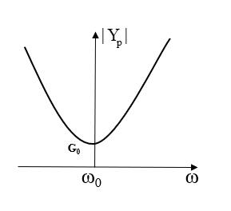</td>
</tr>
</tbody>
</table>
**并联电纳:**

<table style="border-collapse: collapse; width: 100%; margin-left: auto; margin-right: auto;" border="1">
<tbody>
<tr>
<td style="width: 48.9094%;  text-align: center; vertical-align: middle;">$B = \omega C - \frac{1}{\omega L}$</td>
<td style="width: 48.9094%;  text-align: center; vertical-align: middle;">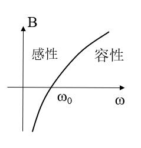</td>
</tr>
</tbody>
</table>
**品质因数:**
$$
Q = \frac{\omega _0 C}{G_0} = \frac{1}{G_0 \omega _0 L}
$$
矩形系数同串联谐振

#### 抽头并联谐振回路

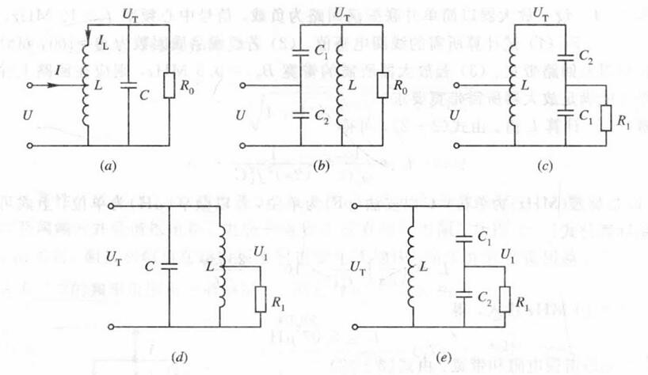

**接入系数:**
$$
p = \frac{U}{U_T} = \frac{L_1}{L_1+L_2}=\frac{C_1}{C_1+C_2}
$$

> **$L_1$为抽头部分电感 / $C_2$为抽头部分的电容**

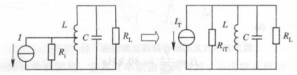
$$
\begin{aligned}
U &= pU_T \\
I_T &= pI \\
R_{i} &= p^2 R_{iT} \\
g &= \frac{1}{p^2} g_T 
\end{aligned}
$$

#### 耦合震荡回路(双调谐回路)

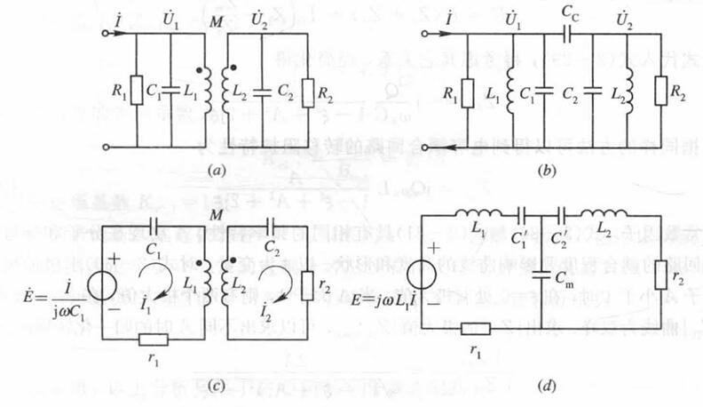

**耦合系数:**
$$
\begin{aligned}
互感耦合 & k=\frac{M}{\sqrt{L_1L_2}} \\
电容耦合 & k=\frac{Cc}{\sqrt{(C_1+Cc)(C_2+Cc)} }  
\end{aligned}
$$
临界耦合: $k_0 = \frac{1}{\sqrt{Q_1Q_2}}$

**通频带:(临界耦合)**
$$
B_{0.7}=\sqrt{2}\frac{f_0}{Q}
$$
**矩形系数:(临界耦合)**
$$
K_{r0.1}=3.15
$$

#### 石英晶体谐振器

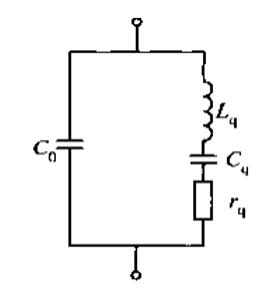

串联谐振频率
$$
f_q = \frac{1}{2 \pi \sqrt{L_qC_q}}
$$
并联谐振频率:
$$
f_0 = f_q \sqrt{1+\frac{C_q}{C_0}}
$$

### 电子噪声

#### 电阻热噪声

噪音电压功率谱密度:
$$
S_U = 4kTR
$$
噪音电流功率谱密度:
$$
S_I = 4kTG
$$
噪音电压均方值:
$$
E_n^2 = 4kTBR
$$
噪音电流均方值:
$$
I_n^2 = 4kTBG
$$

## 高频小信号放大器

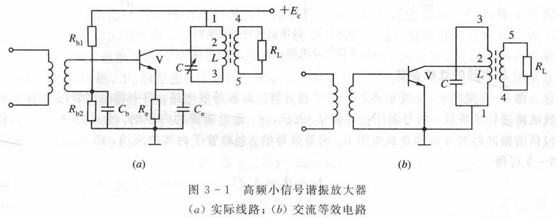

### 放大器高频等效模型

#### 晶体管高频Y参数等效电路

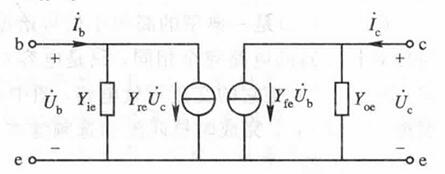
$$
I_b = Y_{ie}U_{b}+Y_{re}U_{c} \\
I_c = Y_{fe}U_{b}+Y_{oe}U_{c}
$$
#### 带载小信号放大器高频等效电路

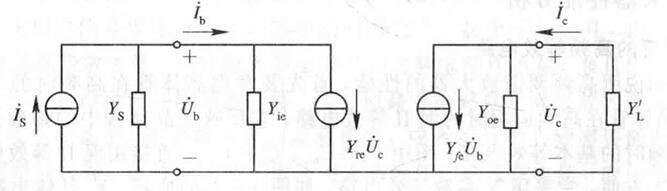

电压放大倍数:
$$
K = \frac{U_c}{U_b} = -\frac{Y_{fe}}{Y_{oe}+Y_L'}
$$
​	谐振时放大器增益为:
$$
K_0 = \frac{p_1p_2 Y_{fe}}{G_{\sum }}
$$
输入导纳:
$$
Y_i = Y_{ie}-\frac{Y_{re}Y_{fe}}{Y_{oe}+Y_L'} \approx Y_{ie}
$$
输出导纳:
$$
Y_o = Y_{oe}-\frac{Y_{re}Y_{fe}}{Y_{S}+Y_{ie}} \approx Y_{oe}
$$
谐振频率:
$$
f_0 = \frac{1}{2 \pi \sqrt{LC_{ \sum }}}
$$
有载品质因数:
$$
Q_L = \frac{1}{\omega _0 L g_{\sum}}
$$

> 次级为电阻
> $$
> C_{\sum } = C + p_1^2C_{oe} \\
> G_{\sum } = g_0 + p_1^2g_{oe} + p_2^2g_L
> $$
> 次级为放大器
> $$
> C_{\sum } = C + p_1^2C_{oe} + p_2^2C_{ie} \\
> G_{\sum } = g_0 + p_1^2g_{oe} + p_2^2g_{ie}
> $$

### 多级谐振放大器

#### 多级单调谐放大器

多级放大器谐振频率相同, 均为信号中心频率

总放大倍数为各级放大倍数累乘

频带宽度:
$$
B_{n0.7} = \sqrt{2^{1/n}-1} \cdot \frac{f_0}{Q_L}
$$
矩形系数:
$$
K_{r0.1} = \sqrt{\frac{100^{1/n}-1}{2^{1/n}-1}}
$$

#### 多级双调谐放大器

临界耦合下

总放大倍数为各级放大倍数累乘

频带宽度:
$$
B_{n0.7} = \sqrt[4]{2^{1/n}-1} \cdot \sqrt{2} \cdot \frac{f_0}{Q_L}
$$
矩形系数:
$$
K_{r0.1} = \sqrt[4]{\frac{100^{1/n}-1}{2^{1/n}-1}}
$$

## 高频功率放大器

| 分类          | 特点                          |
| ------------- | ----------------------------- |
| 甲类(A)       | 电流通角为360度，最大效率50%  |
| 乙类(B)       | 电流通角180度，最大效率78.5%  |
| 甲乙类(AB)    | 电流通角180度~360度           |
| **丙类(C)**   | 电流通角小于180度，效率比较高 |
| 开关型(D/E/S) | 开关形式，效率接近100%        |

### 丙类高频功率放大器

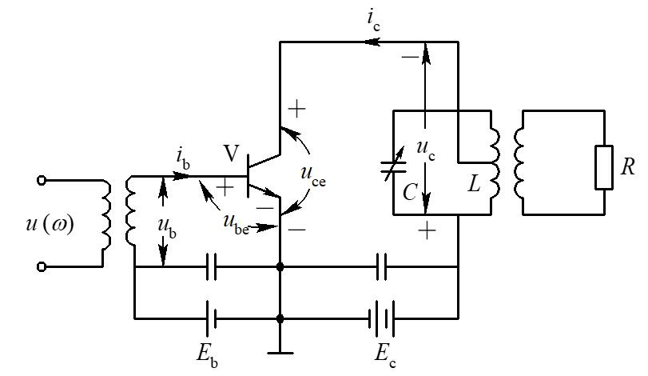

- 静态发射结反偏, 使晶体管工作在截止区($E_b$一般为负值)
