> [实验手册](https://bookdown.org/loongson/_book3/)
>
> [实验代码仓库](https://gitee.com/loongson-edu/cdp_ede_local)

## exp6：20条指令单周期CPU

目标：

- [x] [学习使用龙芯提供的基于trace比对的调试框架](https://library.vincent-ice.me/posts/%E5%8A%9F%E8%83%BD%E6%B5%8B%E8%AF%95/)
- [ ] 学习龙芯提供的单周期CPU的**数据通路**
- [x] [学习基本仿真调试思路](https://library.vincent-ice.me/posts/%E8%B0%83%E8%AF%95%E6%8A%80%E5%B7%A7/)
- [ ] 学习使用trace比对的CPU系统调试

### 数据通路

数据通路是芯片上最重要的“路”之一，介于初学时对CPU的数据通路不够了解，自己动手拼搭模块会无从下手，我们建议学习现有的CPU的数据通路，这里我们采用龙芯实验代码仓库中提供的[单周期CPU](https://gitee.com/loongson-edu/cdp_ede_local/tree/master/mycpu_env/myCPU)（存在错误需要调试）。

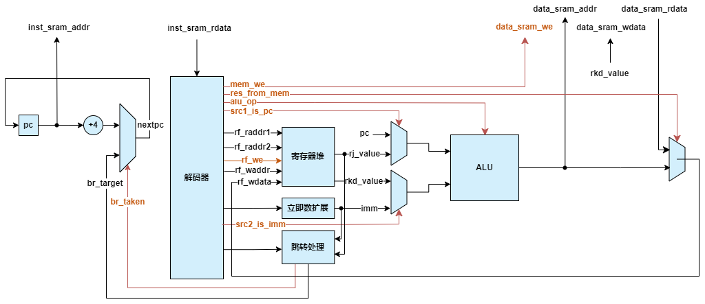

简单的数据通路结构图，请自己理解给出的单周期CPU的结构、不同部件之间如何协同工作、各个控制信号如何控制数据的流动。

CPU的debug实际上就是在观察数据通路上各处流动的数据是不是我们想要的数据，然后修改控制信号的逻辑或者数据通路本身以获得预期结果。

### 调试Tips

1. 善用反汇编文件（`func/obj/test.s`）查询某个PC对应的指令
2. 当CPU的第一条指令都没有成功运行，而你一点思路都没有的话，不妨试着在数据通路图上模拟运行一遍第一条指令
3. 运行过程中的Error一般出在之前成功运行的指令都没有用的部分

## exp7：不考虑相关冲突处理的简单流水线CPU

目标：

- [x] 学习流水线的基本概念（课上讲义、百度、[计算机体系结构基础](https://foxsen.github.io/archbase/%E6%8C%87%E4%BB%A4%E6%B5%81%E6%B0%B4%E7%BA%BF.html#sec-pipeline-cpu)）
- [x] 多周期CPU的概念
- [ ] 修改单周期CPU，使其流水线化

### 流水线的作用

随着CPU电路中组合逻辑部分越来越复杂，其延迟也必然增大，整个电路的频率就会变低。

在单周期CPU中，每个时钟周期必须完成取指、译码、读寄存器、执行、访存等很多组合逻辑工作，为了保证在下一个时钟上升沿到来之前准备好寄存器堆的写数据，需要将每个时钟周期的间隔拉长，导致处理器的主频无法提高，使用流水线技术可以提高处理器的主频。

> 在这里我将跳过流水线的基本概念，直接分析经典的五级静态单发射流水线CPU。

### 修改步骤

#### 划分流水级

按照经典五级流水线，我们将单周期CPU的处理流程划分为五个阶段：

- **IF（取指）**：从指令存储器读取指令。
- **ID（译码）**：解析指令，读取寄存器堆数据。
- **EX（执行）**：执行算术/逻辑运算或计算地址。
- **MEM（访存）**：访问数据存储器（如加载/存储指令）。
- **WB（写回）**：将结果写回寄存器堆。

#### 插入流水线寄存器

在流水线中，每一级都可能处理着不同的指令，这时我们就需要一些存储当前级指令信息的级间寄存器，这些级间寄存器储存着指令相关的数据和控制信息以供当前级处理使用。

<a name="数据通路流水线"></a> 以下是流水线化后的CPU数据通路示意图：

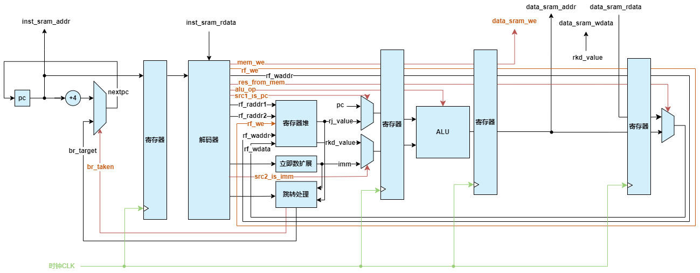

### 调试Tips

1. 调整CPU顶层接口，增加指令RAM的片选信号 `inst_sram_en` 和数据RAM的片选信号 `data_sram_en`
2. 调整CPU顶层接口，将`inst_sram_we` 和 `data_sram_we` 都从1比特的写使能调整为4比特的字节写使能
3. 在流水线CPU中，调试定错可以基于级间寄存器的内容判断
4. 各级流水线中命名需要有命名逻辑，很容易找不到

## exp8：阻塞技术解决相关引发的冲突

目标：

- [x] 流水线CPU的运行过程
- [ ] 流水线冲突以及如何处理流水线冲突（阻塞方法）

### 流水线冲突

**流水线冲突（Hazard）** 是指由于指令在流水线中并行执行时产生的依赖关系或资源竞争，导致后续指令无法正常执行的现象。主要分为三类：数据相关、控制相关和结构相关。

#### 数据冲突

数据相关根据冲突访问读和写的次序可以分为3种。

1. 写后读（Read After Write,简称RAW）相关，即后面指令要用到前面指令所写的数据，也称为真相关。
2. 写后写（Write After Write,简称WAW）相关，即两条指令写同一个单元，也称为输出相关。
3. 读后写（Write After Read,简称WAR）相关，即后面的指令覆盖前面指令所读的单元，也称为反相关。

> 在静态五级流水线CPU中，仅会出现RAW相关流水线冲突，WAW和WAR在乱序流水线中需要考虑。

对于以下两条指令：

```asm
add.w $r2, $r1, $r1
add.w $r3, $r2, $r2
```

第2条指令的源寄存器`r2`为第1条指令的目的寄存器，即存在RAW相关。其时空图如下：

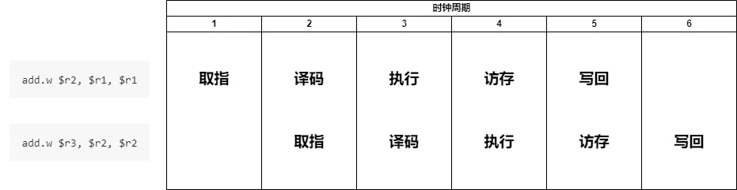

我们注意到在第3个时钟周期时，第2条指令读取`r2`寄存器的值，但此时第1条指令未执行写回，也就是说读取到`r2`寄存器的值并非是最新的、正确的值，第2条指令的运行数据必然是错误的。

为了保证执行的正确，一种最直接的解决方式是让第2条指令在译码阶段**等待（阻塞）3拍**，直到第1条指令将结果写入寄存器后才能读取寄存器，进入后续的执行阶段。这时时空图如下：

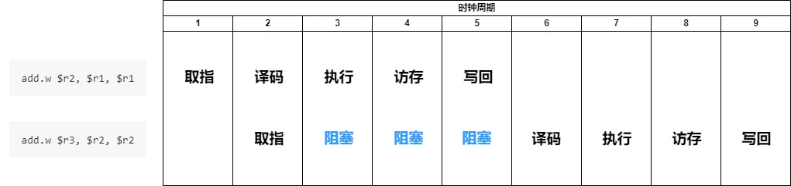

#### 控制冲突

控制冲突主要是由于分支/跳转指令导致后续指令的取指目标不确定。

对于以下的指令序列：

```asm
jirl  $r0, $r1, 0
add.w $r2, $r1, $r1
add.w $r7, $r8, $r9
```

其时空图如下：

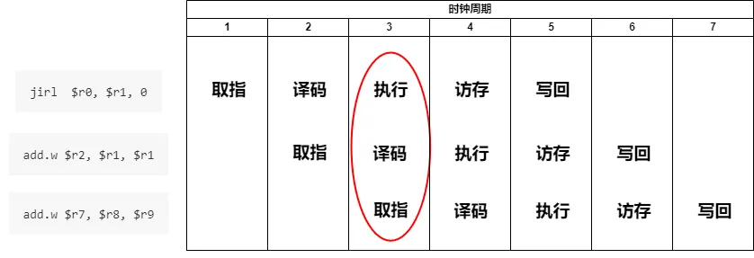

我们注意到在第3周期`jirl`指令被执行的时候，两条`add.w`指令已经进入流水线，而这两条指令是不需要被执行的，这就引发了控制冲突。

为了解决这个问题，可以通过在取指阶段引入2拍的流水线阻塞来解决，此时时空图如下：

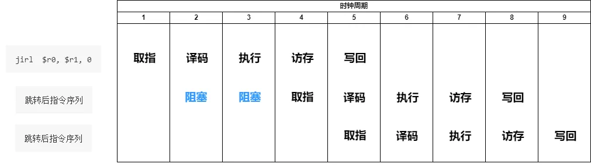

在单发射5级静态流水线中，如果增加专用的运算资源**将转移指令条件判断和计算下一条指令PC的处理调整到译码阶段**，那么转移指令后面的指令只需要在取指阶段等1拍。

> 在前文中的<a href="#数据通路流水线">数据通路图</a>中，我其实已经将跳转处理调整到译码阶段了。

为更进一步减少由控制相关引起的阻塞，可以采用转移指令的**延迟槽**技术，在定义指令系统的时候就明确转移指令延迟槽指令的执行不依赖于转移指令的结果（如MIPS），这样转移指令后面的指令在取指阶段1拍也不用等。

另外一种思路是**分支预测**，通过合理的方式对跳转目标PC的预测以消除等待计算的时间，具体可参考《超标量处理器设计》一书中分支预测[相关部分](https://www.cnblogs.com/lyc-seu/p/16995926.html)。

#### 结构冲突

结构相关引起冲突的原因是两条指令要同时访问流水线中的同一个功能部件。

回顾前文中使用阻塞处理冲突时，被阻塞的指令之后的指令也由于执行部件被占用而无法在流水线中执行，一起被堵在后面。

再回顾前文中数据通路，我们发现有指令、数据两个存储器（哈佛架构），这其实也是为了解决取指和访存同时读取存储器的结构冲突。

### 流水线冲突的解决

流水线冲突的解决方式主要分为两种：**阻塞**和**旁路**。

#### 阻塞

在前文讲解流水线冲突的过程中，我们均采用的是阻塞方法，即一个字：等！等到该准备的都准备好了再执行。其优点是控制逻辑简单，无需添加很多电路单元；当然其缺点也很明显，CPU大部分时间都在摸鱼了，造成了很大的性能浪费。

#### 旁路

旁路技术主要原理是添加一些专用计算模块，以降低甚至消除阻塞时间，体现了芯片设计中的**以空间换时间**的思路。

例如前文中将分支跳转的执行从执行级调整到译码级，并增加专用的分支跳转模块。

### 修改方式

将流水线中添加阻塞控制的思路在这里提供两种：

#### 控制单元

添加一个流水线运行控制单元，其负责处理各级流水线发出的阻塞请求，并给各流水级发出阻塞信号，阻塞信号作为级间寄存器的使能信号即可。

#### 握手机制

握手机制需要在各级流水线中添加握手信号，当两方握上手后使能级间寄存器。

```verilog
always @(posedge clk) begin
    if (for_valid && next_allowin) begin
        buffer <= for_input;
    end
end
```

- `for_valid`为前级有效信号
- `next_allowin`为后级允许进入信号
- `buffer`为级间寄存器
- `for_input`为前级输入数据

> 注意如果使用后级允许进入信号生成本级允许信号的话，可能会使关键路径贯穿整个流水线，在流水线深度较深的情况下需要注意。

### 调试Tips

1. 在已有部件正确的情况下，只需要判断新加入的部件是否正常运行
2. 优先关注控制信号是否正确
3. 如果需要可以先进行单独部件的仿真测试

## exp9：前递技术解决相关引发的冲突

目标：

- [x] 流水线冲突的概念及阻塞处理实现
- [ ] 使用前递技术处理数据冲突

### 前递技术

让我们重新观察使用阻塞方式处理数据冲突的时空图：


对于`add.w`指令，在流水线的执行级已经将结果计算出，如果我们可以提前将结果发送给译码级处，就不用阻塞流水线等待了，这就是流水线前递（Forwarding）技术。同样，我们也要添加访存级、写回级的数据前递回译码级的数据通路。

### 数据通路

以下是添加了前递通路的数据通路参考：

<a name="前推流水线"></a>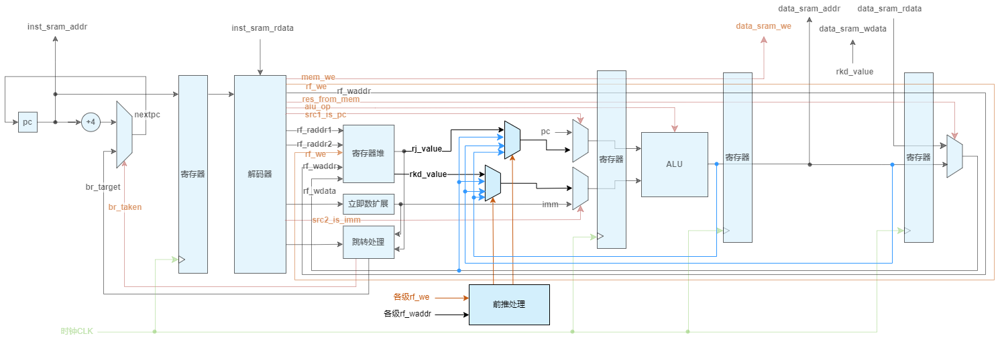

### 调试Tips

1. 同样的我们几乎只需要关注前推处理的逻辑
2. 注意`ld.w`等访存指令需要在访存级结束才能有正确数据

## exp10：算术逻辑运算指令和乘除法运算指令添加

目标：

- [x] 熟悉CPU的<a href="#前推流水线">数据通路</a>
- [ ] 学习如何控制数据流动
- [ ] 学习如何添加指令
- [x] 学习如何使用IP核（基本方法参考[RAM IP核定制](https://bookdown.org/loongson/_book3/appendix-vivado-advanced-usage.html#sec-vivado-generate-ram-ip)，具体IP核请自行搜索）
- [ ] 拓展：学习[乘法器](#乘法器)、[除法器](#除法器)原理

### 算术逻辑运算类指令

需要添加的指令有`slti`、`sltui`、`andi`、`ori`、`xori`、`sll.w`、`srl.w`、`sra.w`、`pcaddu12i`，指令具体信息可参考我的[LoongArch32r指令表]()。

**首先，我们来观察需要添加的指令有什么特点、和我们已有的指令有什么联系吗？**

- `slti`、`sltui`等与已添加的指令`slt`、`sltu`等仅在源操作数2从寄存器还是立即数中取值有区别，所以我们可以几乎**复用**`slt`、`sltu等`指令的数据通路，仅需在源操作数2的仲裁信号`src2_is_imm`处修改即可
- `sll.w`、`srl.w`等与已添加的指令`slli.w`、`srli.w`等仅在源操作数2从寄存器还是立即数中取值有区别，所以我们也可以**复用**
- `pcaddu12i`指令实际上等同`addi.w`的运算过程，只不过源操作数1为该指令的PC值，源操作数2的立即数处理为在最低位后接12bit零，所以我们只需增加一些仲裁和处理逻辑即可

> 你可能会在添加`pcaddu12i`的时候注意到，源操作数1的仲裁信号（`src1_is_pc`）和源操作数2的立即数处理和仲裁信号（`need_si20`、`src2_is_imm`）已经存在了，不需要额外添加。如果你傻乎乎的又新加了两块逻辑，那么你应该重新复习一下完整的数据通路了。
>
> 当我们需要新添加一些东西的时候，首先需要考虑一下能否**复用**已有的，或者进行一些小小的修改，而非直接开堆。冗杂的堆砌不仅是对资源的浪费，对代码可读性也是一种灾难。

经过这一通分析，我想完成这9条指令对你来说是易如反掌了吧(　‘◟ ‘)✧

你可以现在开始仿真debug，当pass了29个点的时候这些指令就没问题了，也可以接着添加最后一起仿真debug。

### 乘除运算类指令

需要添加的指令有`mul.w`、`mulh.w`、`mulh.wu`、`div.w`、`mod.w`、`div.wu`、`mod.wu`，指令具体信息可参考我的[LoongArch32r指令表]()。

**首先，我们还是分析一下这些指令**

- 没有乘除法运算单元，肯定要添加乘除法器 ~~（或者你也可以试试用加减法来算）~~
- 数据流动与`add.w`等 3R-type 指令相同，仅运算方式不一样（指令编码格式相同的指令的数据流动几乎相同）
- 指令间的区别为有/无符号运算、如何选取结果输出

这样来说，我们只需要新加一个乘除法运算单元，其它部分依照`add.w`复用即可。

#### 使用Vivado IP核实现

##### 乘法

最简单的方式为：

```verilog
wire [31:0] src1, src2;
wire [63:0] unsigned_prod;
wire [63:0] signed_prod;

assign unsigned_prod = src1 * src2;
assign signed_prod = $signed(src1) * $signed(src2);
```

Vivado中的综合工具遇到上面代码中的“＊’’运算符时，会自动调用片上的DSP48（内含固化的16位乘法器电路）实现，最终实现的电路的时序通常不错，也几乎不消耗LUT资源，推荐大家使用。

也可以使用IP核`Multiplier`实现。

##### 除法

使用`Divider Generator`IP核实现。

###### **如何创建**

首先找到`Divider Generator`IP核：

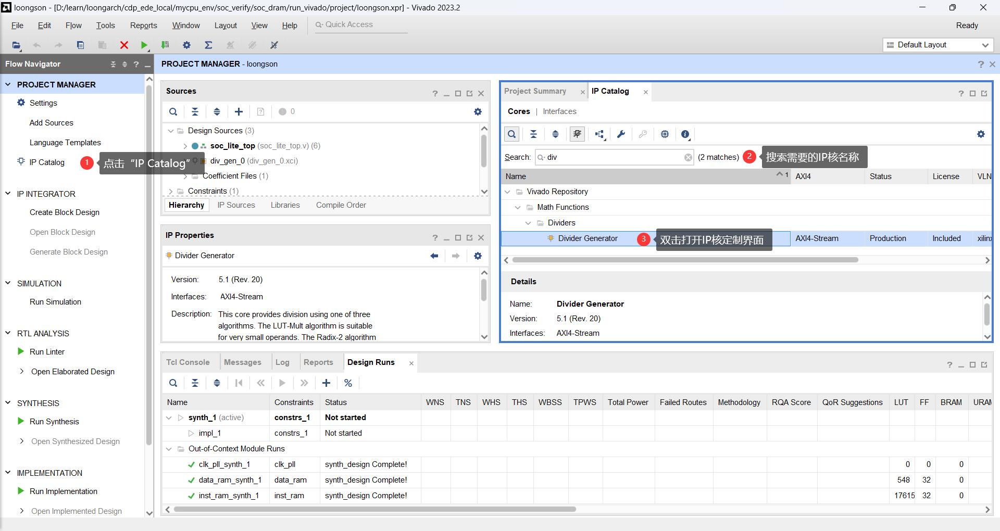

开始定制`Divider Generator`IP核：

<div align="center">
    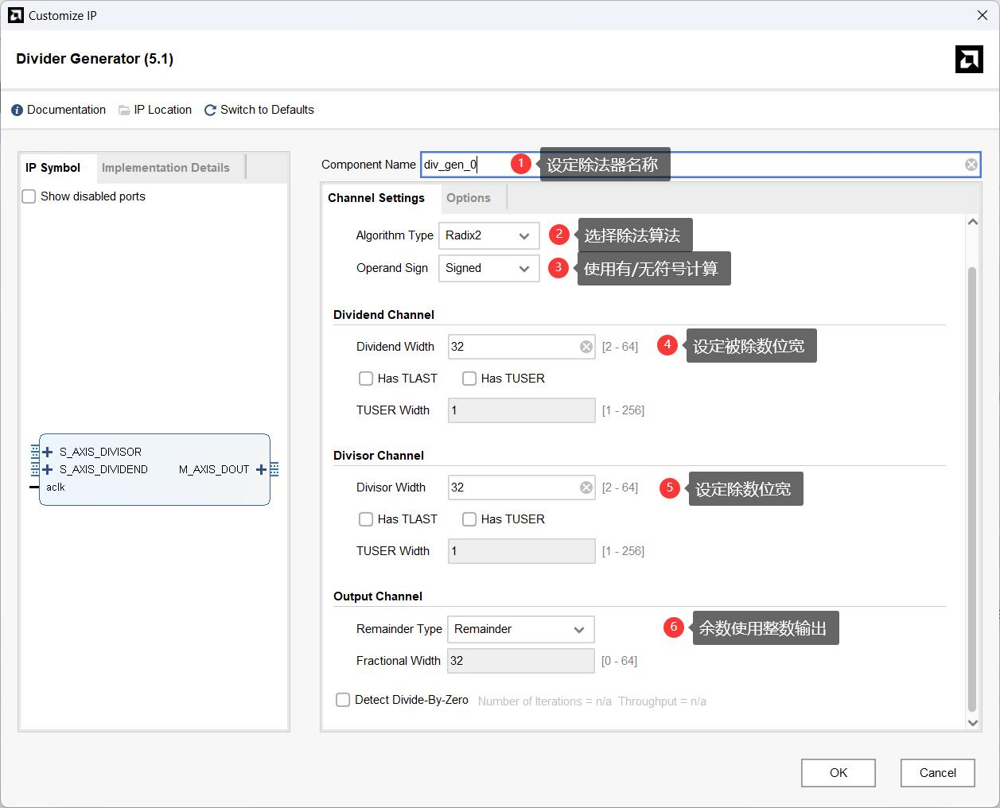
    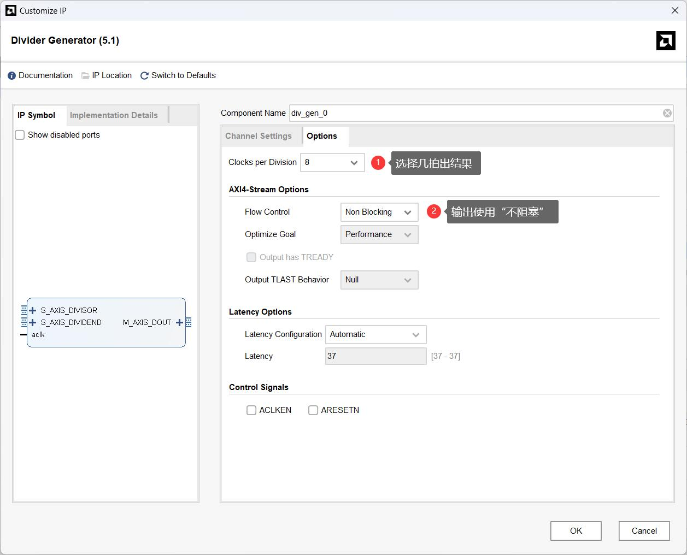
</div>

开始建立IP核：

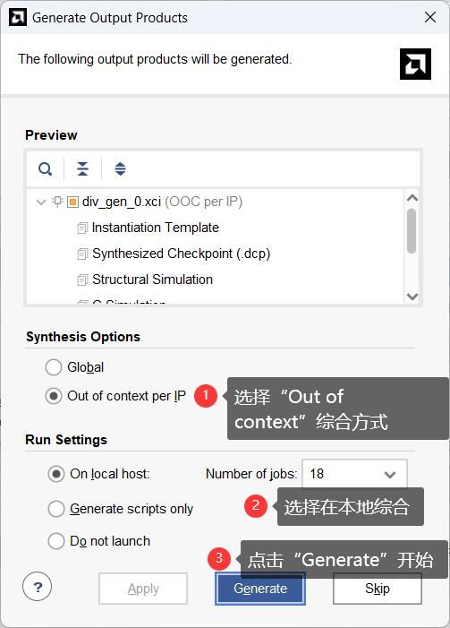

实例化IP核：

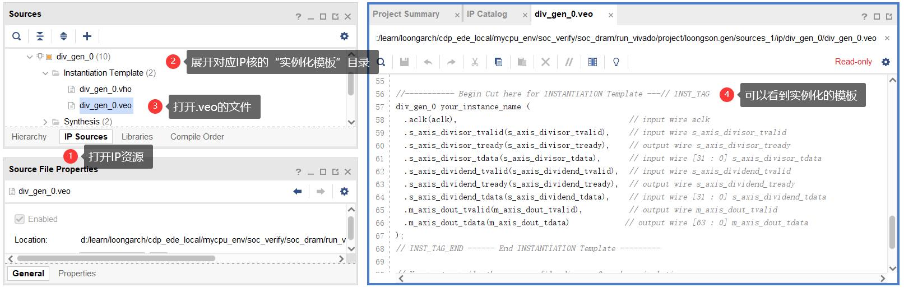

###### **如何使用**

目前Vivado中提供的除法器IP一定是AXI接口的，所以接下来我们对模块顶层信号及其工作方式进行基本介绍。

在定制IP核的界面中（可通过双击IP核的资源名称重新打开定制界面），左侧有接口信号图

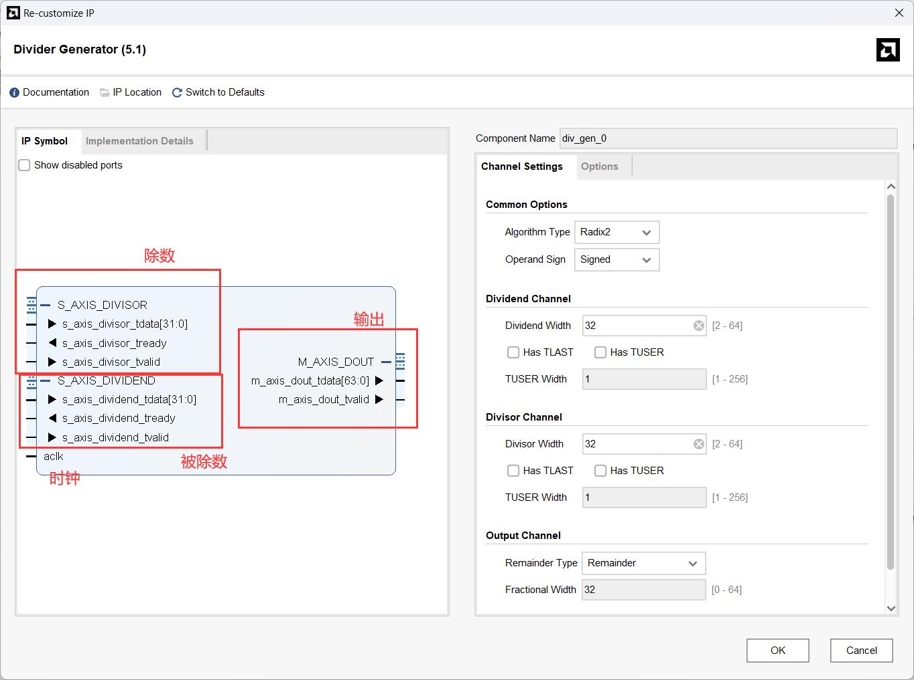

总体上我们会看到时钟信号、被除数、除数通道以及输出（商和余数）通道。

对于被除数、除数通道，其有相同的信号组成

- `tdata`信号为被除数、除数数据输入信号
- `tready`、`tvalid`为一对握手信号。`tvalid`是请求信号，`tready`是应答信号，在时钟上升沿到来时，如果`tvalid`和`tready`都等于1则视为成功的握手，发送方的数据写入接收方的缓存中

> 需要注意的是在握手成功后，**一定要把`tvalid`清0，如果再次握手成功的话将会被视为一个新的除法运算。**

对于输出（商和余数）通道

- `tdata`信号为商和余数数据输出信号，其中 [63:32] 位存放的是商，第 [31:0] 位存放的是余数
- `tvalid`信号为输出有效信号，高电平表示除法计算完成，`tdata`线上为计算结果

#### 自行设计电路实现

可参考附录中的[乘法器](#乘法器)、[除法器](#除法器)部分以及其它网络资源。

> 注意到IP核中无论是乘法还是除法都只能固定计算有/无符号数，这样需要实例化两个运算单元分别进行运算，这样看起来非常浪费资源。我们可以采取一些措施将符号单独计算，全部转化为无符号数处理；也可以将32位的运算全部转化为33位有符号运算，只要根据有/无符号在第33位补充符号位/0即可。

## exp11：转移指令和访存指令添加

目标：

- [x] 熟悉CPU的<a href="#前推流水线">数据通路</a>
- [ ] 练习如何修改数据流动
- [ ] 练习如何添加指令
- [ ] 了解“地址对齐”

### 转移指令

需要添加的指令有`blt`、`bge`、`bltu`、`bgeu`，指令具体信息可参考我的[LoongArch32r指令表]()。

相信经过exp10的分析，大家很快就能发现这些b指令都是换汤不换药（仅跳转条件判断不同）的一类指令，只要照着如`beq`指令的过程添加即可。

### 访存指令

需要添加的指令有`ld.b`、`ld.h`、`ld.bu`、`ld.hu`、`st.b`、`st.h`，指令具体信息可参考我的[LoongArch32r指令表]()。

在看完手册后，我们发现普通访存指令的**数据通路、控制逻辑都是相同的**，区别仅在**处理的数据位宽不同**。

接下来让我们回忆一下我们的`data_sram`，它是一个宽度为32的Memory单元，每次读写的数据为32位。

当读回32位数据后，我们选择访存地址对应的字/半字/字节并按照有/无符号扩展到32位就是读取的数据；当需要写入时，我们将需要写入的字/半字/字节按照**访存地址对应的位置**填入32位数据的位置，并将**字节写使能信号**的对应位使能即可。

#### 地址对齐

访存地址对应的位置即地址对齐，其有一定的规则，假设存储器中存储的数据如下图所示，每个字节中存储其所在字节地址

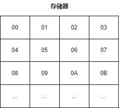

假如运行`ld.w`，访存地址为`00B`，则得到的数据为`03020100H`。（Loongarch采用小尾端的存储方式）

假如运行`ld.h`，存储器返回数据为`03020100H`

- 访存地址末尾为`00B`，最终得到`00000100H`。
- 访存地址末尾为`10B`，最终得到`00000302H`。

假如运行`ld.b`，存储器返回数据为`03020100H`

- 访存地址末尾为`00B`，最终得到`00000000H`。
- 访存地址末尾为`01B`，最终得到`00000001H`。
- 访存地址末尾为`10B`，最终得到`00000002H`。
- 访存地址末尾为`11B`，最终得到`00000003H`。

**你应该会想问，剩下的情况呢？剩下的情况是不被允许的！**剩下的情况被称为访存地址**非自然对齐**。

假如从地址`01H`处读取一个字（32bit），由于存储器的特性，我们需要先读取`00H`处的一个字，再读取`04H`处的一个字，再将它们的`01H`~`04H`处的数据拼接起来作为最终数据。实际上，读取一个字的数据对于CPU来说是非常费时间的（可能是上千个周期），更不用说读两个字了，所以我们在定义的时候就不允许这种跨字的数据读写（编译器分配地址空间时也会按照自然对齐地址分配）。

#### 字节写使能

> 如果你不知道字节写使能是哪根线的话请重新看exp7的实践任务第2条

字节写使能即以字节为单位控制存储器写入的数据。

例如字节写使能为`0011B`，则地址为`00B`、`01B`处会写入新的数据，地址为`10B`、`11B`处数据**不会被修改**。

接下来让我们针对`00H`处的一个字的存储单元运行一段指令序列吧~

| 指令序号 | 指令  | 访存地址（B） | 数据（H）    | 存储器数据（H） |
| -------- | ----- | ------------- | ------------ | --------------- |
| 1        | st.w  | 00            | 1234ABCD     | **1234ABCD**    |
| 2        | ld.b  | 01            | **FFFFFFAB** | 1234ABCD        |
| 3        | st.h  | 10            | 00009876     | **9876ABCD**    |
| 4        | ld.hu | 00            | **0000ABCD** | 9876ABCD        |
| 5        | st.b  | 11            | 12345678     | **7876ABCD**    |
| 6        | ld.w  | 01            | *ERROR*      | 7876ABCD        |

### 调试Tips

1. 顶层信号中地址线`addr`在接入存储器时将末两位截去，所以`00B`~`11B`的访存地址均会取出`00H`开始的一个字，详见`soc_lite_top.v`文件
2. 大部分分支跳转指令本身的执行错误不会引发trace比对的ERROR，其后一条指令才会引发

## exp12：添加系统调用异常支持

目标：

- [ ] 理解CPU中断例外的概念
- [ ] 学习精确异常处理的过程
- [ ] 在CPU中添加系统调用异常的支持
- [x] 完全掌握exp11及以前的内容

### 特权指令

在计算机系统层次结构中，应用层在操作系统层之上，只能看到和使用指令系统的一个子集，即指令系统的用户态部分。每个应用程序都有自己的寄存器、内存空间以及可执行的指令。现代计算机的指令系统在用户态子集之外还定义了操作系统核心专用的特权态部分，我们称之为特权指令系统。

特权指令系统的存在主要是为了让计算机变得更好用、更安全。操作系统通过特权指令系统管理计算机，使得应用程序形成独占CPU的假象，并使应用间相互隔离，互不干扰。应用程序只能在操作系统划定的范围内执行，一旦超出就会被CPU切换成操作系统代码运行。

龙芯架构32位精简版中处理器核分为2个特权等级（PrivilegeLeVel，简称PLV），分别是PLV0和PLV3。处理器核当前处于哪个特权等级由CSR.CRMD中PLV域的值唯一确定。

所有特权等级中，**PLV0是具有最高权限的特权等级**，也是**唯一可以使用特权指令并访问所有特权资源的特权等级**。PLV3这个特权等级不能执行特权指令访问特权资源。对于Linux系统来说，架构中仅PLV0级可对应核心态，PLV3级对应用户态。

### 控制状态寄存器（CSR寄存器）

为了控制CPU的运行状态以及处理特权指令，有一组控制状态寄存器（在龙芯架构中称为CSR寄存器），其位于一个独立的地址空间。

| 名称 | 地址 | 描述 |
| :--: | :--: | :--: |
| CRMD | 0x0 | 当前模式信息 |
| PRMD | 0x1 | 例外前模式信息 |
| ESTAT | 0x5 | 例外状态 |
| ERA | 0x6 | 例外返回地址 |
| EENTRY | 0xc | 例外入口地址 |
| SAVE0~SAVE3 | 0x30~0x33 | 数据保存 |

完整CSR寄存器表和各个CSR寄存器的定义详见[原手册](https://www.loongson.cn/uploads/images/2023041918122813624.%E9%BE%99%E8%8A%AF%E6%9E%B6%E6%9E%8432%E4%BD%8D%E7%B2%BE%E7%AE%80%E7%89%88%E5%8F%82%E8%80%83%E6%89%8B%E5%86%8C_r1p03.pdf)第7节。

CSR寄存器有其专用的读写指令`csrrd`、`csrwr`、`csrxchg`，注意这些指令仅在核心态（即PLV0）可运行。

### 异常和中断

计算机通常按照软件的执行流进行顺序执行和跳转，但有时会需要中断正常的执行流程去处理其他任务，可以触发这一过程的事件统称为异常。

中断通常由CPU核外部事件发起，CPU核响应后暂停原先程序执行另一段程序的事件。从CPU角度看，中断也可以被视为一种特定的异常，接下来将不做区分统一以“异常”表达。

顾名思义，“异常”不是常态。异常对应的情况发生的频度不高，但处理起来比较复杂。本着“好钢用在刀刃上”的设计原则，我们希望尽可能由软件程序而不是硬件逻辑来处理这些复杂的异常情况。这样做既能保证硬件的设计复杂度得到控制又能确保系统的实际运行性能没有太大的损失。

异常处理绝大部分交给异常处理程序完成，但是在处理的开始和结束仍需硬件完成。

#### 预备阶段

- CPU核内部或外部事件置起异常信号，表示有异常事件发生，请求CPU处理。
- 每个异常事件有其对应的异常编码，需要在申请时同时提供。编码对应详见<a href="https://library.vincent-ice.me/posts/loongarch32r%E6%8C%87%E4%BB%A4%E9%9B%86/#%E5%BC%82%E5%B8%B8">这里</a>或者[原手册](https://www.loongson.cn/uploads/images/2023041918122813624.%E9%BE%99%E8%8A%AF%E6%9E%B6%E6%9E%8432%E4%BD%8D%E7%B2%BE%E7%AE%80%E7%89%88%E5%8F%82%E8%80%83%E6%89%8B%E5%86%8C_r1p03.pdf)表7-7。

#### 响应准备阶段

- CPU确认自身可以响应异常处理。
- 记录被异常打断的指令的地址到`CSR.ERA`
- 记录当前运行状态（`CSR.CRMD`的PLV、IE）到`CSR.PRMD`的对应域。
- 同时调整CPU的权限等级（通常调整至最高特权等级`CSR.CRMD.PLV=0`）并关闭中断响应（`CSR.CRMD.IE=0`）。

#### 响应阶段

- 根据例外优先级（见[原手册](https://www.loongson.cn/uploads/images/2023041918122813624.%E9%BE%99%E8%8A%AF%E6%9E%B6%E6%9E%8432%E4%BD%8D%E7%B2%BE%E7%AE%80%E7%89%88%E5%8F%82%E8%80%83%E6%89%8B%E5%86%8C_r1p03.pdf)6.2.2节）选择响应最高优先级的异常，将对应的异常编码写入`CSR.ESTAT`的Ecode和Esubcode。
- 跳转至例外入口（来自`CSR.EENTRY`）。

#### 结束阶段

- 异常处理程序结束后会执行`ertn`指令，其指示CPU从例外处理状态返回。
- 例外前运行状态（`CSR.PRMD`的PLV、IE）被写回`CSR.CRMD`的对应域。
- 跳转到被异常打断的指令的地址`CSR.ERA`处取指。

#### 精确异常

走完异常处理的全部流程，如果我们从原程序流的角度“看”，那么我们会发现它根本不知道某个时刻CPU被“借走”处理了另一段程序，这就是所谓的**精确异常**。

简单的来说精确异常要求在处理异常时，发生异常的指令前面的所有指令都执行完（修改了机器状态），而发生异常的指令及其后面的指令都没有执行（没有修改机器状态）。

在流水线处理器中，同时会有多条指令处于不同阶段，不同阶段都有发生异常的可能，那么如何实现精确异常呢？书中给出一种可行的设计方案：

1. 任何一级流水发生异常时，在流水线中记录下发生异常的事件，直到写回阶段再处理。
2. 如果在执行阶段要修改机器状态（如状态寄存器），保存下来直到写回阶段再修改。
3. 指令的PC值随指令流水前进到写回阶段为异常处理专用。
4. 将外部中断作为取指的异常处理。
5. 指定一个通用寄存器（或一个专用寄存器）为异常处理时保存PC值专用。
6. 当发生异常的指令处在写回阶段时，保存该指令的PC及必需的其他状态，置取指的PC值为异常处理程序入口地址。

### 调试Tips

1. 异常处理需要复杂的控制系统支持，添加起来有一定难度。~~但它对CPU意味着可以在考试中途出去上个厕所回来接着做而非必须一口气做到底~~
2. 如果觉得直接在流水线上改动的不熟练的话，或许可以在单周期CPU上先添加一下，然后再切分到流水线的各个级。~~如果你有做好git版本控制的话应该很好找吧~~
3. 某些CSR寄存器和PC寄存器一样存在特定的复位值，见[原手册](https://www.loongson.cn/uploads/images/2023041918122813624.%E9%BE%99%E8%8A%AF%E6%9E%B6%E6%9E%8432%E4%BD%8D%E7%B2%BE%E7%AE%80%E7%89%88%E5%8F%82%E8%80%83%E6%89%8B%E5%86%8C_r1p03.pdf)6.3节。
4. 对于CSR寄存器，其也和通用寄存器一样存在冒险问题等待解决。
5. 在`CSR.ESTAT.IS`域，其第10位在有些func程序中固定为0，有些开放读写，可能需要注意下。
6. 例外返回的地址不一定是`CSR.ERA`中的地址。在本实验中返回原地址将会重新执行`syscall`。~~是死循环捏~~

## exp13：添加其它异常支持

目标：

- [ ] 完善`ADEF`、`ALE`、`BRK`、`INE`异常支持
- [ ] 添加中断支持
- [ ] 添加定时器、计时器

在exp12完成了`syscall`的异常支持后，我想CPU中完整的异常处理的数据和控制通路已经搭建完成了，添加新的异常支持只需要针对新的异常进行对应的判断，发出对应的异常消息即可。

### 中断

中断可被视为一种特定的异常，但是其与其它异常有着一个关键的不同点。

由于中断通常由CPU核外部事件触发，其相对CPU核是异步的，所以发出的中断信号需要保持到被CPU采样，否则将永远无法触发中断异常。当然这是由中断源负责维护的。

在较为简单的线中断模式下，硬件仅需每拍采样各个中断源并将其状态记录于`CSR.ESTAT.IS`域中，并在认为有需要响应的中断时将中断例外标注至流水线中的某一条指令上，随后的过程与其它例外相同。

### 定时器与定时器中断

在龙芯32位精简版架构中定义了一个定时器，其随着时钟自减，直到为零时置起定时器中断信号。

详细定义及运行控制信息见[原手册](https://www.loongson.cn/uploads/images/2023041918122813624.%E9%BE%99%E8%8A%AF%E6%9E%B6%E6%9E%8432%E4%BD%8D%E7%B2%BE%E7%AE%80%E7%89%88%E5%8F%82%E8%80%83%E6%89%8B%E5%86%8C_r1p03.pdf)的`TCFG`、`TVAL`、`TICLR`寄存器定义（7.6.2~7.6.4）。

### 计时器

龙芯架构 32 位精简版定义了一个恒定频率计时器，其主体是一个 64 位的计数器，称为 Stable Counter。Stable Counter 在复位后置为 0，随后每个计数时钟周期自增 1，当计数至全 1 时自动绕回至 0 继续自增。同时每个计时器都有一个软件可配置的全局唯一编号，称为 Counter ID，保存在`CSR.TID`寄存器中。

### 调试Tips

1. 在经过了exp12的锤炼后，本实验应该不难了吧~~\doge~~
2. 在verilog描述中**注意多驱动问题**。如果你选择给每个CSR寄存器一个always块负责内容修改的话，请注意这个CSR寄存器中所有数据更新都必须在这个always块中，以避免多驱动问题产生。例如`CSR.ESTAT.IS[11]`的定时器中断状态位的赋值不能在`CSR.TVAL`寄存器中，当然还有其它情况，请自行注意避免。（可以在综合的警告或者Linter语法检查找到已有的多驱动）
3. 选择你觉得舒服的CSR寄存器声明方式，可以按照名字定义32位的，也可以直接按照子域分开定义……善用宏定义将位索引转换为有意义的单词

## 附录

> 在学习之前，你需要
>
> - [ ] 学会verilog的基本语法
>
>     - [Verilog 基础知识 | Vincent的图书馆](https://library.vincent-ice.me/posts/verilog基本语法/)
>
>     - [Verilog HDL——运算符_verilog逻辑运算符_~Old的博客-CSDN博客](https://blog.csdn.net/qq_43460068/article/details/122001173)
>     - [Verilog语法之四：运算符 - 知乎 (zhihu.com)](https://zhuanlan.zhihu.com/p/72014513?ivk_sa=1024320u&utm_id=0)
>     - [Verilog 基础仿真文件编写_verilog仿真程序编写_背影疾风的博客-CSDN博客](https://blog.csdn.net/weixin_54358182/article/details/129495887)
>
> - [ ] 学会补码及其加减法
>
>     - [原码-反码-补码 --数学公式分析_原码反码补码计算公式及关系-CSDN博客](https://blog.csdn.net/qq_34771697/article/details/77972501)
>     - [【原创】计算机为什么要用补码？ - 知乎 (zhihu.com)](https://zhuanlan.zhihu.com/p/105917577)
>     - [【计算机组成原理】补码的加减运算方法_补码相加怎么算的-CSDN博客](https://blog.csdn.net/qq_43511405/article/details/105898286)

### 多路复选器

作用：从一组输入数据中选出某一个来


核心：用与门当做开关，通过数据信号和控制信号相与实现各数据的选择效果

#### 二选一

电路图：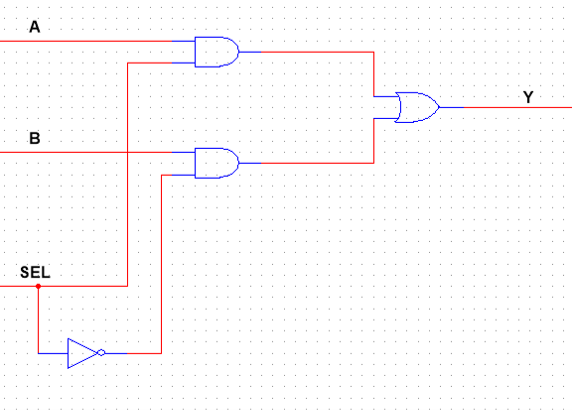

verilog实现方式：

- 门级电路（了解即可）

```verilog
module mux2_gate (
    input wire [7:0]a,b,
	input wire sel,
    output wire [7:0]y
);
    assign y = (a & {8{sel}}) | (b & {8{~sel}});
endmodule
```

- 行为级描述

```verilog
module mux2 (
	input wire[7:0] a,b,
	input wire sel,
	output wire[7:0] y
    );
		
	assign y = sel ? a : b;
endmodule //1=>a,0=>b
```

- 带参数的常用写法

```verilog
module mux2_par #(
	parameter n=8
) (
	input wire[n-1:0] a,b,
	input wire sel,
	output wire[n-1:0] y	
);
	assign y = sel ? a : b;
endmodule
```

​		调用方式

``` verilog
mux2_par #(.n()) u_mux2_par (.a(),.b(),.sel(),.y());
```

#### 四选一

电路图：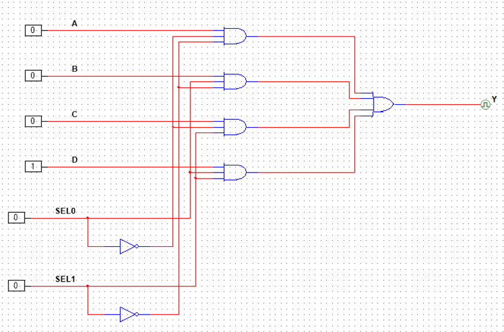

verilog实现方式：

- 门级电路（了解即可）

``` verilog
module mux4_gate (
	input wire [7:0]a,b,c,d,
	input wire [1:0]sel,
	output wire y
);
    assign y=(a&&~sel[0]&&~sel[1])|(b&&sel[0]&&~sel[1])|(c&&~sel[0]&&sel[1])|(d&&sel[0]&&sel[1]);
endmodule//00=>a,01=>b,10=>c,11=>d
```

- 行为级描述

```verilog
module mux4 (
	input  wire[7:0] a,b,c,d,
	input  wire[1:0] sel,
	output wire[7:0] y
    );
	
	assign y = sel[0] ? (sel[1] ? d : c) : (sel[1] ? b : a);
endmodule//00=>a,01=>b,10=>c,11=>d
```

- 带参数的常用写法

``` verilog
module mux4_par #(
	parameter n=8
) (
    input  wire[n-1:0] a,b,c,d,
	input  wire[1:0] sel,
    output wire[n-1:0] y
    );
	
	assign y = sel[0] ? (sel[1] ? d : c) : (sel[1] ? b : a);
endmodule//00=>a,01=>b,10=>c,11=>d
```

​		调用方式

``` verilog
mux4_par #(.n()) u_mux4_par (.a(),.b(),.c(),.d(),.sel(),.y());
```


> 本章你需要学会的
>
> - [ ] 带参数的写法及其调用方法


### 加法器

#### 半加器

只将两个1位二进制数相加，不考虑低位进位。

- 真值表

<table border="4" >
	<tr align =center>
		<td colspan="2">输入</td>
        <td colspan="2">输出</td>
	</tr>
	<tr align =center>
		<td>A</td>
		<td>B</td>
        <td>S</td>
        <td>CO</td>
	</tr>
    <tr align =center>
        <td>0</td>
		<td>0</td>
        <td>0</td>
        <td>0</td>
    </tr>
    <tr align =center>
        <td>0</td>
		<td>1</td>
        <td>1</td>
        <td>0</td>
    </tr>
    <tr align =center>
        <td>1</td>
		<td>0</td>
        <td>1</td>
        <td>0</td>
    </tr>
    <tr align =center>
        <td>1</td>
		<td>1</td>
        <td>0</td>
        <td>1</td>
    </tr>
</table>

- 逻辑函数

$$
S=\overline{A}B+A\overline{B}=A\oplus B\\
CO=AB
$$

- 电路图

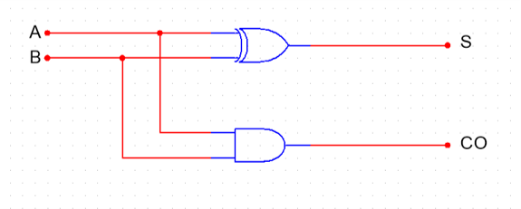

- verilog实现方式

```verilog
module half_adder (
    input  a,b,
    output s
);

assign s = a ^ b;
endmodule
```

#### 全加器

除了要将两个1位二进制数相加外，还有考虑来自低位的进位。

- 真值表

<table border="5" >
	<tr align =center>
		<td colspan="3">输入</td>
        <td colspan="2">输出</td>
	</tr>
	<tr align =center>
        <td>CI</td>
		<td>A</td>
		<td>B</td>
        <td>S</td>
        <td>CO</td>
	</tr>
    <tr align =center>
        <td>0</td>
        <td>0</td>
		<td>0</td>
        <td>0</td>
        <td>0</td>
    </tr>
    <tr align =center>
        <td>0</td>
        <td>0</td>
		<td>1</td>
        <td>1</td>
        <td>0</td>
    </tr>
    <tr align =center>
        <td>0</td>
        <td>1</td>
		<td>0</td>
        <td>1</td>
        <td>0</td>
    </tr>
    <tr align =center>
        <td>0</td>
        <td>1</td>
		<td>1</td>
        <td>0</td>
        <td>1</td>
    </tr>
    <tr align =center>
        <td>1</td>
        <td>0</td>
		<td>0</td>
        <td>1</td>
        <td>0</td>
    </tr>
    <tr align =center>
        <td>1</td>
        <td>0</td>
		<td>1</td>
        <td>0</td>
        <td>1</td>
    </tr>
    <tr align =center>
        <td>1</td>
        <td>1</td>
		<td>0</td>
        <td>0</td>
        <td>1</td>
    </tr>
    <tr align =center>
        <td>1</td>
        <td>1</td>
		<td>1</td>
        <td>1</td>
        <td>1</td>
    </tr>
</table>


- ~~逻辑函数~~ 可以通过两个半加器串联修改实现

$$
S=A\oplus B\oplus CI\\
CO=AB+\left( A+B\right) \left( CI\right)
$$


- 电路图

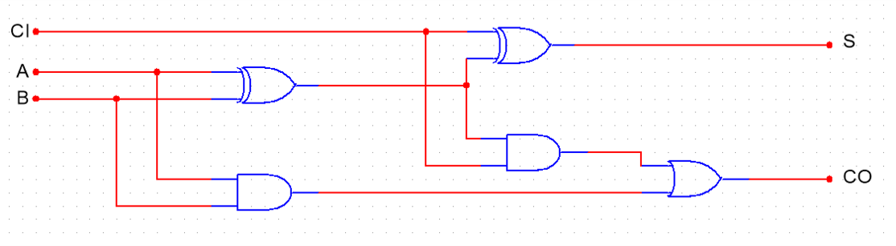

- verilog实现方式

```verilog
module adder_1bit (
    input a,b,ci,
    output s,co
);

assign s = a^b^ci;
assign co = (a&b)|(ci&(a^b));
endmodule
```

#### 多位加法器

##### 行波进位加法器（Ripple-carry adder）

- 示意图

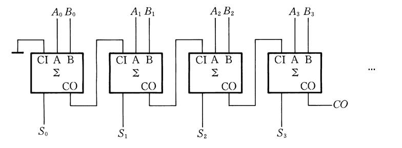

如同波一般向前计算。每次运算需要等待前一位的进位值，由全加器的电路图可知，从cin到cout有两级门电路的时延，所以对于N位行波进位加法器，时延就是$3+(N-1)*2=2N+1$级。可见，在位数更高的RCA中，串行计算带来的时延会相当大，这对于现代高速运算是不可忍受的。

- verilog实现方式

```verilog
module adder_8bit (
    input  [7:0] a,b,
    input        ci,
    output [7:0] s,
    output       co
);

wire [8:0] temp_co;

assign temp_co[0] = ci;

generate
    genvar i;
    for (i = 0;i<8 ;i=i+1 ) begin:adder_simple
        adder_1bit adder_unit(.a(a[i]),.b(b[i]),.ci(temp_co[i]),.s(s[i]),.co(temp_co[i+1]));
    end
endgenerate

assign co=temp_co[8];
endmodule
```

##### 超前进位加法器（Carry-lookahead Adder）

为了提高运算速度，必须设法减小或消除由于进位信号逐级传递所耗费的时间，于是设计出超前进位加法器。

###### 超前进位逻辑


两个多位数中第*i*位相加产生的进位输出$(CO)_i$可表示为
$$
(CO)_i=A_iB_i+\left( A_i+B_i\right) \left( CI\right)_i
$$
我们将$G_i = A_iB_i$称为进位生成函数，将$P_i = (A_i+B_i)(CI)_i$称为进位传递函数。

通过数学计算展开可得
$$
\left( CO\right) _{i}=G_{i}+P_{i}G_{i-1}+P_{i}P_{i-1}G_{i-2}+\ldots +P_{i}P_{i-1}\ldots P_{1}G_{0}
+P_{i}P_{i-1}\ldots P_{0}G_{0}
$$
于是我们得到了任意一位产生的进位，避免了等待进位信号的逐级传递，将实现上述逻辑的电路称为**CLU**（Carry Lookahead Unit）。由公式可以看出，并行生成各级$C_i$的时延来自$G_i$和$P_i$的先与后或，再加上生成$G_i$和$P_i$的一级门电路，总共是三级门电路时延。而且可以看出，时延的级数并不会随位数的增加而增加，不论多少位CLA，生成各级$C_i$的时延恒为三级门电路。


由全加器的真值表可得第$i$位和$S_i$的逻辑式
$$
S_i=A_i\oplus B_i\oplus (CI)_i \ \ \ 或 \ \ \ S_i= \sim G_i P_i\oplus (CI)_i
$$
同样不超过三级门电路


###### 4位超前进位加法器

```verilog
module CLA4 (
    input [3:0]a,b,
    input ci,
    output [3:0]s,
    output co
);

wire [3:0]G,P;
wire [3:0]co_buf,ci_buf;

generate
    genvar i;
    for (i = 0;i<4 ;i=i+1 ) begin
       assign G[i] = a[i] & b[i];
       assign P[i] = a[i] | b[i];
    end
endgenerate

assign co_buf[0]=G[0] | G[0]&ci;
assign co_buf[1]=G[1] | P[1]&G[0] | P[1]&P[0]&ci;
assign co_buf[2]=G[2] | P[2]&G[1] | P[2]&P[1]&G[0] | P[2]&P[1]&P[0]&ci;
assign co_buf[3]=G[3] | P[3]&G[2] | P[3]&P[2]&G[1] | P[3]&P[2]&P[1]&G[0] | P[3]&P[2]&P[1]&P[0]&ci;
assign co = co_buf[3];
            
assign ci_buf = {co_buf[2:0],1'b0};

generate
	genvar i;
	for (i = 0;i<4 ;i=i+1) begin
		assign s[i] = ~G[0] & P[i] ^ ci_buf[i];
	end
endgenerate
    
endmodule
```

###### 更多位超前进位加法器

在设计出4位超前进位加法器后，一个很自然的想法是：要想得到更多位CLA，只需像4位CLA那样，只是多递归几次的区别。这个方法叫**全超前进位**。全超前进位理论上是可行的，但由CLU的公式可知，随着位数的增加，实现CLU的门电路数量会急剧增加，导致电路面积开销过大；另一方面，位数的增加也会使扇入飞速增大，导致时延增加。

**所以，单纯的递归并不是好的解决方案。**

一个解决方案是借鉴RCA。将多个4位CLA级联，即采用“组内超前进位，组间串行进位“来构成更多位超前进位加法器。其中每个4位CLA从进位输入到进位输出是两级门电路时延，加上第一级CLA的PG时延和最后一级CLA的异或门时延，这种方式构成的N位超前进位加法器的总时延为$1+2*(N/4)+1=N/2+2$。

如果想获得更快的速度，就得采用另一种方法——**多级超前进位加法器**。多级超前进位加法器采用“组内超前进位，组间也超前进位”的方式，可进一步降低因组间串联进位带来的时延。即将每个4位CLA看做一位再由超前进位逻辑再次进行超前进位，故称为多级超前进位加法器。

> 本章你要学会的
>
> - [ ] 超前进位加法器是怎么优化降低时延的
> - [ ] generate-for循环调用模块
>
> 一些可参考资料
>
> - 《数字电子技术基础》阎石 p172-176
> - 《计算机体系结构基础》胡伟武 p188-193
> - [32位超前进位加法器的设计-T-Tang-电子技术应用-AET-中国科技核心期刊-最丰富的电子设计资源平台 (chinaaet.com)](http://blog.chinaaet.com/T_Tang/p/5100051382)
> - [16位两级超前进位加法器的Verilog实现及时延分析 - 知乎 (zhihu.com)](https://zhuanlan.zhihu.com/p/579055858?utm_id=0)

### 乘法器

不采用任何优化算法的乘法过程，可以用我们小学就学过的列竖式乘法来说明。从乘数的低位开始，每次取一位与被乘数相乘，其乘积作为部分积暂存，乘数的全部有效位都乘完后，再将所有部分积根据对应乘数数位的权值错位累加，得到最后的乘积。

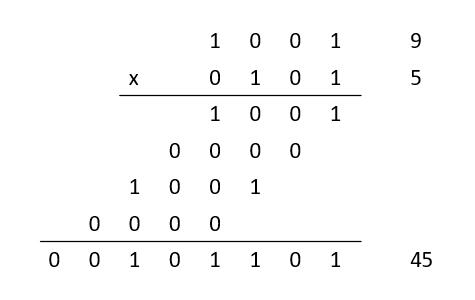

这样原始的乘法在设计上是可以实现的，但在工程应用上几乎不会采用，在时延与面积上都需要优化。一个N位的乘法运算，需要产生N个部分积，并对它们进行全加处理，位宽越大，部分积个数越多，需要的加法器也越多，加法器延时也越大，那么针对乘法运算的优化，主要也就集中在两个方面：**一是减少加法器带来的延时，二是减少部分积的个数**。

#### 补码移位乘法器

首先解决负数乘法问题。在加减法中我们采用补码解决负数和减法问题，在负数乘法中同样可以使用补码。

假定有 8 位定点数 $Y$， $[Y]_补$  的二进制格式写作 $y_7 y_6 y_5 y_4 y_3 y_2 y_1 y_0$ ，根据补码定义，$Y$ 的值等于
$$
Y=y_{7}\times -2^{7}+y_{6}\times 2^{6}+y_{5}\times 2^{5}+\ldots +y_{0}\times 2^{0}
$$
由此可得出
$$
\begin{aligned}\left[ X\times Y\right] _{补}&=\left[   X\times (y _{7}\times -2^{7}+y_{6}\times 2^{6}+\ldots +y_{0}\times 2^0) \right]_{补} \\
&=\left[X \times -y_7\times 2^{7}+X\times y_{6}\times 2^{6}+\ldots +X\times y_{0}\times 2^{0}\right] _{补}\\
&=\left[ X\times-y_{7}\times2^{7}\right] _{补}+\left[ X\times y_6\times 2^{6}\right] _{补}+\ldots +[  X\times y_{0}\times 2^{0}) _{补}\\
&=-y_{7}\times \left[ X \times 2^{7} \right] _{补} + y_{6}\times \left[ X \times 2^{6} \right] _{补}+\ldots +y_{0}\times \left[ X\times 2^{0}\right]_{补}\\
&=\left[ X\right] _{补}\times \left( -y_{7}\times 2^{7}+y_{6}\times 2^{6}+\ldots +y_{0}\times 2^{0} \right) \end{aligned}
$$


根据公式可以用verilog设计出简单的移位补码乘法器

```verilog
module mult_simple (
    input [7:0] op1,op2,
    output[15:0]out
);

wire [15:0] op1_ext = op1[7] ? {8'b11111111,op1} : {8'b0,op1};
wire [15:0] mult_buf [7:0];

generate
    genvar i;
    for (i = 0;i<8 ;i=i+1 ) begin
        assign mult_buf[i] = ~op2[i] ? 16'b0 : (op1_ext<<i);
    end
endgenerate

assign out = mult_buf[0] + mult_buf[1] + mult_buf[2] + mult_buf[3] 
           + mult_buf[4] + mult_buf[5] + mult_buf[6] - mult_buf[7];
endmodule
```

#### 华莱士树

由于累加器本身的进位传递延时对电路性能依然存在非常大的影响，所以优化的第一个方面，就是改进部分积累加结构，提升累加性能。如果采用部分积直接相加的方式，因为全加器进位的关系，当前bit的相加结果依赖于它前一bit的进位输出，整个计算过程相当于串行化，位宽越大，延时越大，所以优化的关键就是消除进位链，使运算并行化。

进位保留加法器（Carry Save Adder, CSA）是比较常用的一种优化方式，CSA实际上就是一位全加器。在上一章中我们学习了全加器有3个输入A,B,CI和2个输出S,CO，通过CI和上一级CO相接实现串行的加法，但是在CSA中我们保留每一位的CO，CI使用另外一个加数D来替代，即
$$
A+B+D=S+\{C,0\}
$$
这样我们就实现了3个加数变为2个加数的加数缩减，也就是说我们将加数减少了1/3，如果我们再往后加一层同样的CSA，可以进一步减少加数，直到只剩两个加数即可使用一个加法器得到最终结果。对于N个加数的加法，使用串行加法器需要N-1个加法器的延时，使用多层华莱士树大致需要$log_{1.5}(0.5N)$个加法器延迟，显然明显地降低计算延迟，数据宽度越宽，其效果越明显。 

下面为8个1位数相加的四层华莱士树结构图，同样也可将1位数扩展为多位数，结构是相似的。

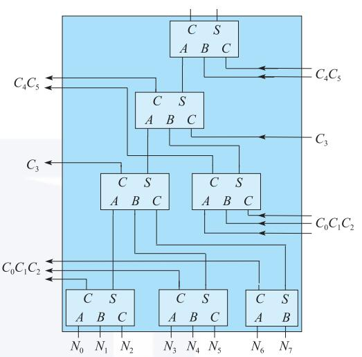

**注意每一层的进位信号只能接到下一层，不能接到上一层**

```verilog
module compressor32 (
    input [15:0] op1,op2,op3,
    output[15:0] out1,out2
);

assign out1 = op1^op2^op3;
assign out2 = (op1&op2|op2&op3|op3&op1)<<1;
    
endmodule
```

同样也可以设计4-2压缩的华莱士树

#### booth乘法器

如果遵循第一节的补码乘法算法，需要特地挑出第 N 个部分积，并使用补码减法操作，这就需要实现一个额外的状态机来控制，增加了硬件设计复杂度。 因此对补码乘法公式进行变换
$$
\begin{aligned}
Y&=-y_{7}\times 2^{7}+y_{6}\times 2^{6}+y_{5}\times 2^{5}+\ldots +y_{0}\times 2^{0}\\
&=\left( -y_7 \times 2^{7}+\left( y_{6}\times 2^{7}-y_{6}\times 2^{6}\right) +\left( y_{5}\times 2^{6}-y_{5}\times 2^{5}\right) +\ldots
 +\left( y_1\times 2^{2}-y_1\times 2^{1}\right) +\left( y_{0}\times 2^1- y_{0}\times 2^{0}\right) +\left( 0\times 2^{0}\right) \right) \\
&=\left( y_{6}-y_{7}\right) \times 2^{7}+\left( y_{5}-y_{6}\right) \times 2^{6}+\ldots +\left( y_{0}-y_{1}\right) \times 2^{1}+
\left( y_{-1}-y_{0}\right) \times 2^{0}\end{aligned}
$$
其中$y_{-1}$取值为 0。 经过变换，公式变得更加规整，不再需要专门对最后一次部分积采用补码减法，更适合硬件实现。 这个新公式被称为 Booth 一位乘算法。

根据算法公式，很容易得出它的规则

| $y_i$ | $y_{i-1}$ |   操作    |
| :---: | :-------: | :-------: |
|   0   |     0     |     0     |
|   0   |     1     | $+[X]_补$ |
|   1   |     0     | $-[X]_补$ |
|   1   |     1     |     0     |

于是我们可以设计出booth一位乘

```verilog
module compressor32 (//华莱士树32压缩
    input [15:0] op1,op2,op3,
    output[15:0] out1,out2
);

assign out1 = op1^op2^op3;
assign out2 = (op1&op2|op2&op3|op3&op1)<<1;
    
endmodule

module mult_booth1 (//booth一位乘
    input signed [7:0] op1,op2,
    output signed [15:0] out
);

wire signed [15:0] op1_ext = op1[7] ? {8'b11111111,op1} : {8'b0,op1};
wire signed [15:0] mult_buf [7:0];

generate
    genvar i;
    for (i = 0; i < 8; i = i + 1) begin
        if (i == 0) begin
            assign mult_buf[0] = op2[0] ? -op1_ext : 0;
        end else begin
            assign mult_buf[i] = op2[i] ^ op2[i - 1] ? (op2[i] ? -op1_ext : op1_ext) : 0;
        end
    end  
endgenerate

wire [15:0] wallace1_buf [11:0];
begin:wallace1
    compressor32 wallace1_1(mult_buf[0],mult_buf[1]<<1,mult_buf[2]<<2,wallace1_buf[0],wallace1_buf[1]);
    compressor32 wallace1_2(mult_buf[3]<<3,mult_buf[4]<<4,mult_buf[5]<<5,wallace1_buf[2],wallace1_buf[3]);
end
begin:wallace2
    compressor32 wallace2_1(wallace1_buf[0],wallace1_buf[1],wallace1_buf[2],wallace1_buf[4],wallace1_buf[5]);
    compressor32 wallace2_2(wallace1_buf[3],mult_buf[6]<<6,mult_buf[7]<<7,wallace1_buf[6],wallace1_buf[7]);
end
begin:wallace3
    compressor32 wallace3(wallace1_buf[4],wallace1_buf[5],wallace1_buf[6],wallace1_buf[8],wallace1_buf[9]);
end
begin:wallace4
    compressor32 wallace4(wallace1_buf[8],wallace1_buf[9],wallace1_buf[7],wallace1_buf[10],wallace1_buf[11]);
end
begin:adder
    assign out = wallace1_buf[10] + wallace1_buf[11];
end
endmodule
```


在 Booth 一位乘算法中，为了计算 N 位的补码乘法, 依然需要 N-1 次加法。 而数据宽度较大的补码加法器面积大、电路延迟长，限制了硬件乘法器的计算速度，所以优化的第二个方面就是减少部分积的个数。重新对补码乘法公式进行变换，得到 Booth 两位乘算法。
$$
𝑌=(𝑦_5+𝑦_6−2𝑦_7 )×2^6+(𝑦_3+𝑦_4−2𝑦_5 )×2^4+⋯+(𝑦_{−1}+𝑦_0−2𝑦_1 )×2^0
$$
根据算法公式，很容易得出它的规则

| $y_{i+1}$ | $y_{i}$ | $y_{i-1}$ | 操作       |
| :-------: | :-----: | :-------: | ---------- |
|     0     |    0    |     0     | 0          |
|     0     |    0    |     1     | $+[X]_补$  |
|     0     |    1    |     0     | $+[X]_补$  |
|     0     |    1    |     1     | $+2[X]_补$ |
|     1     |    0    |     0     | $-2[X]_补$ |
|     1     |    0    |     1     | $-[X]_补$  |
|     1     |    1    |     0     | $-[X]_补$  |
|     1     |    1    |     1     | 0          |

*于是你们就可以设计一个8位booth二位乘乘法器了*

>本章你要学会的
>
>- [ ] 补码乘法
>- [ ] 并行化优化思路
>
>一些参考资料
>
> - 《计算机体系结构基础》胡伟武 p196-206
> - 《CPU设计实战》p140-146
> - [乘法器的布斯算法原理与VERILOG实现 - 知乎 (zhihu.com)](https://zhuanlan.zhihu.com/p/127164011)
> - [八位“Booth二位乘算法”乘法器 - 知乎 (zhihu.com)](https://zhuanlan.zhihu.com/p/291239777)

### 除法器

符号解释：

- $N$ = numerator (dividend)，分子，被除数
- $D$ = denominator (divisor)，分母，除数
- $Q$ = quotient，商
- $R$ = Remainder，余数

#### 循环相减法

最简单粗暴的法子，减到没法减。

其伪代码如下

```bash
R := N
Q := 0
while R ≥ D do
  R := R − D
  Q := Q + 1
end
return (Q,R)
```

#### 慢速算法（迭代）

以下恢复余数法、非恢复余数法、SRT算法均是慢速算法，其共同点为通过循环等式，对余数R进行迭代：
$$
R_{j+1} = B \times R_j - q_{n-(j+1)} \times D
$$
其中：

- $R_j$ 是第 $j$ 个部分余数，$R$ = $R_n$ ，$N$ = $R_0$
- $B$ 是基，在二进制中，为2
- $q_{n−(j+1)}$ 是商的第 $n−(j+1)$ 位，例如第1次迭代（j=0）产生 $q_{n−1}$ ，商的最高位
- $n$ 是商的位数
- $D$ 是除数

$$
\begin{aligned}
R &= R_n = 2R_{n-1}-q_0D = 2R_{n-2}-2^1q_1D-q_0D = \cdots \\
  &= 2^nN - 2^{n-1}q_{n-1}D - \cdots -2^1q_1D - q_0D \\
  &= 2^nN-QD
\end{aligned}
$$

注意要将N（被除数）左移n位

#### 恢复余数法

恢复余数法无法直接用于与有符号数，对于有符号数需要先转换为无符号数，然后根据除数与被除数的符号判断商与余数的符号。

其算法核心是在每次迭代时都假定$q$为1，计算出下一个部分和。然后判断该部分和的正负性，如果为正则假定正确，即该位商为1；如果为负则假定不正确，即该位商为0，且将部分余数恢复为正（即将减去的除数加回去）。

算法伪代码如下：

```bash
R := N
D := D << n            -- R和D需要两倍位宽
for i := n − 1 .. 0 do 
  R := 2 * R − D
  if R >= 0 then
    q(i) := 1          -- 该位商为 1
  else
    q(i) := 0          -- 该位商为 0
    R := R + D         -- 将部分余数恢复为正
  end
end
```

#### 非恢复余数法

在非恢复余数法中，使用`{-1,1}`替代`{0,1}`，同时去除恢复余数的冗杂步骤，根据该位商情况迭代不同的。

> $-3 = (-1)(1)(1)(-1) = -2^3 + 2^2 + 2^1 - 2^0$

算法伪代码如下：

```bash
R := N
D := D << n            -- R和D需要两倍位宽
for i = n − 1 .. 0 do
  if R >= 0 then
    q(i) := + 1
    R := 2 * R − D
  else
    q(i) := − 1
    R := 2 * R + D
  end
end
```

##### **On-The-Fly算法**

由于非恢复余数法中的商出现了负数，直接得出的商是非标准形式的，我们需要把非标准形式的商在算法的最后一步转换为标准形式，但是它需要耗费额外的延迟以及芯片面积。

On-the-fly转换是为了获得实时的转换结果而设计的，它仅仅使用2个Flip-Flop和一些简单的组合逻辑就可以完成转换过程。

Q的值在每次迭代中的更新公式为：
$$
Q_{j+1} = Q_j + q_{j+1}r^{-(j+1)}
$$
在存在负数的商位的情况下：
$$
Q_{j+1} =
\left\{\begin{matrix}
Q_j + q_{j+1}r^{-(j+1)}  & , q_{j+1} \ge 0\\
Q_j - r^{-j} + (r-\left | q_{j+1} \right | )r^{-(j+1)}  & , q_{j+1} < 0
\end{matrix}\right.
$$
该更新公式有一个缺点，需要做减法，进位的传播会使电路变得很慢，因此我们定义另一个寄存器$QM_{j+1} = Q_j - r^{-j}$。于是减法操作可替换为对寄存器 QM 进行采样。

此时两个寄存器的更新公式为：
$$
Q_{j+1} =
\left\{\begin{matrix}
Q_j + q_{j+1}r^{-(j+1)}  & , q_{j+1} \ge 0\\
QM_j + (r-\left | q_{j+1} \right | )r^{-(j+1)}  & , q_{j+1} < 0
\end{matrix}\right.
$$

$$
QM_{j+1} =
\left\{\begin{matrix}
Q_j + q_{j+1}r^{-(j+1)}  & , q_{j+1} > 0\\
QM_j + (r-\left | (r-1)-q_{j+1} \right | )r^{-(j+1)}  & , q_{j+1} \le 0
\end{matrix}\right.
$$

初始化条件为：
$$
Q = QM =
\left\{\begin{matrix}
全0  & , 商为正\\
全1  & , 商为负
\end{matrix}\right.
$$

> 一些参考资料
>
> - [硬件除法专题-SRT除法 - devindd - 博客园](https://www.cnblogs.com/devindd/articles/17633558.html#fnref1)
> - [SRT除法的一些理解 - 知乎](https://zhuanlan.zhihu.com/p/550913605)
> - [除法器的实现（恢复余数、不恢复余数、级数展开、Newton-Raphson）_恢复余数除法器-CSDN博客](https://blog.csdn.net/lum250/article/details/125111667)
